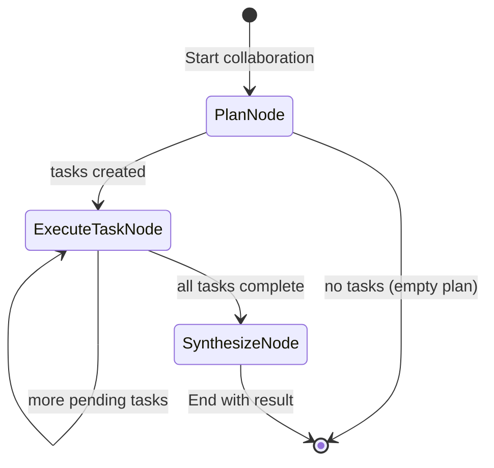

# Spec 02: Multi-Agent Pattern Graph Refactoring

**Status**: DRAFT
**Decision**: REPLACE - graph genuinely simplifies complex flow
**Priority**: P1
**Complexity**: Medium

---

## 1. Implementation Details

### 1.1 Overview

Replace the existing manual while-loop orchestration with a cyclic pydantic_graph implementation. The graph approach eliminates fragile mutable state, removes code duplication, and provides clear state machine semantics for the supervisor-worker pattern.

### 1.2 File Changes

```
src/agentic_patterns/
└── multi_agent.py        # REPLACE internals, keep public API
```

### 1.3 State Design

```python
@dataclass
class CollaborationState:
    """Graph state for multi-agent collaboration."""

    objective: str
    plan: SupervisorPlan | None = None
    pending_tasks: list[DelegatedTask] = field(default_factory=list)
    completed_results: list[TaskResult] = field(default_factory=list)
    messages: list[AgentMessage] = field(default_factory=list)

    @property
    def current_task(self) -> DelegatedTask | None:
        """Get next pending task, if any."""
        return self.pending_tasks[0] if self.pending_tasks else None

    def complete_task(self, result: TaskResult) -> None:
        """Mark current task complete and move to results."""
        if self.pending_tasks:
            self.pending_tasks.pop(0)
        self.completed_results.append(result)
```

### 1.4 Node Definitions

```python
@dataclass
class PlanNode(BaseNode[CollaborationState, None, CollaborationResult]):
    """Supervisor creates delegation plan."""

    async def run(
        self, ctx: GraphRunContext[CollaborationState]
    ) -> ExecuteTaskNode | End[CollaborationResult]:
        result = await supervisor_agent.run(
            f"Create delegation plan for: {ctx.state.objective}"
        )
        ctx.state.plan = result.output
        ctx.state.pending_tasks = list(result.output.tasks)

        if ctx.state.pending_tasks:
            return ExecuteTaskNode()
        return End(self._empty_result(ctx.state))

@dataclass
class ExecuteTaskNode(BaseNode[CollaborationState, None, CollaborationResult]):
    """Execute current task with appropriate worker agent."""

    async def run(
        self, ctx: GraphRunContext[CollaborationState]
    ) -> ExecuteTaskNode | SynthesizeNode:
        task = ctx.state.current_task
        if task is None:
            return SynthesizeNode()

        agent = ROLE_AGENTS.get(task.assigned_to)
        if agent is None:
            ctx.state.complete_task(TaskResult(
                task_id=task.task_id,
                agent_role=task.assigned_to,
                success=False,
                output=f"No agent for role: {task.assigned_to}",
            ))
        else:
            result = await agent.run(self._build_prompt(task, ctx.state))
            result.output.task_id = task.task_id
            result.output.agent_role = task.assigned_to
            ctx.state.complete_task(result.output)

        # Cyclic: return to self if more tasks, otherwise synthesize
        if ctx.state.pending_tasks:
            return ExecuteTaskNode()
        return SynthesizeNode()

@dataclass
class SynthesizeNode(BaseNode[CollaborationState, None, CollaborationResult]):
    """Combine all task results into final output."""

    async def run(
        self, ctx: GraphRunContext[CollaborationState]
    ) -> End[CollaborationResult]:
        completed = [r for r in ctx.state.completed_results if r.success]
        final_output = await synthesizer_agent.run(
            self._build_synthesis_prompt(ctx.state.objective, completed)
        )

        return End(CollaborationResult(
            objective=ctx.state.objective,
            success=len(completed) == len(ctx.state.completed_results),
            task_results=ctx.state.completed_results,
            final_output=final_output.output,
            messages_exchanged=len(ctx.state.messages),
        ))

# Graph definition with cyclic support
collaboration_graph = Graph(nodes=[PlanNode, ExecuteTaskNode, SynthesizeNode])
```

### 1.5 Public API (Preserved)

```python
async def run_collaborative_task(
    objective: str,
    max_tasks: int = 4,
) -> CollaborationResult:
    """
    Run collaborative task - PUBLIC API UNCHANGED.

    Internally uses graph implementation.
    """
    state = CollaborationState(objective=objective)
    result = await collaboration_graph.run(PlanNode(), state=state)
    return result.output
```

### 1.6 Implementation Tasks

1. Define `CollaborationState` dataclass with helper methods
2. Implement `PlanNode` for supervisor planning
3. Implement `ExecuteTaskNode` with cyclic self-transition
4. Implement `SynthesizeNode` for result combination
5. Define `collaboration_graph`
6. Update `run_collaborative_task()` to use graph internally
7. Remove old loop-based implementation
8. Remove duplicated `get_previous` tools (4 copies -> 0)
9. Update tests to verify same behavior
10. Add graph-specific tests for state transitions

---

## 2. Value vs Complexity Analysis

### 2.1 Benefits

| Benefit | Impact |
|---------|--------|
| Eliminate fragile while loop | High - removes bug-prone code |
| Remove 4 duplicated tools | High - DRY principle |
| Explicit state machine | High - clear control flow |
| Cyclic graph support | Medium - natural fit for iterative patterns |
| Mermaid visualization | Medium - documentation value |
| State encapsulation | Medium - no mutable list manipulation |

### 2.2 Complexity Assessment

| Factor | Rating | Notes |
|--------|--------|-------|
| Lines changed | ~200 LOC | Replace ~300 LOC with ~200 LOC |
| Learning curve | Medium | Cyclic graphs require understanding |
| Risk of breaking existing | Low | Public API unchanged |
| Test effort | Medium | Same tests, verify edge cases |

**Overall Complexity**: Medium

### 2.3 Risk Factors

| Risk | Mitigation |
|------|------------|
| Cyclic graph complexity | Clear documentation, state helper methods |
| Performance overhead | Graph overhead minimal vs LLM latency |
| Edge case handling | Comprehensive test coverage |

### 2.4 Recommendation

**Priority P1** - Important refactoring that genuinely improves code quality.

---

## 3. Pre/Post Code Analysis

### 3.1 Current Implementation (Problems)

```
# BEFORE: Fragile loop-based orchestration

async def run_collaborative_task(objective, max_tasks=4):
    context = CollaborationContext(messages=[], task_results=[])

    # Phase 1: Planning
    plan = await create_delegation_plan(objective)
    tasks = plan.tasks[:max_tasks]

    # Phase 2: Manual loop with mutable state
    for task in tasks:
        result = await execute_task(task, context)
        context.task_results.append(result)  # MUTATION

        context.messages.append(AgentMessage(...))  # MORE MUTATION

    # Phase 3: Synthesis
    final_output = await synthesize_results(objective, context.task_results)

    return CollaborationResult(...)

# PROBLEM: 4 nearly-identical tool definitions
@researcher_agent.tool
async def researcher_get_previous(ctx, role):
    return _find_result_by_role(ctx.deps.task_results, role)

@analyst_agent.tool
async def analyst_get_previous(ctx, role):  # COPY-PASTE
    return _find_result_by_role(ctx.deps.task_results, role)

@writer_agent.tool
async def writer_get_previous(ctx, role):  # COPY-PASTE
    return _find_result_by_role(ctx.deps.task_results, role)

@reviewer_agent.tool
async def reviewer_get_previous(ctx, role):  # COPY-PASTE
    return _find_result_by_role(ctx.deps.task_results, role)
```

**Issues**:
- Manual loop management
- Mutable list manipulation
- 4 duplicated tool definitions (~80 lines)
- Implicit state machine

### 3.2 New Implementation (Graph)

```
# AFTER: Clean state machine with graph

@dataclass
class CollaborationState:
    objective: str
    plan: SupervisorPlan | None = None
    pending_tasks: list[DelegatedTask] = field(default_factory=list)
    completed_results: list[TaskResult] = field(default_factory=list)

    def complete_task(self, result):
        self.pending_tasks.pop(0)
        self.completed_results.append(result)

@dataclass
class PlanNode(BaseNode[CollaborationState]):
    async def run(self, ctx) -> ExecuteTaskNode | End:
        plan = await supervisor_agent.run(ctx.state.objective)
        ctx.state.plan = plan.output
        ctx.state.pending_tasks = list(plan.output.tasks)
        return ExecuteTaskNode() if ctx.state.pending_tasks else End(...)

@dataclass
class ExecuteTaskNode(BaseNode[CollaborationState]):
    async def run(self, ctx) -> ExecuteTaskNode | SynthesizeNode:
        # Execute current task
        task = ctx.state.current_task
        result = await ROLE_AGENTS[task.assigned_to].run(...)
        ctx.state.complete_task(result)

        # CYCLIC: Return to self or proceed
        return ExecuteTaskNode() if ctx.state.pending_tasks else SynthesizeNode()

@dataclass
class SynthesizeNode(BaseNode[CollaborationState]):
    async def run(self, ctx) -> End[CollaborationResult]:
        final = await synthesizer_agent.run(...)
        return End(CollaborationResult(...))

# Graph handles transitions automatically
collaboration_graph = Graph(nodes=[PlanNode, ExecuteTaskNode, SynthesizeNode])
```

**Improvements**:
- Explicit state machine (no implicit loop)
- State encapsulated in dataclass with helper methods
- No duplicated tools (agents access state via context)
- Cyclic transition is explicit in return type
- ~100 fewer lines of code

---

## 4. Mermaid Diagram



### 4.1 State Transitions

| From | To | Condition |
|------|-----|-----------|
| Start | PlanNode | Always |
| PlanNode | ExecuteTaskNode | `pending_tasks` not empty |
| PlanNode | End | `pending_tasks` empty |
| ExecuteTaskNode | ExecuteTaskNode | More `pending_tasks` |
| ExecuteTaskNode | SynthesizeNode | `pending_tasks` empty |
| SynthesizeNode | End | Always |

---

## 5. Testing Strategy

### 5.1 Preserved Behavior Tests

```python
# Verify public API unchanged

async def test_run_collaborative_task_returns_result():
    result = await run_collaborative_task("Research Python async")
    assert isinstance(result, CollaborationResult)
    assert result.objective == "Research Python async"

async def test_run_collaborative_task_limits_tasks():
    result = await run_collaborative_task("Complex task", max_tasks=2)
    assert len(result.task_results) <= 2
```

### 5.2 Graph-Specific Tests

```python
# Test cyclic execution

async def test_execute_node_cycles_for_multiple_tasks():
    state = CollaborationState(
        objective="Test",
        pending_tasks=[task1, task2, task3],
    )
    # Graph should cycle through ExecuteTaskNode 3 times
    result = await collaboration_graph.run(ExecuteTaskNode(), state=state)
    assert len(state.completed_results) == 3

async def test_state_helper_complete_task():
    state = CollaborationState(objective="Test")
    state.pending_tasks = [task1, task2]
    state.complete_task(result1)
    assert len(state.pending_tasks) == 1
    assert len(state.completed_results) == 1
```

### 5.3 Coverage Target

- Maintain 80%+ coverage
- All node transitions tested
- Edge cases: empty plan, single task, max tasks limit
