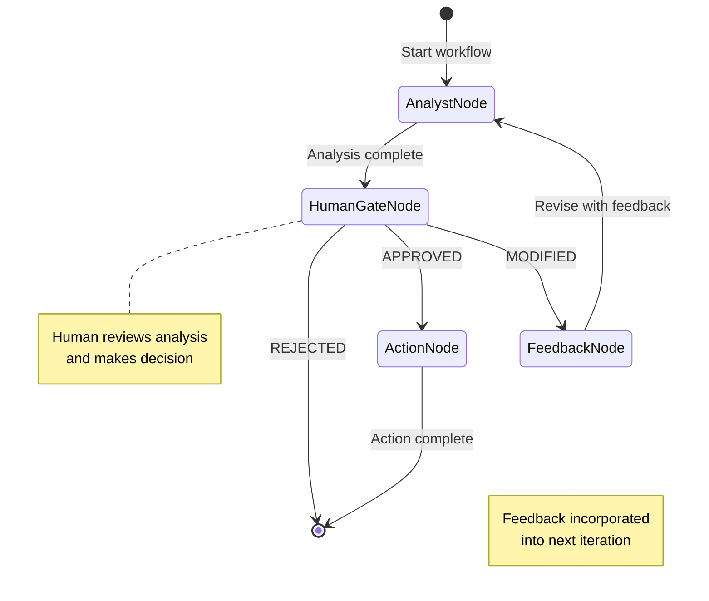

# Spec 04: Human-in-the-Loop Graph

**Status**: DEFERRED
**Decision**: NEW - demonstrates graph strengths for interactive workflows
**Priority**: P2 (punted - existing functional implementation sufficient)
**Complexity**: Medium

---

## 1. Implementation Details

### 1.1 Overview

Create a new module demonstrating pydantic_graph for human-in-the-loop (HITL) workflows. This pattern showcases graphs for stateful, interactive processes where human approval gates control execution flow.

### 1.2 New File

```
src/agentic_patterns/
└── human_in_loop_graph.py    # NEW
```

### 1.3 State Design

```python
from dataclasses import dataclass, field
from enum import Enum

class Decision(str, Enum):
    """Human decision options."""
    PENDING = "pending"
    APPROVED = "approved"
    MODIFIED = "modified"
    REJECTED = "rejected"

@dataclass
class ApprovalState:
    """State for human-in-the-loop workflow."""

    request: str
    analysis: str | None = None
    decision: Decision = Decision.PENDING
    feedback: str | None = None
    action_result: str | None = None
    iteration: int = 0
    max_iterations: int = 3

    def needs_revision(self) -> bool:
        """Check if more iterations allowed."""
        return self.iteration < self.max_iterations

@dataclass
class ApprovalResult:
    """Final result of approval workflow."""

    approved: bool
    request: str
    analysis: str
    action_result: str | None = None
    iterations: int = 0
    final_feedback: str | None = None
```

### 1.4 Node Definitions

```python
from pydantic_graph import BaseNode, End, Graph, GraphRunContext
from pydantic_ai import Agent

# Analyst agent evaluates requests
analyst_agent = Agent(
    model,
    system_prompt=(
        "You are a request analyst. Evaluate the request and provide:\n"
        "1. Summary of what is being requested\n"
        "2. Risk assessment (low/medium/high)\n"
        "3. Recommendation (approve/reject/needs-info)\n"
        "Be thorough but concise."
    ),
    output_type=str,
)

# Action agent executes approved requests
action_agent = Agent(
    model,
    system_prompt=(
        "You are an action executor. Given an approved request, "
        "describe the actions you would take to fulfill it. "
        "Be specific and actionable."
    ),
    output_type=str,
)

@dataclass
class AnalystNode(BaseNode[ApprovalState, None, ApprovalResult]):
    """Analyst evaluates the request."""

    async def run(
        self, ctx: GraphRunContext[ApprovalState]
    ) -> HumanGateNode:
        # Incorporate feedback if this is a revision
        prompt = ctx.state.request
        if ctx.state.feedback:
            prompt = f"Previous feedback: {ctx.state.feedback}\n\nRequest: {prompt}"

        result = await analyst_agent.run(prompt)
        ctx.state.analysis = result.output
        ctx.state.iteration += 1

        return HumanGateNode()

@dataclass
class HumanGateNode(BaseNode[ApprovalState, None, ApprovalResult]):
    """Wait for human decision."""

    async def run(
        self, ctx: GraphRunContext[ApprovalState]
    ) -> ActionNode | FeedbackNode | End[ApprovalResult]:
        # Decision is set externally before resuming graph
        match ctx.state.decision:
            case Decision.APPROVED:
                return ActionNode()
            case Decision.MODIFIED:
                if ctx.state.needs_revision():
                    return FeedbackNode()
                # Max iterations reached, reject
                return End(ApprovalResult(
                    approved=False,
                    request=ctx.state.request,
                    analysis=ctx.state.analysis or "",
                    iterations=ctx.state.iteration,
                    final_feedback="Max revision iterations reached",
                ))
            case Decision.REJECTED:
                return End(ApprovalResult(
                    approved=False,
                    request=ctx.state.request,
                    analysis=ctx.state.analysis or "",
                    iterations=ctx.state.iteration,
                    final_feedback=ctx.state.feedback,
                ))
            case _:
                # Still pending - shouldn't happen if used correctly
                raise ValueError("Decision must be set before resuming")

@dataclass
class FeedbackNode(BaseNode[ApprovalState, None, ApprovalResult]):
    """Process feedback and return to analyst."""

    async def run(
        self, ctx: GraphRunContext[ApprovalState]
    ) -> AnalystNode:
        # Reset decision for next iteration
        ctx.state.decision = Decision.PENDING
        return AnalystNode()

@dataclass
class ActionNode(BaseNode[ApprovalState, None, ApprovalResult]):
    """Execute the approved action."""

    async def run(
        self, ctx: GraphRunContext[ApprovalState]
    ) -> End[ApprovalResult]:
        result = await action_agent.run(
            f"Execute this approved request:\n\n"
            f"Request: {ctx.state.request}\n"
            f"Analysis: {ctx.state.analysis}"
        )
        ctx.state.action_result = result.output

        return End(ApprovalResult(
            approved=True,
            request=ctx.state.request,
            analysis=ctx.state.analysis or "",
            action_result=result.output,
            iterations=ctx.state.iteration,
        ))

# Graph definition
approval_graph = Graph(nodes=[
    AnalystNode,
    HumanGateNode,
    FeedbackNode,
    ActionNode,
])
```

### 1.5 Public API

```python
async def start_approval_workflow(request: str) -> tuple[ApprovalState, str]:
    """
    Start an approval workflow.

    Returns state and analysis for human review.
    """
    state = ApprovalState(request=request)

    # Run until we hit the human gate
    async with approval_graph.iter(AnalystNode(), state=state) as run:
        async for node in run:
            if isinstance(node, HumanGateNode):
                break

    return state, state.analysis or ""

async def continue_approval_workflow(
    state: ApprovalState,
    decision: Decision,
    feedback: str | None = None,
) -> ApprovalResult | tuple[ApprovalState, str]:
    """
    Continue workflow with human decision.

    Returns:
        - ApprovalResult if workflow complete
        - (state, analysis) tuple if needs another review
    """
    state.decision = decision
    state.feedback = feedback

    async with approval_graph.iter(HumanGateNode(), state=state) as run:
        async for node in run:
            if isinstance(node, HumanGateNode):
                # Another review needed
                return state, state.analysis or ""
            if isinstance(node, End):
                return run.result.output

    raise RuntimeError("Unexpected graph termination")
```

### 1.6 Implementation Tasks

1. Create `human_in_loop_graph.py`
2. Define `ApprovalState` and `ApprovalResult` dataclasses
3. Define `Decision` enum
4. Create `analyst_agent` and `action_agent`
5. Implement `AnalystNode` for request evaluation
6. Implement `HumanGateNode` for decision routing
7. Implement `FeedbackNode` for revision cycle
8. Implement `ActionNode` for execution
9. Define `approval_graph`
10. Add `start_approval_workflow()` and `continue_approval_workflow()` APIs
11. Write comprehensive tests
12. Add interactive demo in `__main__`

---

## 2. Value vs Complexity Analysis

### 2.1 Benefits

| Benefit | Impact |
|---------|--------|
| Demonstrates graph for HITL | High - key use case |
| Stateful workflow management | High - graphs excel here |
| Cyclic revision support | Medium - natural graph pattern |
| Clear approval semantics | Medium - explicit state machine |
| Reusable pattern | Medium - template for similar workflows |

### 2.2 Complexity Assessment

| Factor | Rating | Notes |
|--------|--------|-------|
| Lines of code | ~250 LOC | New module, moderate size |
| Concepts introduced | Medium | HITL pattern, graph iteration |
| Testing complexity | Medium | Need to simulate human decisions |
| Documentation needs | Medium | Interactive workflow docs |

**Overall Complexity**: Medium

### 2.3 Risk Factors

| Risk | Mitigation |
|------|------------|
| API usability unclear | Clear examples in demo |
| State persistence | Document state serialization |
| Timeout handling | Add max_wait parameter |

### 2.4 Recommendation

**Priority P2** - Implement after core refactoring. Valuable for demonstrating graph capabilities.

---

## 3. Pre/Post Code Analysis

### 3.1 Without Graph: Manual State Machine

```
# ALTERNATIVE: Manual implementation (more code, harder to follow)

class ApprovalWorkflow:
    def __init__(self, request):
        self.state = ApprovalState(request=request)
        self.current_step = "analyze"

    async def step(self):
        if self.current_step == "analyze":
            self.state.analysis = await analyst_agent.run(...)
            self.current_step = "wait_human"
            return "waiting"

        elif self.current_step == "wait_human":
            if self.state.decision == Decision.APPROVED:
                self.current_step = "execute"
            elif self.state.decision == Decision.MODIFIED:
                self.current_step = "analyze"  # cycle back
            else:
                return "rejected"

        elif self.current_step == "execute":
            self.state.action_result = await action_agent.run(...)
            return "completed"

        # Manual state tracking, error-prone
```

**Issues**:
- Manual step tracking
- Implicit state machine
- Easy to miss transitions
- No visualization

### 3.2 With Graph: Explicit State Machine

```
# WITH GRAPH: Clean, explicit transitions

@dataclass
class AnalystNode(BaseNode[ApprovalState]):
    async def run(self, ctx) -> HumanGateNode:
        ctx.state.analysis = await analyst_agent.run(...)
        return HumanGateNode()  # Explicit next step

@dataclass
class HumanGateNode(BaseNode[ApprovalState]):
    async def run(self, ctx) -> ActionNode | FeedbackNode | End:
        match ctx.state.decision:
            case Decision.APPROVED: return ActionNode()
            case Decision.MODIFIED: return FeedbackNode()  # Cycle
            case Decision.REJECTED: return End(...)

@dataclass
class FeedbackNode(BaseNode[ApprovalState]):
    async def run(self, ctx) -> AnalystNode:
        return AnalystNode()  # Back to analysis

# Graph handles all transitions
approval_graph = Graph(nodes=[AnalystNode, HumanGateNode, FeedbackNode, ActionNode])
```

**Improvements**:
- Explicit transitions in return types
- State machine is type-safe
- Cyclic flow is natural
- Mermaid diagram available

---

## 4. Mermaid Diagram



### 4.1 Flow Description

1. **Start**: Request submitted
2. **AnalystNode**: AI analyzes request, produces assessment
3. **HumanGateNode**: Human reviews, decides:
   - **APPROVED** -> ActionNode -> End (success)
   - **MODIFIED** -> FeedbackNode -> AnalystNode (cycle)
   - **REJECTED** -> End (failure)
4. **Cycle limit**: Max 3 iterations before auto-reject

---

## 5. Interactive Demo

```python
# human_in_loop_graph.py - __main__ section

if __name__ == "__main__":
    import asyncio

    async def interactive_demo():
        print("=" * 60)
        print("Human-in-the-Loop Approval Workflow Demo")
        print("=" * 60)

        # Start workflow
        request = input("\nEnter request to evaluate: ")
        state, analysis = await start_approval_workflow(request)

        while True:
            print("\n" + "=" * 60)
            print(f"Iteration: {state.iteration}")
            print("=" * 60)
            print(f"\nRequest: {state.request}")
            print(f"\nAnalysis:\n{analysis}")
            print("\n" + "-" * 40)
            print("Options:")
            print("  1. APPROVE - Execute the request")
            print("  2. MODIFY  - Request changes")
            print("  3. REJECT  - Decline the request")

            choice = input("\nYour decision (1/2/3): ").strip()

            if choice == "1":
                result = await continue_approval_workflow(state, Decision.APPROVED)
                print("\n" + "=" * 60)
                print("APPROVED - Action Executed")
                print("=" * 60)
                print(f"\nAction Result:\n{result.action_result}")
                break

            elif choice == "2":
                feedback = input("Enter feedback for revision: ")
                result = await continue_approval_workflow(
                    state, Decision.MODIFIED, feedback
                )
                if isinstance(result, ApprovalResult):
                    print("\n" + "=" * 60)
                    print("MAX ITERATIONS - Auto-rejected")
                    print("=" * 60)
                    break
                state, analysis = result

            elif choice == "3":
                reason = input("Enter rejection reason: ")
                result = await continue_approval_workflow(
                    state, Decision.REJECTED, reason
                )
                print("\n" + "=" * 60)
                print("REJECTED")
                print("=" * 60)
                print(f"Reason: {reason}")
                break

            else:
                print("Invalid choice, try again.")

        print(f"\nWorkflow completed in {state.iteration} iteration(s)")

    asyncio.run(interactive_demo())
```

---

## 6. Testing Strategy

### 6.1 Unit Tests

```python
# tests/test_human_in_loop_graph.py

import pytest
from agentic_patterns.human_in_loop_graph import (
    ApprovalState,
    Decision,
    start_approval_workflow,
    continue_approval_workflow,
)

@pytest.fixture
def mock_agents(mocker):
    """Mock analyst and action agents."""
    mocker.patch(
        "agentic_patterns.human_in_loop_graph.analyst_agent.run",
        return_value=mocker.Mock(output="Analysis: Low risk, recommend approve"),
    )
    mocker.patch(
        "agentic_patterns.human_in_loop_graph.action_agent.run",
        return_value=mocker.Mock(output="Action executed successfully"),
    )

async def test_start_approval_workflow(mock_agents):
    state, analysis = await start_approval_workflow("Test request")
    assert state.request == "Test request"
    assert state.analysis is not None
    assert state.iteration == 1
    assert state.decision == Decision.PENDING

async def test_approve_workflow(mock_agents):
    state, _ = await start_approval_workflow("Test request")
    result = await continue_approval_workflow(state, Decision.APPROVED)
    assert result.approved is True
    assert result.action_result is not None

async def test_reject_workflow(mock_agents):
    state, _ = await start_approval_workflow("Test request")
    result = await continue_approval_workflow(
        state, Decision.REJECTED, "Not needed"
    )
    assert result.approved is False
    assert result.final_feedback == "Not needed"

async def test_modify_workflow_cycles(mock_agents):
    state, _ = await start_approval_workflow("Test request")

    # First modification
    result = await continue_approval_workflow(
        state, Decision.MODIFIED, "Add more detail"
    )
    assert isinstance(result, tuple)  # (state, analysis)
    state, analysis = result
    assert state.iteration == 2

    # Approve on second iteration
    result = await continue_approval_workflow(state, Decision.APPROVED)
    assert result.approved is True
    assert result.iterations == 2

async def test_max_iterations_reached(mock_agents):
    state, _ = await start_approval_workflow("Test request")
    state.max_iterations = 2

    # First modification
    result = await continue_approval_workflow(state, Decision.MODIFIED, "Change 1")
    state, _ = result

    # Second modification hits limit
    result = await continue_approval_workflow(state, Decision.MODIFIED, "Change 2")
    assert isinstance(result, ApprovalResult)
    assert result.approved is False
    assert "Max revision iterations" in result.final_feedback
```

### 6.2 Coverage Target

- 80%+ coverage
- All decision paths tested
- Cycle behavior verified
- Max iterations enforced
