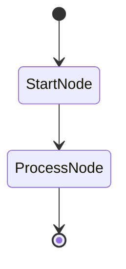

# Spec 05: Verification Standards

**Status**: DRAFT
**Purpose**: Document implementation standards, testing strategy, and verification checklist
**Priority**: P3 (finalize after implementation)

---

## 1. Implementation Standards

### 1.1 Node Definition Standards

All graph nodes must follow these conventions:

```python
from dataclasses import dataclass
from pydantic_graph import BaseNode, End, GraphRunContext

@dataclass
class MyNode(BaseNode[StateType, DepsType, ReturnType]):
    """
    Docstring describing the node's purpose.

    Transitions:
        - NextNode: when condition X
        - OtherNode: when condition Y
        - End: when complete
    """

    # Optional node-specific data fields
    field_name: FieldType = default_value

    async def run(
        self,
        ctx: GraphRunContext[StateType, DepsType],
    ) -> NextNode | OtherNode | End[ReturnType]:
        """Execute node logic and return next node."""
        # Node implementation
        ...
```

**Checklist**:
- [ ] Use `@dataclass` decorator
- [ ] Inherit from `BaseNode[State, Deps, Return]`
- [ ] Document transitions in docstring
- [ ] Type-hint return with union of possible next nodes
- [ ] Use `async def run()` signature

### 1.2 State Design Patterns

```python
from dataclasses import dataclass, field

@dataclass
class MyGraphState:
    """
    State for MyGraph workflow.

    Fields should be:
    - Immutable inputs (set once)
    - Mutable accumulators (updated during execution)
    - Derived properties (computed from other fields)
    """

    # Immutable input
    objective: str

    # Mutable accumulators (use default_factory for collections)
    results: list[Result] = field(default_factory=list)
    current_step: int = 0

    # Optional/nullable fields
    analysis: str | None = None

    # Helper methods for common operations
    @property
    def is_complete(self) -> bool:
        """Derived property."""
        return self.current_step >= len(self.results)

    def add_result(self, result: Result) -> None:
        """Mutation helper."""
        self.results.append(result)
```

**Checklist**:
- [ ] Use `@dataclass` decorator
- [ ] Document field purposes
- [ ] Use `field(default_factory=list)` for mutable defaults
- [ ] Add helper methods for complex state operations
- [ ] Use `@property` for derived values

### 1.3 Graph Definition Standards

```python
from pydantic_graph import Graph

# Define nodes first, then graph
my_graph = Graph(
    nodes=[
        StartNode,
        ProcessNode,
        EndNode,
    ],
)

# Optional: Add mermaid generation
def get_my_graph_diagram() -> str:
    """Generate Mermaid diagram for documentation."""
    return my_graph.mermaid_code()
```

**Checklist**:
- [ ] List nodes in logical order (start -> end)
- [ ] Add diagram generation function
- [ ] Export graph in `__all__`

### 1.4 Transition Type Safety

Return types define valid transitions. The type checker enforces this:

```python
# GOOD: Explicit union of allowed transitions
async def run(self, ctx) -> NodeA | NodeB | End[Result]:
    if condition_a:
        return NodeA()
    elif condition_b:
        return NodeB()
    else:
        return End(result)

# BAD: Returning node not in type hint
async def run(self, ctx) -> NodeA | End[Result]:
    return NodeC()  # Type error! NodeC not allowed
```

---

## 2. Testing Strategy

### 2.1 Test Organization

```
tests/
├── test_routing.py           # Functional routing tests (existing)
├── test_routing_graph.py     # Graph routing tests (new)
├── test_multi_agent.py       # Multi-agent tests (update)
├── test_evaluation.py        # Evaluation tests (update)
├── test_human_in_loop.py     # HITL tests (new)
└── conftest.py               # Shared fixtures
```

### 2.2 Test Categories

#### Unit Tests (per node)

```python
async def test_analyst_node_produces_analysis(mock_agent):
    """Test individual node behavior."""
    state = ApprovalState(request="Test")
    ctx = MockContext(state)

    node = AnalystNode()
    next_node = await node.run(ctx)

    assert state.analysis is not None
    assert isinstance(next_node, HumanGateNode)
```

#### Integration Tests (full graph)

```python
async def test_approval_graph_full_flow(mock_agents):
    """Test complete graph execution."""
    state = ApprovalState(request="Test")
    state.decision = Decision.APPROVED

    result = await approval_graph.run(AnalystNode(), state=state)

    assert result.output.approved is True
```

#### State Transition Tests

```python
@pytest.mark.parametrize("decision,expected_node", [
    (Decision.APPROVED, ActionNode),
    (Decision.MODIFIED, FeedbackNode),
    (Decision.REJECTED, End),
])
async def test_human_gate_transitions(decision, expected_node):
    """Test all transition paths from HumanGateNode."""
    state = ApprovalState(request="Test", decision=decision)
    ctx = MockContext(state)

    node = HumanGateNode()
    next_node = await node.run(ctx)

    assert isinstance(next_node, expected_node)
```

### 2.3 Coverage Requirements

```bash
# Minimum coverage: 80%
uv run pytest --cov=agentic_patterns --cov-fail-under=80

# Coverage report
uv run pytest --cov=agentic_patterns --cov-report=html
```

**Per-module targets**:
| Module | Target | Notes |
|--------|--------|-------|
| `routing.py` | 85% | Existing + kept |
| `routing_graph.py` | 80% | New module |
| `multi_agent.py` | 80% | Refactored |
| `evaluation.py` | 80% | Slimmed |
| `human_in_loop_graph.py` | 80% | New module |

---

## 3. Quality Gates

### 3.1 Pre-Commit Checks

Run before every commit:

```bash
#!/bin/bash
# scripts/pre-commit.sh

set -e

echo "=== Ruff Check ==="
uv run ruff check src/ tests/

echo "=== Ruff Format ==="
uv run ruff format --check src/ tests/

echo "=== Pytest ==="
uv run pytest --cov-fail-under=80

echo "=== All checks passed ==="
```

### 3.2 Milestone Checklist

After completing each spec:

- [ ] Code changes complete
- [ ] `uv run ruff check src/ tests/` passes (0 errors, 0 warnings)
- [ ] `uv run ruff format --check src/ tests/` passes
- [ ] `uv run pytest --cov-fail-under=80` passes
- [ ] Demo runs successfully (`python -m agentic_patterns.<module>`)
- [ ] Documentation updated (if applicable)

### 3.3 Integration Test

Full integration with Logfire:

```bash
# Set Logfire token
export LOGFIRE_TOKEN=your_token_here

# Run integration tests
./scripts/integration_test.sh

# Verify in Logfire dashboard
echo "Check traces at: https://logfire.pydantic.dev/"
```

---

## 4. Logfire Verification

### 4.1 Verification Checklist

After refactoring, verify Logfire captures:

- [ ] **Agent spans**: Each agent call creates a span
- [ ] **Latency**: Duration recorded accurately
- [ ] **Token usage**: Input/output tokens tracked
- [ ] **Errors**: Exceptions captured with stack traces
- [ ] **Graph spans**: Graph execution creates parent span
- [ ] **Node spans**: Each node creates child span

### 4.2 Test Queries

Verify data in Logfire with these queries:

```sql
-- Check agent spans exist
SELECT span_name, COUNT(*)
FROM records
WHERE span_name LIKE 'pydantic_ai:%'
  AND start_timestamp > NOW() - INTERVAL '1 hour'
GROUP BY span_name;

-- Check graph spans
SELECT span_name, duration_ms
FROM records
WHERE span_name LIKE '%graph%'
  AND start_timestamp > NOW() - INTERVAL '1 hour'
ORDER BY start_timestamp DESC
LIMIT 10;

-- Check for errors
SELECT span_name, exception_type, exception_message
FROM records
WHERE exception_type IS NOT NULL
  AND start_timestamp > NOW() - INTERVAL '1 hour';
```

---

## 5. Mermaid Diagram Standards

### 5.1 Diagram Generation

Each graph module should expose diagram generation:

```python
# In each graph module
def get_diagram() -> str:
    """Generate Mermaid diagram for this graph."""
    return my_graph.mermaid_code()

# Export in __all__
__all__ = ["my_graph", "get_diagram", ...]
```

### 5.2 Documentation Integration

Include diagrams in module docstrings:

```python
"""
My Graph Module.

Flow diagram:


"""
```

### 5.3 Automated Diagram Updates

```bash
# scripts/update_diagrams.sh
#!/bin/bash

# Generate diagrams for all graph modules
.venv/bin/python -c "
from agentic_patterns.routing_graph import get_routing_diagram
from agentic_patterns.multi_agent import get_collaboration_diagram
from agentic_patterns.human_in_loop_graph import get_approval_diagram

print('# Routing Graph')
print(get_routing_diagram())
print()
print('# Multi-Agent Graph')
print(get_collaboration_diagram())
print()
print('# Approval Graph')
print(get_approval_diagram())
" > docs/diagrams.md
```

---

## 6. Migration Checklist

### 6.1 Spec 03: Evaluation Slimdown

- [ ] Delete `AgentMetrics` class
- [ ] Delete `PerformanceMonitor` class
- [ ] Delete `MetricValue` model
- [ ] Delete `PerformanceSummary` model
- [ ] Delete `generate_evaluation_report()` function
- [ ] Update `EvaluationReport` model
- [ ] Remove deleted tests
- [ ] Update demo
- [ ] Create `scripts/run_evals.sh`
- [ ] Run quality gates

### 6.2 Spec 01: Routing Graph

- [ ] Create `routing_graph.py`
- [ ] Define `RoutingState`
- [ ] Implement `ClassifyIntentNode`
- [ ] Implement 4 handler nodes
- [ ] Define `routing_graph`
- [ ] Add `route_query_graph()` API
- [ ] Add `get_routing_diagram()`
- [ ] Write tests
- [ ] Run quality gates

### 6.3 Spec 02: Multi-Agent Graph

- [ ] Define `CollaborationState` with helpers
- [ ] Implement `PlanNode`
- [ ] Implement `ExecuteTaskNode` (cyclic)
- [ ] Implement `SynthesizeNode`
- [ ] Define `collaboration_graph`
- [ ] Update `run_collaborative_task()` to use graph
- [ ] Remove old loop implementation
- [ ] Remove duplicated tools
- [ ] Update tests
- [ ] Run quality gates

### 6.4 Spec 04: Human-in-Loop Graph

- [ ] Create `human_in_loop_graph.py`
- [ ] Define `ApprovalState` and `Decision`
- [ ] Create analyst and action agents
- [ ] Implement `AnalystNode`
- [ ] Implement `HumanGateNode`
- [ ] Implement `FeedbackNode`
- [ ] Implement `ActionNode`
- [ ] Define `approval_graph`
- [ ] Add public API functions
- [ ] Write tests
- [ ] Add interactive demo
- [ ] Run quality gates

---

## 7. Implementation Order

1. **Phase 1**: Spec 03 (Evaluation slimdown) - P0
   - Lowest risk, immediate cleanup
   - No graph dependencies

2. **Phase 2**: Spec 01 (Routing graph) - P2
   - Simple graph pattern
   - Establishes conventions

3. **Phase 3**: Spec 02 (Multi-agent graph) - P1
   - Complex cyclic graph
   - Uses established patterns

4. **Phase 4**: Spec 04 (HITL graph) - P2
   - New implementation
   - Demonstrates graph capabilities

5. **Phase 5**: Spec 05 (This document) - P3
   - Finalize after implementation
   - Document learnings
