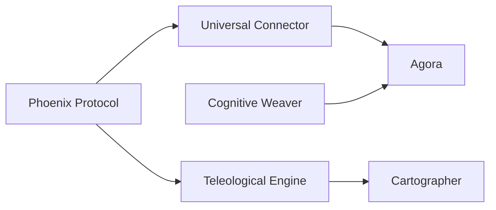

# Missing Patterns Implementation Strategy

**Status:** Draft v2
**Date:** 2025-12-27
**Context:** Plan for implementing remaining chapters from "Agentic Design Patterns"

## 1. Overview

This document is the master plan for implementing chapters 10, 11, 12, 15, 17, 21.

**Core Philosophy:**
- **Library-First:** Pure Python modules in `src/agentic_patterns/`, no external servers
- **Idiomatic pydantic-ai:** Use native features (`@output_validator`, `@system_prompt`, `deps_type`, `@tool`) per `pattern-implementation.md`
- **Graph-Aware:** Prefer `pydantic_graph` for stateful workflows over raw `asyncio` loops

## 2. Documentation Standards

All patterns must adhere to `dev/specs/documentation.md`:
- Module docstrings (Google-style)
- Pattern docs in `docs/patterns/` with Mermaid diagrams
- README updates (Implemented Patterns table)
- Lessons learned in `docs/LESSONS.md`

## 3. Idiomatic Requirements

Every pattern spec MUST include an **Idiomatic Feature Table**:

| Feature | Used? | Implementation |
|---------|-------|----------------|
| `@output_validator` + `ModelRetry` | Yes/No | How/why |
| `@system_prompt` | Yes/No | What context injected |
| `deps_type` + `RunContext` | Yes/No | What state shared |
| `@tool` / `@tool_plain` | Yes/No | What dynamic fetching |
| `pydantic_graph` | Yes/No | Stable or Beta API |

Decision framework (from `pattern-implementation.md:109-116`):
1. Is there a retry loop? → `@output_validator` + `ModelRetry`
2. Is context injected into system prompt? → `@system_prompt`
3. Is there shared runtime state? → `deps_type`
4. Does the agent need to fetch data dynamically? → `@tool`
5. Is it a multi-step stateful workflow? → `pydantic_graph`

## 4. Graph API Decision Tree

```
Is the pattern a multi-step workflow?
├─ No → Plain async functions
└─ Yes
    ├─ Does it have cycles (loops)?
    │   └─ Yes → pydantic_graph stable API (BaseNode with self-return)
    ├─ Does it need parallel fan-out/fan-in?
    │   └─ Yes → pydantic_graph.beta (.map() + g.join())
    └─ Linear steps only → Either works, prefer stable for simplicity
```

## 5. Test Strategy Requirements

Every pattern spec MUST include a **Test Strategy** section covering:

1. **Unit Tests:**
   - Mock agents using `unittest.mock.AsyncMock`
   - Use `MagicMock` for `RunContext` in tool tests
   - Patch agent dicts for dispatch testing

2. **Integration Tests:**
   - Use `TestModel` from pydantic-ai for deterministic LLM responses
   - Define expected tool calls and outputs

3. **Pattern-Specific:**
   - Background loops: Test start/stop lifecycle
   - MCP: Mock stdio transport or use in-process server
   - Graphs: Test individual nodes and full graph runs

## 6. Implementation Roadmap

### Phase 1: Robustness

**Chapter 12: Phoenix Protocol (Exception Handling)**
- *Purpose:* Recovery from exceptions *outside* normal agent flow
- *Distinction:* `ModelRetry` handles semantic failures during generation; Phoenix handles Python exceptions, tool crashes, context overflow
- *Graph:* No (wrapper function pattern)
- *Spec:* `dev/specs/missing-patterns/spec-12-phoenix-protocol.md`

### Phase 2: Extensibility

**Chapter 10: Universal Connector (MCP)**
- *Purpose:* Demonstrate MCP integration patterns beyond basic `toolsets=[server]`
- *Novel Value:* Multi-server orchestration, server selection, fallback handling
- *Graph:* No (connection management, not workflow)
- *Spec:* `dev/specs/missing-patterns/spec-10-universal-connector.md`

### Phase 3: Autonomy

**Chapter 11: Teleological Engine (Goal Setting)**
- *Purpose:* Proactive goal monitoring with remediation
- *Graph:* **Yes - pydantic_graph stable** (cyclic Monitor → Remediate → Monitor)
- *Spec:* `dev/specs/missing-patterns/spec-11-teleological-engine.md`

**Chapter 21: Cartographer (Exploration)**
- *Purpose:* Active domain discovery and knowledge graph construction
- *Graph:* **Yes - pydantic_graph stable** (cyclic Explore → Extract → Map → Explore)
- *Distinction:* Active indexing vs passive retrieval (knowledge_retrieval.py)
- *Spec:* `dev/specs/missing-patterns/spec-21-cartographer.md`

### Phase 4: Intelligence & Scale

**Chapter 17: Cognitive Weaver (Reasoning)**
- *Purpose:* Tree/Graph of Thoughts reasoning topologies
- *Graph:* **Yes - pydantic_graph.beta** (fan-out with `.map()`, fan-in with `g.join()`)
- *Spec:* `dev/specs/missing-patterns/spec-17-cognitive-weaver.md`

**Chapter 15: Agora (Inter-Agent Communication)**
- *Purpose:* Market-based task allocation via bidding
- *Graph:* **Yes - pydantic_graph stable** (RFP → Bid → Select → Execute)
- *Spec:* `dev/specs/missing-patterns/spec-15-agora.md`

## 7. Dependency Order



Rationale:
- Phoenix first: establishes error handling patterns used by others
- MCP before Agora: agents in Agora may use MCP tools
- Goals before Cartographer: exploration is a form of goal-directed behavior
- Weaver before Agora: bidding evaluation could use structured reasoning

## 8. Entry Point Conventions

Each pattern must expose a main async function:

```python
# Phoenix Protocol
async def recoverable_run(
    agent: Agent[DepsT, OutputT],
    prompt: str,
    deps: DepsT | None = None,
    max_recoveries: int = 2,
) -> OutputT: ...

# Universal Connector
async def create_mcp_agent(
    configs: list[MCPServerConfig],
    system_prompt: str,
) -> Agent: ...

# Teleological Engine
async def run_goal_monitor(
    objectives: list[GoalObjective],
    check_interval: float = 60.0,
) -> None: ...

# Agora
async def run_marketplace_task(
    rfp: TaskRFP,
    bidders: list[Agent],
) -> TaskResult: ...

# Cognitive Weaver
async def reason_with_topology(
    problem: str,
    strategy: ReasoningStrategy,
    max_depth: int = 3,
) -> ReasoningResult: ...

# Cartographer
async def explore_domain(
    root_path: Path,
    max_depth: int = 5,
) -> KnowledgeMap: ...
```

## 9. Quality Gates

Each pattern must pass ALL gates before completion:

- [ ] `uv run ruff check` - zero warnings
- [ ] `uv run ruff format` - applied
- [ ] `uv run pytest` - all passing
- [ ] Test coverage >= 80%
- [ ] Idiomatic feature table completed
- [ ] Test strategy documented
- [ ] Entry point function defined
- [ ] Added to `scripts/integration_test.sh` ALL_PATTERNS array
- [ ] Exported from `src/agentic_patterns/__init__.py`
- [ ] Mermaid diagram in docs
- [ ] Blacksmith review approved

## 10. Next Steps

1. Review and approve this master plan
2. Implement Phase 1 (Phoenix Protocol)
3. Proceed through phases sequentially
4. Update `docs/LESSONS.md` after each pattern
