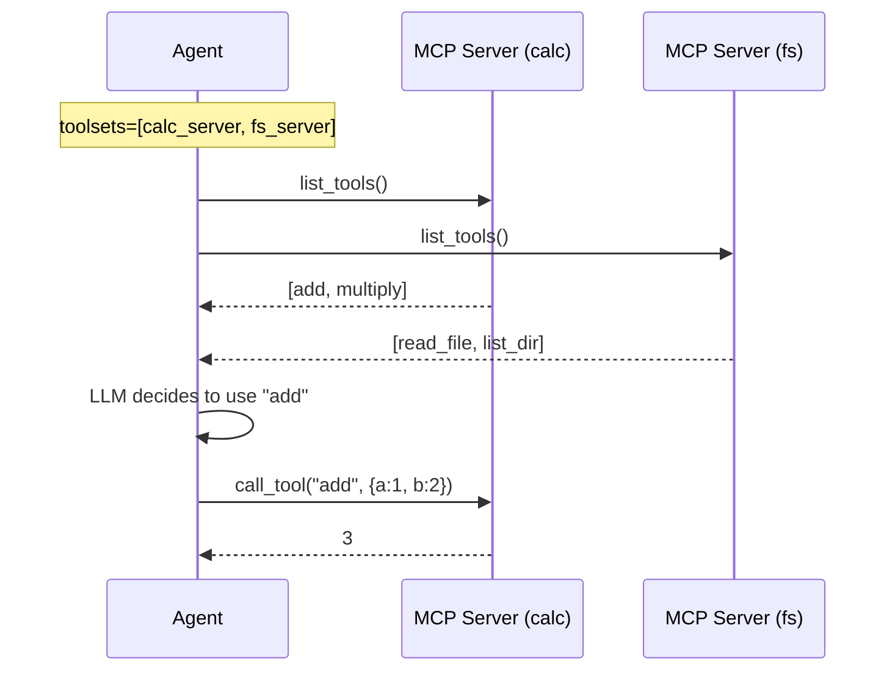

# Specification: MCP Integration (Tool Extensibility)

**Chapter:** 10
**Pattern Name:** MCP Integration
**Status:** Draft v3 (Simplified)
**Module:** `src/agentic_patterns/mcp_integration.py`

## 1. Overview

The original "Universal Connector" spec proposed an abstraction layer over
pydantic-ai's MCP support. **This is unnecessary.** pydantic-ai already has
clean, idiomatic MCP integration out of the box.

This pattern demonstrates **how to use pydantic-ai's native MCP support**
rather than building a custom connector.

### 1.1 What pydantic-ai Already Provides

```python
from pydantic_ai import Agent
from pydantic_ai.mcp import MCPServerStdio, MCPServerSSE

# Single server - just works
server = MCPServerStdio('python', args=['my_server.py'])
agent = Agent('openai:gpt-4', toolsets=[server])

# Multiple servers - just works
agent = Agent('openai:gpt-4', toolsets=[server1, server2, server3])

# HTTP/SSE servers - just works
http_server = MCPServerSSE('http://localhost:3001/sse')
agent = Agent('openai:gpt-4', toolsets=[http_server])
```

### 1.2 What We DON'T Need to Build

| Feature | Status | Why |
|---------|--------|-----|
| Multi-server support | Native | `toolsets=[s1, s2]` |
| Tool discovery | Native | Automatic on agent creation |
| Tool prefixes | Native | `tool_prefix='calc'` param |
| Deps injection | Native | `process_tool_call` callback |
| Server health | Overkill | MCP handles connection errors |
| Fallback routing | Overkill | Different tools, not redundancy |

### 1.3 What This Pattern Actually Teaches

1. **Idiomatic multi-server setup** - How to connect to multiple MCP servers
2. **Deps propagation** - How to pass agent deps to MCP tool handlers
3. **Tool prefixes** - How to avoid naming conflicts
4. **Building MCP servers** - How to create servers with FastMCP

## 2. Architecture

### 2.1 Native Multi-Server Pattern



No custom routing needed. The agent sees all tools and the LLM picks the right one.

## 3. Implementation

### 3.1 Multi-Server Agent (Native)

```python
"""
MCP Integration Pattern - Idiomatic pydantic-ai usage.

This module demonstrates native MCP support in pydantic-ai.
No custom connector class needed.
"""

from pydantic_ai import Agent
from pydantic_ai.mcp import MCPServerStdio

from agentic_patterns._models import get_model


async def create_multi_server_agent(
    system_prompt: str = "You have access to calculator and filesystem tools.",
) -> Agent:
    """
    Create an agent with multiple MCP servers.

    This is just native pydantic-ai - no abstraction needed.

    Example:
        async with create_multi_server_agent() as agent:
            result = await agent.run("What is 2 + 2?")
    """
    calc_server = MCPServerStdio(
        'python',
        args=['-m', 'agentic_patterns.mcp_servers.calculator'],
    )

    fs_server = MCPServerStdio(
        'python',
        args=['-m', 'agentic_patterns.mcp_servers.filesystem'],
    )

    return Agent(
        get_model(),
        system_prompt=system_prompt,
        toolsets=[calc_server, fs_server],
    )
```

### 3.2 Tool Prefixes for Naming Conflicts

```python
from pydantic_ai import Agent
from pydantic_ai.mcp import MCPServerStdio

# Both servers might have a tool called "process"
server_a = MCPServerStdio(
    'python', args=['server_a.py'],
    tool_prefix='a',  # Tools become: a_process, a_query
)

server_b = MCPServerStdio(
    'python', args=['server_b.py'],
    tool_prefix='b',  # Tools become: b_process, b_query
)

agent = Agent('openai:gpt-4', toolsets=[server_a, server_b])
# Agent sees: a_process, a_query, b_process, b_query
```

### 3.3 Deps Propagation to MCP Servers

```python
from dataclasses import dataclass
from typing import Any

from pydantic_ai import Agent, RunContext
from pydantic_ai.mcp import CallToolFunc, MCPServerStdio, ToolResult

from agentic_patterns._models import get_model


@dataclass
class AppDeps:
    """Dependencies to pass through to MCP tools."""
    user_id: str
    request_id: str


async def process_tool_call(
    ctx: RunContext[AppDeps],
    call_tool: CallToolFunc,
    name: str,
    tool_args: dict[str, Any],
) -> ToolResult:
    """
    Inject deps into MCP tool calls.

    The MCP server can access these via ctx.request_context.meta.deps
    """
    meta = {
        'user_id': ctx.deps.user_id,
        'request_id': ctx.deps.request_id,
    }
    return await call_tool(name, tool_args, meta)


def create_agent_with_deps() -> Agent[AppDeps, str]:
    """Create agent that passes deps to MCP servers."""
    server = MCPServerStdio(
        'python',
        args=['my_server.py'],
        process_tool_call=process_tool_call,
    )

    return Agent(
        get_model(),
        deps_type=AppDeps,
        toolsets=[server],
    )


# Usage:
# result = await agent.run(
#     "Do something",
#     deps=AppDeps(user_id="123", request_id="abc"),
# )
```

### 3.4 Example MCP Server (FastMCP)

```python
# src/agentic_patterns/mcp_servers/calculator.py
"""Simple calculator MCP server."""

from mcp.server.fastmcp import FastMCP

app = FastMCP("Calculator")


@app.tool()
def add(a: float, b: float) -> float:
    """Add two numbers."""
    return a + b


@app.tool()
def multiply(a: float, b: float) -> float:
    """Multiply two numbers."""
    return a * b


@app.tool()
def divide(a: float, b: float) -> float:
    """Divide two numbers."""
    if b == 0:
        raise ValueError("Cannot divide by zero")
    return a / b


if __name__ == "__main__":
    app.run(transport="stdio")
```

```python
# src/agentic_patterns/mcp_servers/filesystem.py
"""Simple filesystem MCP server."""

from pathlib import Path

from mcp.server.fastmcp import FastMCP

app = FastMCP("Filesystem")


@app.tool()
def list_directory(path: str) -> list[str]:
    """List files in a directory."""
    p = Path(path)
    if not p.exists():
        raise ValueError(f"Path does not exist: {path}")
    if not p.is_dir():
        raise ValueError(f"Path is not a directory: {path}")
    return [f.name for f in p.iterdir()]


@app.tool()
def read_file(path: str, max_chars: int = 10000) -> str:
    """Read file contents (truncated to max_chars)."""
    p = Path(path)
    if not p.exists():
        raise ValueError(f"File does not exist: {path}")
    if not p.is_file():
        raise ValueError(f"Path is not a file: {path}")
    content = p.read_text()
    if len(content) > max_chars:
        return content[:max_chars] + f"\n... [truncated, {len(content)} total chars]"
    return content


if __name__ == "__main__":
    app.run(transport="stdio")
```

## 4. Entry Point

```python
async def run_with_mcp_tools(
    prompt: str,
    servers: list[MCPServerStdio] | None = None,
) -> str:
    """
    Run a prompt with MCP tool access.

    Simple wrapper showing idiomatic usage.

    Args:
        prompt: The user prompt.
        servers: MCP servers to use. Defaults to calculator.

    Returns:
        Agent response.

    Example:
        result = await run_with_mcp_tools("What is 15 * 7?")
        print(result)  # "105"
    """
    if servers is None:
        servers = [
            MCPServerStdio(
                'python',
                args=['-m', 'agentic_patterns.mcp_servers.calculator'],
            ),
        ]

    agent = Agent(
        get_model(),
        system_prompt="Use the available tools to help the user.",
        toolsets=servers,
    )

    async with agent:
        result = await agent.run(prompt)
        return result.output
```

## 5. Idiomatic Feature Table

| Feature | Used? | Implementation |
|---------|-------|----------------|
| `@output_validator` | No | Not relevant to MCP |
| `@system_prompt` | No | Static prompt sufficient |
| `deps_type` + `RunContext` | Yes | `process_tool_call` for deps injection |
| `@tool` / `@tool_plain` | No | Tools come from MCP servers |
| `pydantic_graph` | No | Simple agent pattern |
| `toolsets` | **Yes** | Native multi-server support |
| `tool_prefix` | **Yes** | Avoid naming conflicts |
| `process_tool_call` | **Yes** | Deps propagation |

## 6. Test Strategy

### 6.1 Unit Tests (Mocked)

```python
import pytest
from unittest.mock import AsyncMock, MagicMock, patch


async def test_multi_server_discovers_all_tools():
    """Agent should see tools from all servers."""
    # Mock server responses
    mock_calc = MagicMock()
    mock_calc.list_tools = AsyncMock(return_value=[
        {"name": "add", "description": "Add numbers"},
    ])

    mock_fs = MagicMock()
    mock_fs.list_tools = AsyncMock(return_value=[
        {"name": "read_file", "description": "Read a file"},
    ])

    # Verify both tool sets are available
    # (Implementation depends on how we test Agent internals)


async def test_tool_prefix_applied():
    """Tools should be prefixed to avoid conflicts."""
    server = MCPServerStdio(
        'python', args=['server.py'],
        tool_prefix='calc',
    )
    # When agent lists tools, they should be prefixed
    # calc_add, calc_multiply, etc.


async def test_deps_passed_to_tool_call():
    """Deps should be injected into MCP tool calls."""
    deps = AppDeps(user_id="123", request_id="abc")

    captured_meta = {}

    async def mock_call_tool(name, args, meta=None):
        captured_meta.update(meta or {})
        return {"result": "ok"}

    # Run agent with deps
    # Verify captured_meta contains user_id and request_id
```

### 6.2 Integration Tests

```python
import subprocess
import sys


@pytest.fixture
async def calculator_server():
    """Start real calculator MCP server for integration test."""
    # Note: In practice, pydantic-ai handles subprocess lifecycle
    # This is just for standalone server testing
    pass


async def test_calculator_integration():
    """Integration test with real MCP server."""
    server = MCPServerStdio(
        sys.executable,
        args=['-m', 'agentic_patterns.mcp_servers.calculator'],
    )

    agent = Agent(
        'test',  # or real model
        toolsets=[server],
    )

    async with agent:
        # Agent should be able to call calculator tools
        pass
```

## 7. What's NOT Implemented

Documented decisions on what we're skipping:

1. **Custom connector class:** pydantic-ai's `toolsets` is sufficient
2. **Fallback routing:** If you need redundancy, use different patterns
3. **Health monitoring:** MCP handles connection errors; let it
4. **Server selection logic:** The LLM picks the right tool
5. **Tool caching:** pydantic-ai handles this internally

## 8. Integration & Documentation

**Integration (TODO):**
- [ ] Added to `scripts/integration_test.sh` ALL_PATTERNS array
- [ ] Exported from `src/agentic_patterns/__init__.py`
- [ ] `if __name__ == "__main__"` demo block

**Documentation:**
- **Pattern page:** `docs/patterns/10-mcp-integration.md`
- **Key insight:** pydantic-ai's native MCP support is complete
- **When to use:** When agents need external tool access
- **Example:** Calculator + filesystem multi-server agent

## 9. Skeptical Notes

### Why the Original Spec Was Over-Engineered

1. **"Server selection"** - The LLM already selects tools. No routing needed.

2. **"Automatic failover"** - If a server is down, that's an error. Don't hide
   it with fallback magic. Fix the server.

3. **"Health checks"** - MCP connections fail fast. You'll know if something
   is wrong. Periodic pings add complexity for minimal value.

4. **"UniversalConnector class"** - This is just wrapping `toolsets=[...]`
   with extra steps. The native API is cleaner.

### When You Might Actually Need More

- **True redundancy:** If you have multiple identical servers for load
  balancing, consider infrastructure-level solutions (load balancer, not
  agent code).

- **Dynamic server discovery:** If servers come and go at runtime, you might
  need custom logic. But this is rare for agent use cases.

- **Complex routing:** If tool selection requires business logic beyond what
  the LLM can decide, consider a routing pattern (Chapter 2) instead.
