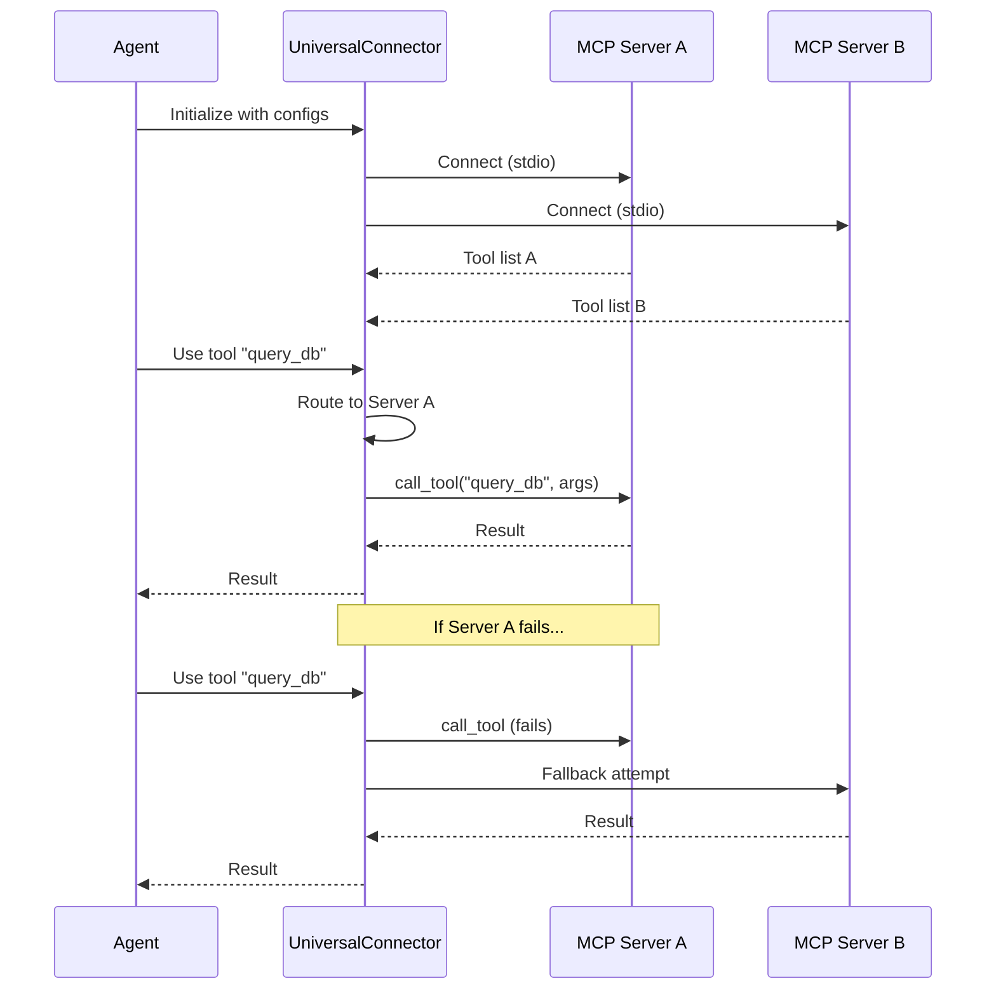

# Specification: The Universal Connector (MCP)

**Chapter:** 10
**Pattern Name:** The Universal Connector
**Status:** Draft v2
**Module:** `src/agentic_patterns/mcp_connector.py`

## 1. Overview

Hardcoding tools into an agent makes the system brittle. The **Universal
Connector** demonstrates advanced MCP (Model Context Protocol) patterns beyond
basic `toolsets=[server]` usage.

### 1.1 What This Pattern Adds

pydantic-ai has native MCP support:
```python
from pydantic_ai.mcp import MCPServerStdio
server = MCPServerStdio('cmd', args=['server.py'])
agent = Agent('model', toolsets=[server])
```

This pattern adds:

| Capability | Native pydantic-ai | Universal Connector |
|------------|-------------------|---------------------|
| Single server | Yes | Yes |
| Multiple servers | Manual setup | Orchestrated |
| Server selection | No | Agent chooses servers |
| Fallback on failure | No | Automatic failover |
| Deps passing to MCP | Manual `process_tool_call` | Built-in |
| Server health checks | No | Periodic ping |

### 1.2 Use Cases

1. **Multi-server orchestration:** Connect to filesystem, database, and API
   servers simultaneously
2. **Dynamic capability discovery:** Agent inspects available tools before
   deciding approach
3. **Resilient tool access:** If primary server fails, try backup
4. **Context passing:** Propagate agent deps to MCP server handlers

## 2. Architecture

### 2.1 Data Flow



### 2.2 Data Models

```python
from dataclasses import dataclass, field
from typing import Any, Callable, Awaitable
from pydantic import BaseModel, Field
from pydantic_ai import RunContext


class MCPServerConfig(BaseModel):
    """Configuration for an MCP server subprocess."""
    name: str = Field(description="Unique server identifier")
    command: str = Field(description="Command to run (e.g., 'python')")
    args: list[str] = Field(
        default_factory=list,
        description="Command arguments"
    )
    env: dict[str, str] | None = Field(
        default=None,
        description="Environment variables"
    )
    priority: int = Field(
        default=0,
        description="Higher = preferred for fallback (0-100)"
    )
    tags: list[str] = Field(
        default_factory=list,
        description="Capability tags for routing"
    )


class DiscoveredTool(BaseModel):
    """Tool discovered from an MCP server."""
    name: str
    description: str
    input_schema: dict[str, Any]
    server_name: str
    server_priority: int = 0


class ServerHealth(BaseModel):
    """Health status of an MCP server."""
    name: str
    is_connected: bool
    last_ping: float | None = None  # timestamp
    error_count: int = 0
    tools_available: int = 0


class ConnectorState(BaseModel):
    """Current state of the connector."""
    servers: list[ServerHealth]
    total_tools: int
    last_discovery: float | None = None


@dataclass
class ConnectorDeps:
    """Dependencies passed through to MCP tool calls."""
    user_context: dict[str, Any] = field(default_factory=dict)
    request_id: str | None = None


# Type alias for process_tool_call signature
ProcessToolCallFn = Callable[
    [RunContext[Any], Any, str, dict[str, Any]],
    Awaitable[Any]
]
```

### 2.3 The Connector Class

```python
from pydantic_ai import Agent
from pydantic_ai.mcp import MCPServerStdio


class UniversalConnector:
    """
    Manages multiple MCP servers with orchestration features.

    Features:
    - Multi-server connection management
    - Tool discovery across all servers
    - Automatic fallback on server failure
    - Deps propagation to MCP handlers
    - Health monitoring
    """

    def __init__(
        self,
        configs: list[MCPServerConfig],
        auto_connect: bool = True,
    ):
        self.configs = configs
        self._servers: dict[str, MCPServerStdio] = {}
        self._tools: dict[str, DiscoveredTool] = {}
        self._health: dict[str, ServerHealth] = {}

    async def connect_all(self) -> None:
        """Connect to all configured servers."""
        ...

    async def disconnect_all(self) -> None:
        """Gracefully disconnect from all servers."""
        ...

    async def discover_tools(self) -> list[DiscoveredTool]:
        """Discover tools from all connected servers."""
        ...

    async def call_tool(
        self,
        name: str,
        arguments: dict[str, Any],
        deps: ConnectorDeps | None = None,
    ) -> Any:
        """
        Call a tool with automatic server routing and fallback.

        Routes to the server that provides the tool. If that server
        fails, attempts fallback to other servers with the same tool.
        """
        ...

    def create_agent(
        self,
        system_prompt: str,
        output_type: type | None = None,
    ) -> Agent:
        """
        Create a pydantic-ai Agent with all discovered tools.

        The agent will have access to tools from all connected servers.
        """
        ...

    def get_state(self) -> ConnectorState:
        """Get current connector state for monitoring."""
        ...
```

### 2.4 Entry Points

```python
async def create_mcp_agent(
    configs: list[MCPServerConfig],
    system_prompt: str,
    output_type: type | None = None,
    deps_type: type | None = None,
) -> Agent:
    """
    Create an agent connected to multiple MCP servers.

    Convenience function that:
    1. Creates a UniversalConnector
    2. Connects to all servers
    3. Discovers tools
    4. Returns configured Agent

    Args:
        configs: MCP server configurations.
        system_prompt: Agent system prompt.
        output_type: Optional structured output type.
        deps_type: Optional dependencies type.

    Returns:
        Configured Agent with MCP tools.

    Example:
        agent = await create_mcp_agent(
            configs=[
                MCPServerConfig(
                    name="filesystem",
                    command="python",
                    args=["fs_server.py"],
                ),
                MCPServerConfig(
                    name="database",
                    command="python",
                    args=["db_server.py"],
                ),
            ],
            system_prompt="You can access files and databases.",
        )
        result = await agent.run("List files in /tmp")
    """
    ...


async def with_mcp_fallback(
    primary: MCPServerConfig,
    fallbacks: list[MCPServerConfig],
    tool_name: str,
    arguments: dict[str, Any],
) -> Any:
    """
    Call an MCP tool with automatic fallback.

    Tries primary server first, then fallbacks in order.

    Args:
        primary: Primary server configuration.
        fallbacks: Backup server configurations.
        tool_name: Tool to call.
        arguments: Tool arguments.

    Returns:
        Tool result from first successful server.

    Raises:
        MCPAllServersFailedError: If all servers fail.
    """
    ...
```

## 3. Idiomatic Feature Table

| Feature | Used? | Implementation |
|---------|-------|----------------|
| `@output_validator` + `ModelRetry` | No | MCP errors handled via fallback, not retry |
| `@system_prompt` | Yes | Inject discovered tool descriptions |
| `deps_type` + `RunContext` | Yes | `ConnectorDeps` passed to `process_tool_call` |
| `@tool` / `@tool_plain` | No | Tools come from MCP servers |
| `pydantic_graph` | No | Connection management, not workflow |

## 4. Deps Propagation

Pass agent deps to MCP server handlers:

```python
async def process_tool_call_with_deps(
    ctx: RunContext[ConnectorDeps],
    call_tool: CallToolFunc,
    name: str,
    tool_args: dict[str, Any],
) -> ToolResult:
    """
    Process tool call, injecting deps into MCP metadata.

    The MCP server can access these via ctx.request_context.meta.deps
    """
    meta = {
        "deps": {
            "user_context": ctx.deps.user_context,
            "request_id": ctx.deps.request_id,
        }
    }
    return await call_tool(name, tool_args, meta)


# Usage in connector
server = MCPServerStdio(
    config.command,
    args=config.args,
    process_tool_call=process_tool_call_with_deps,
)
```

## 5. Example MCP Servers

### 5.1 Calculator Server

```python
# src/agentic_patterns/mcp_servers/calculator.py
from mcp.server.fastmcp import FastMCP

app = FastMCP("Calculator")


@app.tool()
def add(a: float, b: float) -> float:
    """Add two numbers."""
    return a + b


@app.tool()
def multiply(a: float, b: float) -> float:
    """Multiply two numbers."""
    return a * b


if __name__ == "__main__":
    app.run(transport="stdio")
```

### 5.2 File System Server

```python
# src/agentic_patterns/mcp_servers/filesystem.py
from pathlib import Path
from mcp.server.fastmcp import FastMCP

app = FastMCP("Filesystem")


@app.tool()
def list_directory(path: str) -> list[str]:
    """List files in a directory."""
    return [f.name for f in Path(path).iterdir()]


@app.tool()
def read_file(path: str) -> str:
    """Read file contents."""
    return Path(path).read_text()


if __name__ == "__main__":
    app.run(transport="stdio")
```

## 6. Test Strategy

### 6.1 Unit Tests (Mocked Servers)

```python
import pytest
from unittest.mock import AsyncMock, MagicMock, patch


@pytest.fixture
def mock_mcp_server():
    """Mock MCPServerStdio for unit tests."""
    server = MagicMock()
    server.list_tools = AsyncMock(return_value=[
        {"name": "add", "description": "Add numbers", "inputSchema": {}},
    ])
    server.call_tool = AsyncMock(return_value={"result": 5})
    return server


async def test_discover_tools(mock_mcp_server):
    """Should discover tools from connected servers."""
    connector = UniversalConnector([
        MCPServerConfig(name="calc", command="python", args=["calc.py"])
    ])

    with patch.object(connector, "_servers", {"calc": mock_mcp_server}):
        tools = await connector.discover_tools()

    assert len(tools) == 1
    assert tools[0].name == "add"
    assert tools[0].server_name == "calc"


async def test_fallback_on_failure(mock_mcp_server):
    """Should fallback to secondary server on primary failure."""
    primary = MagicMock()
    primary.call_tool = AsyncMock(side_effect=ConnectionError("Down"))

    secondary = MagicMock()
    secondary.call_tool = AsyncMock(return_value={"result": 10})

    connector = UniversalConnector([
        MCPServerConfig(name="primary", command="p", args=[], priority=100),
        MCPServerConfig(name="secondary", command="s", args=[], priority=50),
    ])

    with patch.object(
        connector, "_servers", {"primary": primary, "secondary": secondary}
    ):
        result = await connector.call_tool("add", {"a": 1, "b": 2})

    assert result == {"result": 10}
    secondary.call_tool.assert_called_once()
```

### 6.2 Integration Tests (Real Subprocess)

```python
import subprocess
import sys

@pytest.fixture
async def calculator_server():
    """Start real calculator MCP server."""
    proc = await asyncio.create_subprocess_exec(
        sys.executable,
        "src/agentic_patterns/mcp_servers/calculator.py",
        stdin=subprocess.PIPE,
        stdout=subprocess.PIPE,
    )
    yield proc
    proc.terminate()
    await proc.wait()


async def test_real_mcp_connection(calculator_server):
    """Integration test with real MCP server."""
    connector = UniversalConnector([
        MCPServerConfig(
            name="calc",
            command=sys.executable,
            args=["src/agentic_patterns/mcp_servers/calculator.py"],
        )
    ])

    await connector.connect_all()
    tools = await connector.discover_tools()

    assert any(t.name == "add" for t in tools)

    result = await connector.call_tool("add", {"a": 2, "b": 3})
    assert result == 5

    await connector.disconnect_all()
```

### 6.3 Health Check Tests

```python
async def test_health_monitoring():
    """Should track server health status."""
    connector = UniversalConnector([
        MCPServerConfig(name="healthy", command="cmd", args=[]),
        MCPServerConfig(name="unhealthy", command="bad", args=[]),
    ])

    # Simulate connection states
    connector._health["healthy"] = ServerHealth(
        name="healthy", is_connected=True, tools_available=3
    )
    connector._health["unhealthy"] = ServerHealth(
        name="unhealthy", is_connected=False, error_count=5
    )

    state = connector.get_state()
    assert state.servers[0].is_connected is True
    assert state.servers[1].error_count == 5
```

## 7. Edge Cases

1. **No servers configured:** Raise `ValueError` at construction
2. **All servers fail to connect:** Raise `MCPConnectionError` with details
3. **Tool not found:** Check all servers, raise `MCPToolNotFoundError`
4. **Server dies mid-call:** Detect and attempt reconnection + fallback
5. **Circular fallback:** Prevent infinite loops with attempt counter

## 8. Integration & Documentation

**Integration (TODO):**
- [ ] Added to `scripts/integration_test.sh` ALL_PATTERNS array
- [ ] Exported from `src/agentic_patterns/__init__.py`
- [ ] `if __name__ == "__main__"` demo block

**Documentation:**
- **Pattern page:** `docs/patterns/10-mcp-connector.md`
- **Mermaid:** Sequence showing multi-server orchestration
- **Example:** Agent with filesystem + database servers
- **Comparison:** Table showing native vs connector capabilities
- **Tutorial:** Building a custom MCP server

## 9. Open Questions

1. Should the connector auto-reconnect on server failure?
2. How to handle conflicting tool names across servers?
3. Should tool discovery be cached or always live?
4. How to prioritize servers when multiple have the same tool?

## 10. Review & Refinement Areas

### 10.1 Subprocess Lifecycle & Zombie Processes
**Concern:** Improper management of subprocesses can lead to "zombie" processes if the main application crashes or is killed forcefully.
**Refinement:** Implement robust signal handling (`SIGINT`, `SIGTERM`) and use `atexit` handlers or `weakref.finalize` to ensure all MCP subprocesses are terminated when the parent process exits.

### 10.2 Schema Conversion Reliability
**Concern:** Converting arbitrary JSON Schemas from MCP servers into Pydantic models (or compatible dicts) for `pydantic-ai` tool registration is non-trivial and error-prone.
**Refinement:** Investigate using `datamodel-code-generator` or `pydantic.create_model` dynamically. Ensure fallback to "generic dict input" if precise schema conversion fails, though this reduces type safety.

### 10.3 Concurrency & Stream Deadlocks
**Concern:** Managing multiple persistent `stdio` pipes (stdin/stdout) for multiple servers concurrently can lead to deadlocks if buffers fill up.
**Refinement:** Ensure `asyncio.create_subprocess_exec` is used with non-blocking stream readers. The `mcp` SDK likely handles this, but we must verify that our `UniversalConnector` doesn't inadvertently block the event loop while waiting for a specific server.
