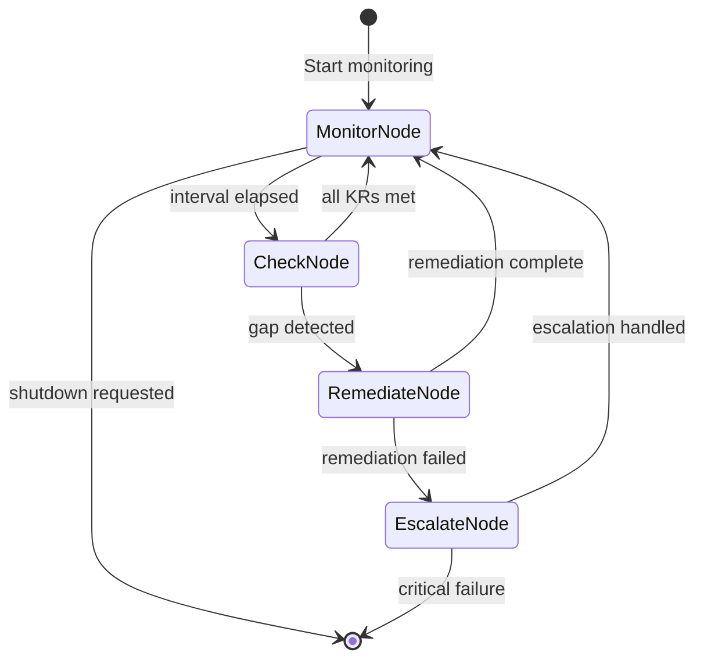

# Specification: The Teleological Engine (Goal Setting)

**Chapter:** 11
**Pattern Name:** The Teleological Engine
**Status:** Draft v2
**Module:** `src/agentic_patterns/goal_monitoring.py`

## 1. Overview

Most agents are "reactive"—they wait for a user prompt to act. The
**Teleological Engine** (from the Greek *telos*, meaning goal) makes agents
"proactive." It implements an OKR-style framework where the agent maintains
persistent goals and monitors the environment to ensure they are met.

### 1.1 Why pydantic_graph

The monitoring loop is a cyclic state machine:
```
Monitor → Check KRs → (Gap?) → Remediate → Monitor
```

Using `pydantic_graph` stable API provides:
- Typed state transitions
- Mermaid visualization for debugging
- Explicit cycle handling via self-returning nodes
- Clean separation of concerns per node

**Alternative considered:** Raw `while True` with `asyncio.sleep()`. Rejected
because it lacks structure, makes testing harder, and doesn't integrate with
pydantic_graph's visualization.

## 2. Architecture

### 2.1 State Machine



### 2.2 Data Models

```python
from dataclasses import dataclass, field
from datetime import datetime
from typing import Literal, Any, Callable, Awaitable
from pydantic import BaseModel, Field


class KeyResult(BaseModel):
    """A measurable key result for an objective."""
    id: str = Field(description="Unique KR identifier")
    metric_name: str = Field(description="What is being measured")
    target_value: float = Field(description="Target threshold")
    current_value: float | None = Field(
        default=None,
        description="Last measured value"
    )
    comparator: Literal[">=", "<=", "==", ">", "<"] = Field(
        default=">=",
        description="How to compare current vs target"
    )
    evaluator_type: Literal[
        "python_callable",
        "file_stat",
        "agent_assessment"
    ] = Field(
        default="python_callable",
        description="How to evaluate current value"
    )
    evaluator_config: dict[str, Any] = Field(
        default_factory=dict,
        description="Config for the evaluator"
    )
    last_checked: datetime | None = None
    is_met: bool = False


class GoalObjective(BaseModel):
    """A high-level objective with key results."""
    id: str = Field(description="Unique objective identifier")
    description: str = Field(description="Human-readable goal")
    key_results: list[KeyResult] = Field(description="Measurable KRs")
    priority: int = Field(
        default=1, ge=1, le=10,
        description="1=highest priority, 10=lowest"
    )
    remediation_prompt: str = Field(
        description="Instructions for the remediation agent"
    )
    remediation_retries: int = Field(
        default=2,
        description="Max remediation attempts per check"
    )
    enabled: bool = True


class GapReport(BaseModel):
    """Report of a detected goal gap."""
    objective_id: str
    failed_krs: list[KeyResult]
    gap_severity: Literal["minor", "moderate", "critical"]
    suggested_action: str


class RemediationResult(BaseModel):
    """Result of a remediation attempt."""
    objective_id: str
    success: bool
    action_taken: str
    error_message: str | None = None
    duration_seconds: float


@dataclass
class GoalMonitorState:
    """State for the goal monitoring graph."""
    objectives: list[GoalObjective]
    check_interval_seconds: float = 60.0
    shutdown_requested: bool = False

    # Mutable accumulators
    current_objective_index: int = 0
    current_gap: GapReport | None = None
    remediation_attempts: int = 0
    remediation_history: list[RemediationResult] = field(default_factory=list)
    last_check_time: datetime | None = None

    def next_objective(self) -> GoalObjective | None:
        """Get next objective to check, or None if done with cycle."""
        enabled = [o for o in self.objectives if o.enabled]
        if self.current_objective_index >= len(enabled):
            self.current_objective_index = 0
            return None
        obj = enabled[self.current_objective_index]
        self.current_objective_index += 1
        return obj

    def reset_cycle(self) -> None:
        """Reset for next monitoring cycle."""
        self.current_objective_index = 0
        self.current_gap = None
        self.remediation_attempts = 0


@dataclass
class GoalMonitorDeps:
    """Dependencies for goal monitoring agents."""
    evaluators: dict[str, Callable[..., Awaitable[float]]]
    on_gap_detected: Callable[[GapReport], Awaitable[None]] | None = None
    on_remediation: Callable[[RemediationResult], Awaitable[None]] | None = None
```

### 2.3 Evaluators

```python
from pathlib import Path
import os
from datetime import datetime, timedelta


async def file_age_evaluator(path: str, unit: str = "hours") -> float:
    """Evaluate file age in specified units."""
    stat = Path(path).stat()
    age = datetime.now().timestamp() - stat.st_mtime
    divisors = {"seconds": 1, "minutes": 60, "hours": 3600, "days": 86400}
    return age / divisors.get(unit, 1)


async def file_exists_evaluator(path: str) -> float:
    """Return 1.0 if file exists, 0.0 otherwise."""
    return 1.0 if Path(path).exists() else 0.0


async def coverage_evaluator(report_path: str) -> float:
    """Parse coverage report and return percentage."""
    # Parse .coverage or coverage.xml
    ...


async def agent_assessment_evaluator(
    agent: Agent,
    prompt: str,
    deps: Any = None,
) -> float:
    """Use an agent to assess a metric (returns 0.0-1.0)."""
    result = await agent.run(prompt, deps=deps)
    return result.output.score  # Assumes agent returns scored output
```

### 2.4 Graph Nodes

```python
from pydantic_graph import BaseNode, End, Graph, GraphRunContext
from pydantic_ai import Agent
from agentic_patterns._models import get_model

model = get_model()


# Remediation agent
remediation_agent = Agent(
    model,
    system_prompt=(
        "You are a maintenance agent. Given a goal gap, take action to "
        "fix the issue. Be specific about what you did."
    ),
    output_type=RemediationResult,
    deps_type=GoalMonitorDeps,
)


@dataclass
class MonitorNode(BaseNode[GoalMonitorState, GoalMonitorDeps, None]):
    """Wait for next check interval."""

    async def run(
        self,
        ctx: GraphRunContext[GoalMonitorState, GoalMonitorDeps],
    ) -> "CheckNode" | End[None]:
        if ctx.state.shutdown_requested:
            return End(None)

        # Wait for interval
        await asyncio.sleep(ctx.state.check_interval_seconds)
        ctx.state.last_check_time = datetime.now()
        ctx.state.reset_cycle()

        return CheckNode()


@dataclass
class CheckNode(BaseNode[GoalMonitorState, GoalMonitorDeps, None]):
    """Check key results for current objective."""

    async def run(
        self,
        ctx: GraphRunContext[GoalMonitorState, GoalMonitorDeps],
    ) -> MonitorNode | "RemediateNode" | "CheckNode":
        objective = ctx.state.next_objective()

        if objective is None:
            # All objectives checked, back to monitoring
            return MonitorNode()

        # Evaluate all KRs
        failed_krs = []
        for kr in objective.key_results:
            current = await self._evaluate_kr(kr, ctx.deps)
            kr.current_value = current
            kr.last_checked = datetime.now()
            kr.is_met = self._check_met(kr)

            if not kr.is_met:
                failed_krs.append(kr)

        if failed_krs:
            ctx.state.current_gap = GapReport(
                objective_id=objective.id,
                failed_krs=failed_krs,
                gap_severity=self._assess_severity(failed_krs),
                suggested_action=objective.remediation_prompt,
            )
            if ctx.deps.on_gap_detected:
                await ctx.deps.on_gap_detected(ctx.state.current_gap)
            return RemediateNode()

        # This objective is fine, check next
        return CheckNode()

    async def _evaluate_kr(
        self,
        kr: KeyResult,
        deps: GoalMonitorDeps,
    ) -> float:
        if kr.evaluator_type == "python_callable":
            fn = deps.evaluators.get(kr.evaluator_config.get("function"))
            if fn:
                return await fn(**kr.evaluator_config.get("args", {}))
        elif kr.evaluator_type == "file_stat":
            return await file_age_evaluator(**kr.evaluator_config)
        return 0.0

    def _check_met(self, kr: KeyResult) -> bool:
        if kr.current_value is None:
            return False
        ops = {
            ">=": lambda c, t: c >= t,
            "<=": lambda c, t: c <= t,
            "==": lambda c, t: c == t,
            ">": lambda c, t: c > t,
            "<": lambda c, t: c < t,
        }
        return ops[kr.comparator](kr.current_value, kr.target_value)

    def _assess_severity(self, failed_krs: list[KeyResult]) -> str:
        # Simple heuristic based on how far from target
        gaps = []
        for kr in failed_krs:
            if kr.current_value and kr.target_value:
                gap = abs(kr.current_value - kr.target_value) / kr.target_value
                gaps.append(gap)
        avg_gap = sum(gaps) / len(gaps) if gaps else 0
        if avg_gap > 0.5:
            return "critical"
        elif avg_gap > 0.2:
            return "moderate"
        return "minor"


@dataclass
class RemediateNode(BaseNode[GoalMonitorState, GoalMonitorDeps, None]):
    """Attempt to remediate a detected gap."""

    async def run(
        self,
        ctx: GraphRunContext[GoalMonitorState, GoalMonitorDeps],
    ) -> MonitorNode | "EscalateNode" | CheckNode:
        gap = ctx.state.current_gap
        if not gap:
            return CheckNode()

        objective = next(
            (o for o in ctx.state.objectives if o.id == gap.objective_id),
            None
        )
        if not objective:
            return CheckNode()

        ctx.state.remediation_attempts += 1

        # Run remediation agent
        try:
            result = await remediation_agent.run(
                f"Fix this gap:\n{gap.suggested_action}\n\n"
                f"Failed metrics: {[kr.metric_name for kr in gap.failed_krs]}",
                deps=ctx.deps,
            )
            remediation = result.output
            ctx.state.remediation_history.append(remediation)

            if ctx.deps.on_remediation:
                await ctx.deps.on_remediation(remediation)

            if remediation.success:
                ctx.state.current_gap = None
                return CheckNode()  # Re-check

        except Exception as e:
            remediation = RemediationResult(
                objective_id=gap.objective_id,
                success=False,
                action_taken="",
                error_message=str(e),
                duration_seconds=0,
            )
            ctx.state.remediation_history.append(remediation)

        # Check if we should escalate
        if ctx.state.remediation_attempts >= objective.remediation_retries:
            return EscalateNode()

        return RemediateNode()  # Retry


@dataclass
class EscalateNode(BaseNode[GoalMonitorState, GoalMonitorDeps, None]):
    """Handle failed remediation (log, alert, or shutdown)."""

    async def run(
        self,
        ctx: GraphRunContext[GoalMonitorState, GoalMonitorDeps],
    ) -> MonitorNode | End[None]:
        gap = ctx.state.current_gap
        if gap and gap.gap_severity == "critical":
            # Critical failure - shutdown
            print(f"CRITICAL: Unable to remediate {gap.objective_id}")
            return End(None)

        # Non-critical - log and continue
        print(f"WARN: Remediation failed for {gap.objective_id if gap else 'unknown'}")
        ctx.state.current_gap = None
        return MonitorNode()


# Define the graph
goal_monitor_graph: Graph[GoalMonitorState, GoalMonitorDeps, None] = Graph(
    nodes=[MonitorNode, CheckNode, RemediateNode, EscalateNode],
)
```

### 2.5 Entry Point

```python
import asyncio
from contextlib import asynccontextmanager


class GoalMonitor:
    """
    Manages goal monitoring lifecycle.

    Wraps the pydantic_graph execution with start/stop control.
    """

    def __init__(
        self,
        objectives: list[GoalObjective],
        check_interval: float = 60.0,
        deps: GoalMonitorDeps | None = None,
    ):
        self.objectives = objectives
        self.check_interval = check_interval
        self.deps = deps or GoalMonitorDeps(evaluators={})
        self._task: asyncio.Task | None = None
        self._state: GoalMonitorState | None = None

    async def start(self) -> None:
        """Start the monitoring loop."""
        self._state = GoalMonitorState(
            objectives=self.objectives,
            check_interval_seconds=self.check_interval,
        )
        self._task = asyncio.create_task(self._run())

    async def stop(self) -> None:
        """Stop the monitoring loop gracefully."""
        if self._state:
            self._state.shutdown_requested = True
        if self._task:
            await self._task

    async def _run(self) -> None:
        """Run the graph to completion."""
        await goal_monitor_graph.run(
            MonitorNode(),
            state=self._state,
            deps=self.deps,
        )

    def get_state(self) -> GoalMonitorState | None:
        """Get current monitoring state."""
        return self._state

    @asynccontextmanager
    async def running(self):
        """Context manager for automatic start/stop."""
        await self.start()
        try:
            yield self
        finally:
            await self.stop()


async def run_goal_monitor(
    objectives: list[GoalObjective],
    check_interval: float = 60.0,
    deps: GoalMonitorDeps | None = None,
) -> None:
    """
    Run goal monitoring until shutdown.

    Args:
        objectives: Goals to monitor.
        check_interval: Seconds between checks.
        deps: Optional dependencies with evaluators.

    Example:
        await run_goal_monitor(
            objectives=[
                GoalObjective(
                    id="docs-fresh",
                    description="Keep docs up to date",
                    key_results=[
                        KeyResult(
                            id="readme-age",
                            metric_name="README.md age",
                            target_value=24.0,
                            comparator="<=",
                            evaluator_type="file_stat",
                            evaluator_config={"path": "README.md", "unit": "hours"},
                        )
                    ],
                    remediation_prompt="Update the README with recent changes",
                )
            ],
            check_interval=300.0,  # 5 minutes
        )
    """
    monitor = GoalMonitor(objectives, check_interval, deps)
    async with monitor.running():
        # Run until interrupted
        while not monitor._state.shutdown_requested:
            await asyncio.sleep(1)
```

## 3. Idiomatic Feature Table

| Feature | Used? | Implementation |
|---------|-------|----------------|
| `@output_validator` + `ModelRetry` | No | Remediation uses retry count, not semantic validation |
| `@system_prompt` | No | Remediation prompt is per-objective, passed in user message |
| `deps_type` + `RunContext` | Yes | `GoalMonitorDeps` holds evaluators and callbacks |
| `@tool` / `@tool_plain` | No | Evaluators are Python callables, not agent tools |
| `pydantic_graph` | **Yes (Stable)** | Cyclic nodes: Monitor → Check → Remediate → Monitor |

## 4. State Persistence

```python
import json
from pathlib import Path


def save_state(state: GoalMonitorState, path: Path) -> None:
    """Persist state for resumption."""
    data = {
        "objectives": [o.model_dump() for o in state.objectives],
        "last_check_time": state.last_check_time.isoformat() if state.last_check_time else None,
        "remediation_history": [r.model_dump() for r in state.remediation_history],
    }
    path.write_text(json.dumps(data, indent=2))


def load_state(path: Path) -> GoalMonitorState:
    """Load state from persistence."""
    data = json.loads(path.read_text())
    return GoalMonitorState(
        objectives=[GoalObjective(**o) for o in data["objectives"]],
        last_check_time=datetime.fromisoformat(data["last_check_time"]) if data["last_check_time"] else None,
        remediation_history=[RemediationResult(**r) for r in data["remediation_history"]],
    )
```

## 5. Test Strategy

### 5.1 Unit Tests

```python
import pytest
from unittest.mock import AsyncMock, MagicMock
from datetime import datetime


@pytest.fixture
def sample_objective():
    return GoalObjective(
        id="test-obj",
        description="Test objective",
        key_results=[
            KeyResult(
                id="kr1",
                metric_name="test_metric",
                target_value=80.0,
                comparator=">=",
                evaluator_type="python_callable",
                evaluator_config={"function": "test_eval"},
            )
        ],
        remediation_prompt="Fix the thing",
    )


@pytest.fixture
def mock_deps():
    return GoalMonitorDeps(
        evaluators={"test_eval": AsyncMock(return_value=75.0)},
        on_gap_detected=AsyncMock(),
    )


async def test_check_detects_gap(sample_objective, mock_deps):
    """CheckNode should detect when KR is not met."""
    state = GoalMonitorState(objectives=[sample_objective])
    ctx = MagicMock()
    ctx.state = state
    ctx.deps = mock_deps

    node = CheckNode()
    next_node = await node.run(ctx)

    assert isinstance(next_node, RemediateNode)
    assert state.current_gap is not None
    assert state.current_gap.objective_id == "test-obj"


async def test_check_passes_when_met(sample_objective, mock_deps):
    """CheckNode should pass when KR is met."""
    mock_deps.evaluators["test_eval"] = AsyncMock(return_value=85.0)
    state = GoalMonitorState(objectives=[sample_objective])
    ctx = MagicMock()
    ctx.state = state
    ctx.deps = mock_deps

    node = CheckNode()
    next_node = await node.run(ctx)

    # After checking all objectives, returns to Monitor
    assert isinstance(next_node, MonitorNode)
    assert state.current_gap is None
```

### 5.2 Graph Tests

```python
async def test_full_monitoring_cycle():
    """Test complete monitoring cycle with mocked agents."""
    objective = GoalObjective(
        id="test",
        description="Test",
        key_results=[
            KeyResult(
                id="kr1",
                metric_name="value",
                target_value=100.0,
                comparator=">=",
                evaluator_type="python_callable",
                evaluator_config={"function": "get_value"},
            )
        ],
        remediation_prompt="Fix it",
    )

    call_count = 0

    async def improving_evaluator():
        nonlocal call_count
        call_count += 1
        return 50.0 if call_count == 1 else 100.0  # Fails first, passes second

    deps = GoalMonitorDeps(evaluators={"get_value": improving_evaluator})
    state = GoalMonitorState(
        objectives=[objective],
        check_interval_seconds=0.01,  # Fast for testing
    )

    # Run for a short time
    async def run_briefly():
        await asyncio.sleep(0.1)
        state.shutdown_requested = True

    asyncio.create_task(run_briefly())
    await goal_monitor_graph.run(MonitorNode(), state=state, deps=deps)

    assert call_count >= 2  # Evaluated at least twice
```

### 5.3 Lifecycle Tests

```python
async def test_monitor_start_stop():
    """Test GoalMonitor lifecycle."""
    monitor = GoalMonitor(
        objectives=[],
        check_interval=0.01,
    )

    await monitor.start()
    assert monitor._task is not None
    assert not monitor._task.done()

    await monitor.stop()
    assert monitor._task.done()


async def test_monitor_context_manager():
    """Test context manager usage."""
    monitor = GoalMonitor(objectives=[], check_interval=0.01)

    async with monitor.running():
        assert monitor._task is not None
        monitor._state.shutdown_requested = True

    assert monitor._task.done()
```

## 6. Edge Cases

1. **No objectives:** Monitor should still run (empty loop)
2. **All objectives disabled:** Skip checking, just wait
3. **Evaluator raises exception:** Log error, treat as KR not met
4. **Remediation agent fails:** Escalate after max retries
5. **Shutdown during remediation:** Complete current action, then stop

## 7. Integration & Documentation

**Integration (TODO):**
- [ ] Added to `scripts/integration_test.sh` ALL_PATTERNS array
- [ ] Exported from `src/agentic_patterns/__init__.py`
- [ ] `if __name__ == "__main__"` demo block

**Documentation:**
- **Pattern page:** `docs/patterns/11-goal-monitoring.md`
- **Mermaid:** State diagram showing Monitor → Check → Remediate cycle
- **Use Cases:** Maintenance daemons, compliance bots, auto-refactorers
- **Example:** Keep README.md fresh, auto-update if stale

## 8. Open Questions

1. Should evaluators be async generators for streaming metrics?
2. How to handle dependent KRs (KR2 only matters if KR1 passes)?
3. Should remediation history be capped to prevent memory growth?
4. How to integrate with external alerting systems (PagerDuty, Slack)?

## 9. Review & Refinement Areas

### 9.1 State Persistence Concurrency
**Concern:** The spec mentions saving state to JSON/SQLite. If the monitor runs in a background task while the main app also accesses this state, we risk race conditions or file corruption.
**Refinement:** Use `aiofiles` for asynchronous file I/O or a lightweight locking mechanism (e.g., `asyncio.Lock`) around state persistence operations to ensure data integrity.

### 9.2 Evaluator Hallucination Risk
**Concern:** The `agent_assessment_evaluator` relies on an LLM to judge success. It might simply "hallucinate" that a goal is met without verifying facts.
**Refinement:** Mark `agent_assessment` as a high-risk evaluator. Mandate that it must be backed by "Ground Truth" tools (e.g., `read_file`, `check_db`) that provided evidence in the context, rather than just asking "Is it done?".

### 9.3 Main App Integration & Blocking
**Concern:** The `on_gap_detected` callback provides integration, but if the callback performs long-running operations, it could block the monitoring loop.
**Refinement:** Explicitly specify that `on_gap_detected` and `on_remediation` callbacks should be "fire-and-forget" or very fast. If complex logic is needed, they should spawn their own background tasks so the Monitor Loop stays responsive.
