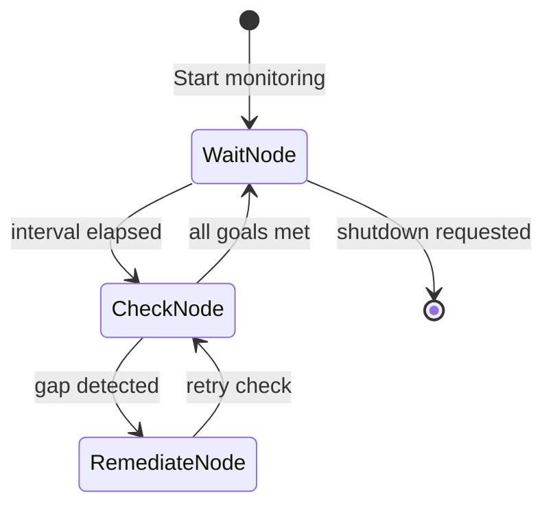

# Specification: Goal Monitoring (Teleological Engine)

**Chapter:** 11
**Pattern Name:** Goal Monitoring
**Status:** V1 Lean
**Module:** `src/agentic_patterns/goal_monitoring.py`

## 1. Overview

Most agents are reactive - they wait for prompts. **Goal Monitoring** makes
agents proactive: they continuously check if goals are met and attempt
remediation when gaps are detected.

This V1 is intentionally lean. Production enhancements are documented in
Section 8.

## 2. V1 Scope

**Included:**
- 3-node pydantic_graph cycle (Wait → Check → Remediate)
- Simple `Goal` dataclass with async evaluator callable
- `GoalMonitor` class with start/stop lifecycle
- Remediation agent that attempts to fix gaps
- Stub `on_escalate()` for production integration

**Not included (see Production TODOs):**
- Persistence (P2)
- Advanced evaluators (P3)
- OKR hierarchy (P4)
- Logfire observability (P5)

## 3. Architecture

### 3.1 State Machine



### 3.2 Data Models

```python
from dataclasses import dataclass, field
from datetime import datetime
from typing import Callable, Awaitable, Literal


@dataclass
class Goal:
    """A single monitorable goal."""

    name: str
    target: float
    evaluator: Callable[[], Awaitable[float]]
    comparator: Literal[">=", "<=", "==", ">", "<"] = ">="
    remediation_hint: str = ""


@dataclass
class GoalStatus:
    """Result of checking a goal."""

    goal_name: str
    current_value: float
    target_value: float
    is_met: bool
    checked_at: datetime


@dataclass
class MonitorState:
    """Graph state for goal monitoring."""

    goals: list[Goal]
    check_interval: float = 60.0
    shutdown: bool = False
    current_gap: Goal | None = None
    last_status: list[GoalStatus] = field(default_factory=list)
```

### 3.3 Graph Nodes

```python
from pydantic_graph import BaseNode, End, Graph, GraphRunContext
import asyncio
from datetime import datetime


@dataclass
class WaitNode(BaseNode[MonitorState, None, None]):
    """Wait for next check interval."""

    async def run(
        self,
        ctx: GraphRunContext[MonitorState],
    ) -> "CheckNode" | End[None]:
        if ctx.state.shutdown:
            return End(None)

        await asyncio.sleep(ctx.state.check_interval)
        return CheckNode()


@dataclass
class CheckNode(BaseNode[MonitorState, None, None]):
    """Evaluate all goals."""

    async def run(
        self,
        ctx: GraphRunContext[MonitorState],
    ) -> WaitNode | "RemediateNode":
        state = ctx.state
        state.last_status = []

        for goal in state.goals:
            current = await goal.evaluator()
            is_met = self._check_met(current, goal.target, goal.comparator)

            state.last_status.append(GoalStatus(
                goal_name=goal.name,
                current_value=current,
                target_value=goal.target,
                is_met=is_met,
                checked_at=datetime.now(),
            ))

            if not is_met:
                state.current_gap = goal
                return RemediateNode()

        return WaitNode()

    def _check_met(
        self,
        current: float,
        target: float,
        comparator: str,
    ) -> bool:
        ops = {
            ">=": lambda c, t: c >= t,
            "<=": lambda c, t: c <= t,
            "==": lambda c, t: c == t,
            ">": lambda c, t: c > t,
            "<": lambda c, t: c < t,
        }
        return ops[comparator](current, target)


@dataclass
class RemediateNode(BaseNode[MonitorState, None, None]):
    """Attempt to fix a detected gap."""

    async def run(
        self,
        ctx: GraphRunContext[MonitorState],
    ) -> CheckNode:
        goal = ctx.state.current_gap
        if goal is None:
            return CheckNode()

        # Call remediation agent
        result = await remediation_agent.run(
            f"Goal '{goal.name}' is not met.\n"
            f"Hint: {goal.remediation_hint}\n"
            f"Take action to fix this."
        )

        if not result.output.success:
            # Escalate via stub (production: integrate alerting)
            await on_escalate(goal, result.output.error or "Remediation failed")

        ctx.state.current_gap = None
        return CheckNode()


# Graph definition
goal_monitor_graph: Graph[MonitorState, None, None] = Graph(
    nodes=[WaitNode, CheckNode, RemediateNode],
)
```

### 3.4 Remediation Agent

```python
from pydantic import BaseModel, Field
from pydantic_ai import Agent
from agentic_patterns._models import get_model


class RemediationResult(BaseModel):
    """Result of a remediation attempt."""

    success: bool
    action_taken: str = Field(description="What was done to fix the gap")
    error: str | None = None


model = get_model()

remediation_agent = Agent(
    model,
    system_prompt=(
        "You are a maintenance agent. When a goal is not met, "
        "take action to fix it. Describe what you did."
    ),
    output_type=RemediationResult,
)
```

### 3.5 Escalation Stub

```python
async def on_escalate(goal: Goal, error: str) -> None:
    """
    Stub for escalation handling.

    Production TODO (P1): Integrate with alerting system.

    Args:
        goal: The goal that failed remediation.
        error: Error message from remediation attempt.
    """
    print(f"ESCALATE: Goal '{goal.name}' - {error}")
```

### 3.6 Entry Point

```python
class GoalMonitor:
    """
    Manages goal monitoring lifecycle.

    Example:
        monitor = GoalMonitor(goals=[...], check_interval=60.0)
        await monitor.start()
        # ... later
        await monitor.stop()
    """

    def __init__(
        self,
        goals: list[Goal],
        check_interval: float = 60.0,
    ):
        self.goals = goals
        self.check_interval = check_interval
        self._task: asyncio.Task | None = None
        self._state: MonitorState | None = None

    async def start(self) -> None:
        """Start the monitoring loop."""
        self._state = MonitorState(
            goals=self.goals,
            check_interval=self.check_interval,
        )
        self._task = asyncio.create_task(self._run())

    async def stop(self) -> None:
        """Stop the monitoring loop gracefully."""
        if self._state:
            self._state.shutdown = True
        if self._task:
            await self._task

    async def _run(self) -> None:
        """Run the graph."""
        await goal_monitor_graph.run(WaitNode(), state=self._state)

    def get_status(self) -> list[GoalStatus]:
        """Get last check results."""
        return self._state.last_status if self._state else []


async def run_goal_monitor(
    goals: list[Goal],
    check_interval: float = 60.0,
) -> None:
    """
    Run goal monitoring until interrupted.

    Args:
        goals: Goals to monitor.
        check_interval: Seconds between checks.
    """
    monitor = GoalMonitor(goals, check_interval)
    await monitor.start()
    try:
        while not monitor._state.shutdown:
            await asyncio.sleep(1)
    finally:
        await monitor.stop()
```

## 4. Example Usage

```python
import asyncio

# Define evaluator functions
async def get_disk_usage() -> float:
    """Return disk usage percentage."""
    import shutil
    usage = shutil.disk_usage("/")
    return (usage.used / usage.total) * 100

async def get_memory_usage() -> float:
    """Return memory usage percentage."""
    import psutil
    return psutil.virtual_memory().percent

# Define goals
goals = [
    Goal(
        name="disk_space",
        target=80.0,
        comparator="<=",
        evaluator=get_disk_usage,
        remediation_hint="Clean up temp files and old logs",
    ),
    Goal(
        name="memory",
        target=90.0,
        comparator="<=",
        evaluator=get_memory_usage,
        remediation_hint="Restart memory-heavy services",
    ),
]

# Run monitor
async def main():
    monitor = GoalMonitor(goals, check_interval=300.0)
    await monitor.start()

    # Run for 1 hour
    await asyncio.sleep(3600)
    await monitor.stop()

    print("Final status:", monitor.get_status())

if __name__ == "__main__":
    asyncio.run(main())
```

## 5. Idiomatic Feature Table

| Feature | Used? | Implementation |
|---------|-------|----------------|
| `@output_validator` + `ModelRetry` | No | Remediation is best-effort |
| `@system_prompt` | No | Static prompt for remediation agent |
| `deps_type` + `RunContext` | No | State passed via graph context |
| `@tool` / `@tool_plain` | No | Evaluators are plain Python callables |
| `pydantic_graph` | **Yes (Stable)** | WaitNode → CheckNode → RemediateNode |

## 6. Test Strategy

### 6.1 Model Tests

```python
def test_goal_creation():
    async def dummy_eval():
        return 50.0

    goal = Goal(
        name="test",
        target=80.0,
        evaluator=dummy_eval,
    )
    assert goal.comparator == ">="
```

### 6.2 Node Tests

```python
@pytest.mark.asyncio
async def test_check_node_detects_gap():
    async def failing_eval():
        return 50.0  # Below target of 80

    goal = Goal(name="test", target=80.0, evaluator=failing_eval)
    state = MonitorState(goals=[goal])
    ctx = MagicMock()
    ctx.state = state

    node = CheckNode()
    next_node = await node.run(ctx)

    assert isinstance(next_node, RemediateNode)
    assert state.current_gap == goal


@pytest.mark.asyncio
async def test_check_node_passes_when_met():
    async def passing_eval():
        return 90.0  # Above target of 80

    goal = Goal(name="test", target=80.0, evaluator=passing_eval)
    state = MonitorState(goals=[goal])
    ctx = MagicMock()
    ctx.state = state

    node = CheckNode()
    next_node = await node.run(ctx)

    assert isinstance(next_node, WaitNode)
```

### 6.3 Lifecycle Tests

```python
@pytest.mark.asyncio
async def test_monitor_start_stop():
    async def always_met():
        return 100.0

    goal = Goal(name="test", target=80.0, evaluator=always_met)
    monitor = GoalMonitor([goal], check_interval=0.01)

    await monitor.start()
    assert monitor._task is not None

    await asyncio.sleep(0.05)
    await monitor.stop()

    assert monitor._task.done()


@pytest.mark.asyncio
async def test_shutdown_exits_wait():
    state = MonitorState(goals=[], shutdown=True)
    ctx = MagicMock()
    ctx.state = state

    node = WaitNode()
    with patch("asyncio.sleep"):
        result = await node.run(ctx)

    assert isinstance(result, End)
```

## 7. Edge Cases

1. **No goals:** Monitor runs but does nothing (empty check loop)
2. **Evaluator raises exception:** Log error, treat as goal not met
3. **Remediation fails:** Call `on_escalate()` stub, continue to next check
4. **Rapid shutdown:** WaitNode checks shutdown before sleeping
5. **All goals met:** Loop back to WaitNode, no remediation

## 8. Production TODOs

### P1: Escalation
- Add `EscalateNode` for repeated remediation failures
- Implement `on_escalate()` with real alerting (Slack, PagerDuty)
- Add `max_remediation_attempts` config
- Track remediation history per goal

### P2: Persistence
- Save `MonitorState` to JSON file
- Load state on startup for resume
- Add `state_path` parameter to `GoalMonitor`

```python
# Future API
monitor = GoalMonitor(
    goals=[...],
    state_path="./monitor_state.json",  # P2
)
```

### P3: Advanced Evaluators
- `file_stat_evaluator(path, metric)` - file age, size, exists
- `agent_assessment_evaluator(agent, prompt)` - LLM judgment
- `composite_evaluator(evals, logic)` - AND/OR combinations

```python
# Future API
Goal(
    name="readme_fresh",
    evaluator=file_stat_evaluator("README.md", "age_hours"),
    target=24.0,
    comparator="<=",
)
```

### P4: OKR Hierarchy
- `Objective` with multiple `KeyResult` children
- Priority ordering for check sequence
- Dependencies between objectives

```python
# Future API
objective = Objective(
    name="System Health",
    key_results=[
        KeyResult(name="disk", target=80.0, ...),
        KeyResult(name="memory", target=90.0, ...),
    ],
    priority=1,
)
```

### P5: Observability
- Logfire integration for structured logging
- Spans around remediation agent calls
- Metrics: goals_checked, gaps_detected, remediations_attempted

```python
# Future implementation
import logfire

logfire.info("goal_checked", goal=goal.name, met=is_met)
logfire.warn("goal_gap", goal=goal.name, current=val, target=target)

with logfire.span("remediation", goal=goal.name):
    result = await remediation_agent.run(...)
```

## 9. Integration Checklist

- [ ] Added to `scripts/integration_test.sh` ALL_PATTERNS array
- [ ] Exported from `src/agentic_patterns/__init__.py`
- [ ] `if __name__ == "__main__"` demo block
- [ ] Documentation at `docs/patterns/11-goal-monitoring.md`
