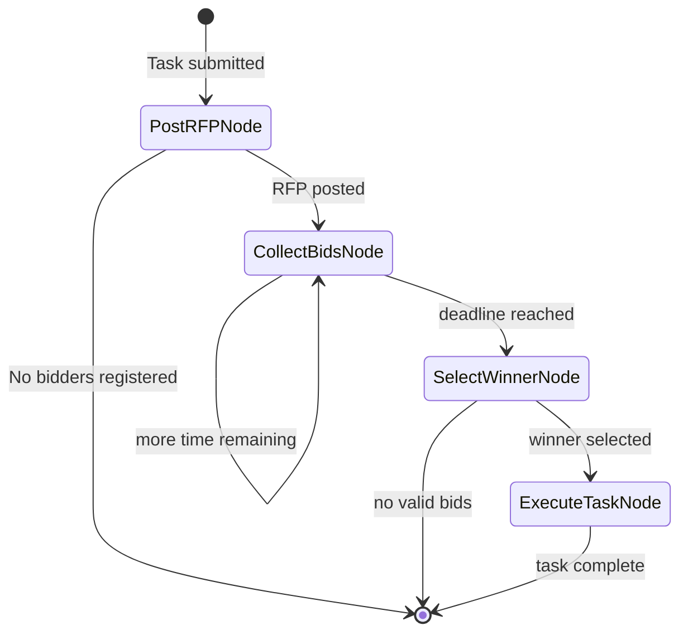

# Specification: The Agora (Inter-Agent Communication)

**Chapter:** 15
**Pattern Name:** The Agora
**Status:** Draft v2
**Module:** `src/agentic_patterns/agent_marketplace.py`

## 1. Overview

In complex systems, agents shouldn't be hard-wired to each other. **The Agora**
implements a decentralized communication pattern where agents function like
participants in a marketplace. They "bid" on tasks based on their skills and
capacity.

### 1.1 Distinction from Multi-Agent Pattern

| Aspect | Multi-Agent (Ch 7) | Agora (Ch 15) |
|--------|-------------------|---------------|
| Routing | Supervisor assigns tasks | Agents self-select via bidding |
| Coupling | Supervisor knows all workers | Requester doesn't know bidders |
| Discovery | Static worker registry | Dynamic capability discovery |
| Selection | Supervisor decides | Market-based (best bid wins) |

### 1.2 Why pydantic_graph

The bidding flow is a stateful workflow:
```
PostRFP → CollectBids → SelectWinner → Execute → Return
```

Using `pydantic_graph` stable API provides:
- Typed state machine for the auction process
- Mermaid visualization of the flow
- Clean separation: bidding vs execution

## 2. Architecture

### 2.1 State Machine



### 2.2 Data Models

```python
from dataclasses import dataclass, field
from datetime import datetime
from typing import Any, Literal
from uuid import UUID, uuid4
from pydantic import BaseModel, Field
from pydantic_ai import Agent


class AgentCapability(BaseModel):
    """Describes what an agent can do."""
    agent_id: str = Field(description="Unique agent identifier")
    name: str = Field(description="Human-readable name")
    skills: list[str] = Field(description="Skill tags (e.g., 'regex', 'sql')")
    description: str = Field(description="What this agent specializes in")
    max_concurrent: int = Field(default=3, description="Max parallel tasks")
    current_load: int = Field(default=0, description="Current active tasks")

    @property
    def available_capacity(self) -> int:
        return max(0, self.max_concurrent - self.current_load)


class TaskRFP(BaseModel):
    """Request for Proposal - a task seeking bids."""
    id: UUID = Field(default_factory=uuid4)
    requirement: str = Field(description="What needs to be done")
    required_skills: list[str] = Field(
        default_factory=list,
        description="Skills the bidder should have"
    )
    context: dict[str, Any] = Field(
        default_factory=dict,
        description="Additional context for the task"
    )
    deadline_ms: int = Field(
        default=5000,
        description="Bidding deadline in milliseconds"
    )
    min_confidence: float = Field(
        default=0.5,
        description="Minimum acceptable confidence score"
    )
    created_at: datetime = Field(default_factory=datetime.now)


class AgentBid(BaseModel):
    """A bid from an agent on an RFP."""
    rfp_id: UUID = Field(description="Which RFP this bids on")
    agent_id: str = Field(description="Bidding agent")
    confidence: float = Field(
        ge=0.0, le=1.0,
        description="How confident the agent is (0-1)"
    )
    proposal: str = Field(description="Brief approach description")
    estimated_tokens: int | None = Field(
        default=None,
        description="Estimated token cost if known"
    )
    metadata: dict[str, Any] = Field(default_factory=dict)


class BidEvaluation(BaseModel):
    """Evaluation of a bid for selection."""
    bid: AgentBid
    skill_match_score: float = Field(description="0-1 skill overlap")
    capacity_score: float = Field(description="0-1 based on availability")
    combined_score: float = Field(description="Weighted final score")


class TaskResult(BaseModel):
    """Result from winning bidder executing the task."""
    rfp_id: UUID
    agent_id: str
    success: bool
    output: str
    error_message: str | None = None
    execution_time_ms: int = 0


class BidSelectionStrategy(BaseModel):
    """How to select the winning bid."""
    strategy: Literal[
        "highest_confidence",
        "best_skill_match",
        "weighted_score",
        "agent_judgment"
    ] = "weighted_score"
    confidence_weight: float = Field(default=0.5, ge=0, le=1)
    skill_weight: float = Field(default=0.3, ge=0, le=1)
    capacity_weight: float = Field(default=0.2, ge=0, le=1)


@dataclass
class AgoraState:
    """State for the marketplace graph."""
    rfp: TaskRFP
    registered_bidders: list[AgentCapability]
    selection_strategy: BidSelectionStrategy = field(
        default_factory=BidSelectionStrategy
    )

    # Mutable state
    bids: list[AgentBid] = field(default_factory=list)
    evaluations: list[BidEvaluation] = field(default_factory=list)
    winning_bid: AgentBid | None = None
    result: TaskResult | None = None


@dataclass
class AgoraDeps:
    """Dependencies for the marketplace."""
    bidder_agents: dict[str, Agent]  # agent_id -> Agent instance
    bid_timeout_ms: int = 5000
    on_bid_received: Any | None = None  # Callback
    on_winner_selected: Any | None = None  # Callback
```

### 2.3 Bidder Agent Definition

```python
from pydantic_ai import Agent, RunContext
from agentic_patterns._models import get_model

model = get_model()


class BidResponse(BaseModel):
    """What a bidder agent returns when asked to bid."""
    will_bid: bool = Field(description="Whether to submit a bid")
    confidence: float = Field(
        ge=0.0, le=1.0,
        description="Confidence in ability to complete"
    )
    proposal: str = Field(description="Brief approach description")
    reasoning: str = Field(description="Why this confidence level")


@dataclass
class BidderContext:
    """Context passed to bidder agents."""
    rfp: TaskRFP
    own_capabilities: AgentCapability


def create_bidder_agent(capability: AgentCapability) -> Agent:
    """
    Create a bidder agent with specific capabilities.

    Each bidder has a system prompt describing its specialization.
    """
    return Agent(
        model,
        system_prompt=(
            f"You are {capability.name}, a specialist in: "
            f"{', '.join(capability.skills)}.\n\n"
            f"{capability.description}\n\n"
            "When presented with a task RFP, evaluate if you can help. "
            "Set will_bid=True only if your skills match. "
            "Be honest about your confidence level."
        ),
        output_type=BidResponse,
        deps_type=BidderContext,
    )


# Selector agent - chooses best bid when strategy="agent_judgment"
selector_agent = Agent(
    model,
    system_prompt=(
        "You are a procurement specialist. Given a task and multiple bids, "
        "select the best bid based on:\n"
        "1. Skill match with requirements\n"
        "2. Confidence level\n"
        "3. Quality of proposal\n"
        "Return the agent_id of the winning bidder."
    ),
    output_type=str,  # Returns winning agent_id
)


# Executor agent - fallback if winning bidder can't execute
executor_agent = Agent(
    model,
    system_prompt=(
        "Execute the given task based on the winning proposal approach."
    ),
    output_type=TaskResult,
)
```

### 2.4 Graph Nodes

```python
import asyncio
from pydantic_graph import BaseNode, End, Graph, GraphRunContext


@dataclass
class PostRFPNode(BaseNode[AgoraState, AgoraDeps, TaskResult]):
    """Post the RFP and prepare for bidding."""

    async def run(
        self,
        ctx: GraphRunContext[AgoraState, AgoraDeps],
    ) -> "CollectBidsNode" | End[TaskResult]:
        if not ctx.state.registered_bidders:
            return End(TaskResult(
                rfp_id=ctx.state.rfp.id,
                agent_id="",
                success=False,
                output="",
                error_message="No bidders registered",
            ))

        print(f"RFP Posted: {ctx.state.rfp.requirement[:50]}...")
        print(f"Seeking skills: {ctx.state.rfp.required_skills}")
        print(f"Registered bidders: {len(ctx.state.registered_bidders)}")

        return CollectBidsNode()


@dataclass
class CollectBidsNode(BaseNode[AgoraState, AgoraDeps, TaskResult]):
    """Collect bids from all registered bidders in parallel."""

    async def run(
        self,
        ctx: GraphRunContext[AgoraState, AgoraDeps],
    ) -> "SelectWinnerNode":
        rfp = ctx.state.rfp

        async def get_bid(capability: AgentCapability) -> AgentBid | None:
            agent = ctx.deps.bidder_agents.get(capability.agent_id)
            if not agent:
                return None

            if capability.available_capacity <= 0:
                return None  # At capacity

            try:
                bidder_ctx = BidderContext(
                    rfp=rfp,
                    own_capabilities=capability,
                )
                result = await asyncio.wait_for(
                    agent.run(
                        f"Evaluate this RFP and decide if you want to bid:\n\n"
                        f"Requirement: {rfp.requirement}\n"
                        f"Required skills: {rfp.required_skills}\n"
                        f"Context: {rfp.context}",
                        deps=bidder_ctx,
                    ),
                    timeout=ctx.deps.bid_timeout_ms / 1000,
                )
                response = result.output

                if response.will_bid:
                    return AgentBid(
                        rfp_id=rfp.id,
                        agent_id=capability.agent_id,
                        confidence=response.confidence,
                        proposal=response.proposal,
                    )
            except asyncio.TimeoutError:
                print(f"Bid timeout: {capability.agent_id}")
            except Exception as e:
                print(f"Bid error from {capability.agent_id}: {e}")

            return None

        # Collect bids in parallel
        bid_tasks = [get_bid(cap) for cap in ctx.state.registered_bidders]
        results = await asyncio.gather(*bid_tasks)

        ctx.state.bids = [b for b in results if b is not None]
        print(f"Received {len(ctx.state.bids)} bids")

        if ctx.deps.on_bid_received:
            for bid in ctx.state.bids:
                await ctx.deps.on_bid_received(bid)

        return SelectWinnerNode()


@dataclass
class SelectWinnerNode(BaseNode[AgoraState, AgoraDeps, TaskResult]):
    """Select the winning bid."""

    async def run(
        self,
        ctx: GraphRunContext[AgoraState, AgoraDeps],
    ) -> "ExecuteTaskNode" | End[TaskResult]:
        rfp = ctx.state.rfp
        bids = ctx.state.bids
        strategy = ctx.state.selection_strategy

        # Filter by minimum confidence
        valid_bids = [b for b in bids if b.confidence >= rfp.min_confidence]

        if not valid_bids:
            return End(TaskResult(
                rfp_id=rfp.id,
                agent_id="",
                success=False,
                output="",
                error_message="No bids met minimum confidence threshold",
            ))

        # Evaluate bids
        evaluations = []
        for bid in valid_bids:
            capability = next(
                (c for c in ctx.state.registered_bidders
                 if c.agent_id == bid.agent_id),
                None
            )
            if not capability:
                continue

            skill_match = self._calc_skill_match(
                capability.skills,
                rfp.required_skills
            )
            capacity = capability.available_capacity / capability.max_concurrent

            combined = (
                strategy.confidence_weight * bid.confidence +
                strategy.skill_weight * skill_match +
                strategy.capacity_weight * capacity
            )

            evaluations.append(BidEvaluation(
                bid=bid,
                skill_match_score=skill_match,
                capacity_score=capacity,
                combined_score=combined,
            ))

        ctx.state.evaluations = evaluations

        # Select winner based on strategy
        if strategy.strategy == "highest_confidence":
            winner = max(evaluations, key=lambda e: e.bid.confidence)
        elif strategy.strategy == "best_skill_match":
            winner = max(evaluations, key=lambda e: e.skill_match_score)
        elif strategy.strategy == "agent_judgment":
            winner = await self._agent_select(evaluations, rfp)
        else:  # weighted_score
            winner = max(evaluations, key=lambda e: e.combined_score)

        ctx.state.winning_bid = winner.bid
        print(f"Winner: {winner.bid.agent_id} (score: {winner.combined_score:.2f})")

        if ctx.deps.on_winner_selected:
            await ctx.deps.on_winner_selected(winner.bid)

        return ExecuteTaskNode()

    def _calc_skill_match(
        self,
        agent_skills: list[str],
        required: list[str],
    ) -> float:
        if not required:
            return 1.0
        matched = set(agent_skills) & set(required)
        return len(matched) / len(required)

    async def _agent_select(
        self,
        evaluations: list[BidEvaluation],
        rfp: TaskRFP,
    ) -> BidEvaluation:
        bids_text = "\n".join(
            f"- {e.bid.agent_id}: confidence={e.bid.confidence}, "
            f"proposal={e.bid.proposal}"
            for e in evaluations
        )
        result = await selector_agent.run(
            f"Task: {rfp.requirement}\n\nBids:\n{bids_text}\n\n"
            f"Which agent_id should win?"
        )
        winner_id = result.output
        return next(
            (e for e in evaluations if e.bid.agent_id == winner_id),
            evaluations[0]
        )


@dataclass
class ExecuteTaskNode(BaseNode[AgoraState, AgoraDeps, TaskResult]):
    """Execute the task with the winning bidder."""

    async def run(
        self,
        ctx: GraphRunContext[AgoraState, AgoraDeps],
    ) -> End[TaskResult]:
        import time

        rfp = ctx.state.rfp
        bid = ctx.state.winning_bid

        if not bid:
            return End(TaskResult(
                rfp_id=rfp.id,
                agent_id="",
                success=False,
                output="",
                error_message="No winning bid",
            ))

        start = time.time()

        # Get the winning agent
        agent = ctx.deps.bidder_agents.get(bid.agent_id)

        if agent:
            try:
                result = await agent.run(
                    f"Execute this task using your proposed approach:\n\n"
                    f"Task: {rfp.requirement}\n"
                    f"Your proposal: {bid.proposal}\n"
                    f"Context: {rfp.context}",
                )
                output = str(result.output)
                success = True
                error = None
            except Exception as e:
                output = ""
                success = False
                error = str(e)
        else:
            # Fallback to generic executor
            result = await executor_agent.run(
                f"Task: {rfp.requirement}\nApproach: {bid.proposal}"
            )
            output = result.output.output
            success = result.output.success
            error = result.output.error_message

        elapsed_ms = int((time.time() - start) * 1000)

        task_result = TaskResult(
            rfp_id=rfp.id,
            agent_id=bid.agent_id,
            success=success,
            output=output,
            error_message=error,
            execution_time_ms=elapsed_ms,
        )

        ctx.state.result = task_result
        return End(task_result)


# Define the graph
agora_graph: Graph[AgoraState, AgoraDeps, TaskResult] = Graph(
    nodes=[PostRFPNode, CollectBidsNode, SelectWinnerNode, ExecuteTaskNode],
)
```

### 2.5 Entry Point

```python
async def run_marketplace_task(
    rfp: TaskRFP,
    bidders: list[tuple[AgentCapability, Agent]],
    selection_strategy: BidSelectionStrategy | None = None,
) -> TaskResult:
    """
    Run a task through the marketplace.

    Args:
        rfp: The task request.
        bidders: List of (capability, agent) tuples.
        selection_strategy: How to select the winner.

    Returns:
        TaskResult from the winning bidder.

    Example:
        # Create specialized bidders
        regex_cap = AgentCapability(
            agent_id="regex-expert",
            name="Regex Expert",
            skills=["regex", "text-processing"],
            description="Expert at complex regex patterns",
        )
        regex_agent = create_bidder_agent(regex_cap)

        sql_cap = AgentCapability(
            agent_id="sql-expert",
            name="SQL Expert",
            skills=["sql", "databases"],
            description="Expert at SQL queries",
        )
        sql_agent = create_bidder_agent(sql_cap)

        # Post task
        result = await run_marketplace_task(
            rfp=TaskRFP(
                requirement="Write a regex to validate email addresses",
                required_skills=["regex"],
            ),
            bidders=[(regex_cap, regex_agent), (sql_cap, sql_agent)],
        )
    """
    state = AgoraState(
        rfp=rfp,
        registered_bidders=[cap for cap, _ in bidders],
        selection_strategy=selection_strategy or BidSelectionStrategy(),
    )

    deps = AgoraDeps(
        bidder_agents={cap.agent_id: agent for cap, agent in bidders},
    )

    result = await agora_graph.run(PostRFPNode(), state=state, deps=deps)
    return result.output
```

## 3. Idiomatic Feature Table

| Feature | Used? | Implementation |
|---------|-------|----------------|
| `@output_validator` + `ModelRetry` | No | Bids accepted as-is, no validation loop |
| `@system_prompt` | Yes | Each bidder has capability-based system prompt |
| `deps_type` + `RunContext` | Yes | `BidderContext` for RFP + capabilities, `AgoraDeps` for agent registry |
| `@tool` / `@tool_plain` | No | Bidding is via structured output, not tools |
| `pydantic_graph` | **Yes (Stable)** | PostRFP → CollectBids → SelectWinner → Execute |

## 4. Test Strategy

### 4.1 Unit Tests

```python
import pytest
from unittest.mock import AsyncMock, MagicMock
from uuid import uuid4


@pytest.fixture
def sample_rfp():
    return TaskRFP(
        id=uuid4(),
        requirement="Write a complex regex",
        required_skills=["regex"],
    )


@pytest.fixture
def sample_bidders():
    return [
        AgentCapability(
            agent_id="regex-1",
            name="Regex Expert",
            skills=["regex", "text"],
            description="Good at regex",
        ),
        AgentCapability(
            agent_id="sql-1",
            name="SQL Expert",
            skills=["sql"],
            description="Good at SQL",
        ),
    ]


async def test_collect_bids_filters_by_skill(sample_rfp, sample_bidders):
    """Bidders should only bid if skills match."""
    # Regex expert bids, SQL expert doesn't
    regex_response = BidResponse(
        will_bid=True,
        confidence=0.9,
        proposal="I can do this",
        reasoning="Regex is my specialty",
    )
    sql_response = BidResponse(
        will_bid=False,
        confidence=0.1,
        proposal="",
        reasoning="Not my area",
    )

    regex_agent = MagicMock()
    regex_agent.run = AsyncMock(return_value=MagicMock(output=regex_response))

    sql_agent = MagicMock()
    sql_agent.run = AsyncMock(return_value=MagicMock(output=sql_response))

    state = AgoraState(rfp=sample_rfp, registered_bidders=sample_bidders)
    deps = AgoraDeps(bidder_agents={
        "regex-1": regex_agent,
        "sql-1": sql_agent,
    })

    ctx = MagicMock()
    ctx.state = state
    ctx.deps = deps

    node = CollectBidsNode()
    await node.run(ctx)

    assert len(state.bids) == 1
    assert state.bids[0].agent_id == "regex-1"


async def test_select_winner_by_confidence(sample_rfp):
    """Should select highest confidence when strategy is highest_confidence."""
    bids = [
        AgentBid(rfp_id=sample_rfp.id, agent_id="a", confidence=0.7, proposal=""),
        AgentBid(rfp_id=sample_rfp.id, agent_id="b", confidence=0.9, proposal=""),
    ]

    state = AgoraState(
        rfp=sample_rfp,
        registered_bidders=[
            AgentCapability(agent_id="a", name="A", skills=[], description=""),
            AgentCapability(agent_id="b", name="B", skills=[], description=""),
        ],
        selection_strategy=BidSelectionStrategy(strategy="highest_confidence"),
    )
    state.bids = bids

    ctx = MagicMock()
    ctx.state = state
    ctx.deps = AgoraDeps(bidder_agents={})

    node = SelectWinnerNode()
    await node.run(ctx)

    assert state.winning_bid.agent_id == "b"
```

### 4.2 Graph Tests

```python
async def test_full_marketplace_flow():
    """Test complete marketplace cycle."""
    rfp = TaskRFP(
        requirement="Calculate 2+2",
        required_skills=["math"],
    )

    math_cap = AgentCapability(
        agent_id="math-agent",
        name="Math Expert",
        skills=["math", "calculation"],
        description="Good at math",
    )

    # Mock agent that bids and executes
    mock_agent = MagicMock()
    mock_agent.run = AsyncMock(side_effect=[
        MagicMock(output=BidResponse(
            will_bid=True,
            confidence=0.95,
            proposal="Simple addition",
            reasoning="Basic math",
        )),
        MagicMock(output="4"),  # Execution result
    ])

    result = await run_marketplace_task(
        rfp=rfp,
        bidders=[(math_cap, mock_agent)],
    )

    assert result.success
    assert result.agent_id == "math-agent"
    assert "4" in result.output
```

## 5. Edge Cases

1. **No bidders:** Return error result immediately
2. **All bids below threshold:** Return error, no winner
3. **Tie in scores:** First bidder wins (deterministic)
4. **Bidder timeout:** Skip that bidder, continue with others
5. **Winner fails execution:** Return failure result with error

## 6. Integration & Documentation

**Integration (TODO):**
- [ ] Added to `scripts/integration_test.sh` ALL_PATTERNS array
- [ ] Exported from `src/agentic_patterns/__init__.py`
- [ ] `if __name__ == "__main__"` demo block

**Documentation:**
- **Pattern page:** `docs/patterns/15-agent-marketplace.md`
- **Mermaid:** Sequence diagram showing RFP → Bid → Select → Execute
- **Use Cases:** Competitive task allocation, capability discovery
- **Example:** Project Manager agent posts RFP, specialists bid

**Open Questions:**
1. Should bids be blind or open?
2. How to prevent "Winner's Curse" (underbidding)?
3. Can agents form coalitions?
4. How to handle task cancellation?

## 6. Review & Refinement Areas

### 6.1 Agentic Selection Logic
**Concern:** The spec suggests simple cost/confidence selection. For creative tasks, this is insufficient.
**Refinement:** The implementation should support an optional `JudgeAgent` (a separate LLM) that reviews the qualitative `proposal` field of the bids to make the final selection, demonstrating agent-to-agent evaluation.

### 6.2 Bidding Concurrency & Reliability
**Concern:** A single slow agent shouldn't block the marketplace.
**Refinement:** The `AgoraBus` must implement a strict `asyncio.wait_for` timeout on the bidding phase. Late bids are discarded to ensure the system remains responsive.

### 6.3 Structured Proposals
**Concern:** Loose text proposals are hard to evaluate.
**Refinement:** Use `pydantic-ai`'s `result_type` to force agents to provide structured bids (e.g., separating "Implementation Plan" from "Confidence Score"), making it easier for both code and other agents to process.

## 7. Production Reality Check & Recommendations

### 7.1 When to Use The Agora
This pattern is complex. For static workflows where you know the agents ahead of time, use **Router (Chapter 2)** or **Supervisor (Chapter 7)**. Use The Agora only when:
*   The worker pool is dynamic (agents join/leave).
*   Cost/Latency tradeoffs vary per request.
*   You want to simulate a competitive environment (e.g., multi-model voting).

### 7.2 Recommended Demo Topic: "The Code Review Marketplace"
To demonstrate value without over-engineering, the example should feature:
1.  **Requester:** A "Pull Request Manager" needing a review.
2.  **Bidder A ("The Linter"):** Fast, cheap, deterministic (Python tools).
3.  **Bidder B ("The Security Auditor"):** Slow, expensive, deep (LLM).
4.  **Scenario:** The Marketplace selects Bidder A for "style fixes" but Bidder B for "auth logic," demonstrating dynamic selection based on context.

### 7.3 Production Requirements (What's Missing)
To make this system production-ready, you would need:
1.  **Durable Message Bus:** Replace `asyncio.Queue` with Redis Streams, RabbitMQ, or NATS to handle process crashes.
2.  **Distributed Tracing:** Implementing OpenTelemetry (Logfire) is critical to visualize the async fan-out.
3.  **Economic Layer:** A real marketplace needs quota tracking, "credits," or rate limiting to prevent "Winner's Curse" (agents over-promising).
4.  **Deadlock Prevention:** Circuit breakers for recursive RFPs (agents hiring agents hiring agents).
