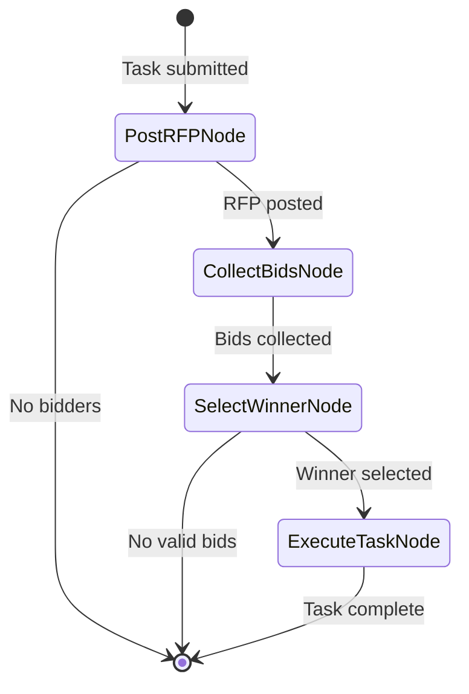

# Specification: The Agora - Core Pattern (Milestone 1)

**Chapter:** 15a
**Pattern Name:** The Agora (Core)
**Status:** Draft
**Module:** `src/agentic_patterns/agent_marketplace.py`

## 1. Overview

The Agora implements a decentralized marketplace where agents bid on tasks based
on their capabilities. Unlike the Multi-Agent pattern (Ch 7) where a supervisor
assigns tasks, here agents self-select through competitive bidding.

### 1.1 Distinction from Multi-Agent

| Aspect | Multi-Agent (Ch 7) | Agora (Ch 15) |
|--------|-------------------|---------------|
| Routing | Supervisor assigns | Agents self-select via bidding |
| Coupling | Supervisor knows workers | Requester doesn't know bidders |
| Discovery | Static worker registry | Dynamic capability discovery |
| Selection | Supervisor decides | Market-based (best bid wins) |

### 1.2 Core Flow



## 2. Data Models

```python
from dataclasses import dataclass, field
from typing import Any
from uuid import UUID, uuid4
from pydantic import BaseModel, Field
from pydantic_ai import Agent


class AgentCapability(BaseModel):
    """Describes what an agent can do."""
    agent_id: str = Field(description="Unique agent identifier")
    name: str = Field(description="Human-readable name")
    skills: list[str] = Field(description="Skill tags")
    description: str = Field(description="Specialization description")


class TaskRFP(BaseModel):
    """Request for Proposal - a task seeking bids."""
    id: UUID = Field(default_factory=uuid4)
    requirement: str = Field(description="What needs to be done")
    required_skills: list[str] = Field(
        default_factory=list,
        description="Skills the bidder should have"
    )
    context: dict[str, Any] = Field(
        default_factory=dict,
        description="Additional context"
    )
    min_confidence: float = Field(
        default=0.5,
        description="Minimum acceptable confidence"
    )


class AgentBid(BaseModel):
    """A bid from an agent on an RFP."""
    rfp_id: UUID
    agent_id: str
    confidence: float = Field(ge=0.0, le=1.0)
    proposal: str = Field(description="Brief approach description")


class TaskResult(BaseModel):
    """Result from the winning bidder."""
    rfp_id: UUID
    agent_id: str
    success: bool
    output: str
    error_message: str | None = None


@dataclass
class AgoraState:
    """Graph state for the marketplace."""
    rfp: TaskRFP
    registered_bidders: list[AgentCapability]
    bidder_agents: dict[str, Agent]  # agent_id -> Agent
    bids: list[AgentBid] = field(default_factory=list)
    winning_bid: AgentBid | None = None
    result: TaskResult | None = None
```

## 3. Bidder Agent

```python
from pydantic_ai import Agent, RunContext
from agentic_patterns._models import get_model


class BidResponse(BaseModel):
    """What a bidder returns when asked to bid."""
    will_bid: bool
    confidence: float = Field(ge=0.0, le=1.0)
    proposal: str
    reasoning: str


@dataclass
class BidderContext:
    """Context for bidder agents."""
    rfp: TaskRFP
    own_capabilities: AgentCapability


def create_bidder_agent(capability: AgentCapability) -> Agent:
    """Create a bidder agent with specific capabilities."""
    return Agent(
        get_model(),
        system_prompt=(
            f"You are {capability.name}, specializing in: "
            f"{', '.join(capability.skills)}.\n\n"
            f"{capability.description}\n\n"
            "When presented with a task RFP, evaluate if you can help. "
            "Set will_bid=True only if your skills match. "
            "Be honest about your confidence level."
        ),
        output_type=BidResponse,
        deps_type=BidderContext,
    )
```

## 4. Graph Nodes

```python
from pydantic_graph import BaseNode, End, Graph, GraphRunContext


@dataclass
class PostRFPNode(BaseNode[AgoraState, None, TaskResult]):
    """Post RFP and validate bidders exist."""

    async def run(self, ctx: GraphRunContext[AgoraState]) -> ...:
        if not ctx.state.registered_bidders:
            return End(TaskResult(
                rfp_id=ctx.state.rfp.id,
                agent_id="",
                success=False,
                output="",
                error_message="No bidders registered",
            ))
        return CollectBidsNode()


@dataclass
class CollectBidsNode(BaseNode[AgoraState, None, TaskResult]):
    """Collect bids from all bidders in parallel."""

    async def run(self, ctx: GraphRunContext[AgoraState]) -> ...:
        import asyncio

        async def get_bid(cap: AgentCapability) -> AgentBid | None:
            agent = ctx.state.bidder_agents.get(cap.agent_id)
            if not agent:
                return None
            try:
                result = await asyncio.wait_for(
                    agent.run(
                        f"RFP: {ctx.state.rfp.requirement}\n"
                        f"Skills needed: {ctx.state.rfp.required_skills}",
                        deps=BidderContext(ctx.state.rfp, cap),
                    ),
                    timeout=5.0,
                )
                if result.output.will_bid:
                    return AgentBid(
                        rfp_id=ctx.state.rfp.id,
                        agent_id=cap.agent_id,
                        confidence=result.output.confidence,
                        proposal=result.output.proposal,
                    )
            except asyncio.TimeoutError:
                pass
            return None

        tasks = [get_bid(cap) for cap in ctx.state.registered_bidders]
        results = await asyncio.gather(*tasks)
        ctx.state.bids = [b for b in results if b]
        return SelectWinnerNode()


@dataclass
class SelectWinnerNode(BaseNode[AgoraState, None, TaskResult]):
    """Select winning bid using weighted scoring."""

    async def run(self, ctx: GraphRunContext[AgoraState]) -> ...:
        rfp = ctx.state.rfp
        valid = [b for b in ctx.state.bids if b.confidence >= rfp.min_confidence]

        if not valid:
            return End(TaskResult(
                rfp_id=rfp.id,
                agent_id="",
                success=False,
                output="",
                error_message="No bids met minimum confidence",
            ))

        # Weighted score: confidence * skill_match
        def score(bid: AgentBid) -> float:
            cap = next(
                (c for c in ctx.state.registered_bidders
                 if c.agent_id == bid.agent_id), None
            )
            if not cap or not rfp.required_skills:
                return bid.confidence
            matched = len(set(cap.skills) & set(rfp.required_skills))
            skill_score = matched / len(rfp.required_skills)
            return 0.6 * bid.confidence + 0.4 * skill_score

        ctx.state.winning_bid = max(valid, key=score)
        return ExecuteTaskNode()


@dataclass
class ExecuteTaskNode(BaseNode[AgoraState, None, TaskResult]):
    """Execute task with winning bidder."""

    async def run(self, ctx: GraphRunContext[AgoraState]) -> End[TaskResult]:
        bid = ctx.state.winning_bid
        agent = ctx.state.bidder_agents.get(bid.agent_id)

        try:
            result = await agent.run(
                f"Execute: {ctx.state.rfp.requirement}\n"
                f"Your approach: {bid.proposal}"
            )
            return End(TaskResult(
                rfp_id=ctx.state.rfp.id,
                agent_id=bid.agent_id,
                success=True,
                output=str(result.output),
            ))
        except Exception as e:
            return End(TaskResult(
                rfp_id=ctx.state.rfp.id,
                agent_id=bid.agent_id,
                success=False,
                output="",
                error_message=str(e),
            ))


agora_graph: Graph[AgoraState, None, TaskResult] = Graph(
    nodes=[PostRFPNode, CollectBidsNode, SelectWinnerNode, ExecuteTaskNode],
)
```

## 5. Entry Point

```python
async def run_marketplace_task(
    rfp: TaskRFP,
    bidders: list[tuple[AgentCapability, Agent]],
) -> TaskResult:
    """
    Run a task through the marketplace.

    Example:
        summarizer = AgentCapability(
            agent_id="summarizer",
            name="Fast Summarizer",
            skills=["speed", "brevity"],
            description="Quick, concise summaries",
        )
        result = await run_marketplace_task(
            rfp=TaskRFP(
                requirement="Summarize this article for executives",
                required_skills=["brevity"],
            ),
            bidders=[(summarizer, create_bidder_agent(summarizer))],
        )
    """
    state = AgoraState(
        rfp=rfp,
        registered_bidders=[cap for cap, _ in bidders],
        bidder_agents={cap.agent_id: agent for cap, agent in bidders},
    )
    result = await agora_graph.run(PostRFPNode(), state=state)
    return result.output
```

## 6. Demo Example

Generic research auction with 3 specialists:

```python
if __name__ == "__main__":
    import asyncio

    async def main():
        # Create bidders
        summarizer = AgentCapability(
            agent_id="summarizer",
            name="Fast Summarizer",
            skills=["speed", "brevity", "extraction"],
            description="Quick summaries, executive style",
        )
        analyzer = AgentCapability(
            agent_id="analyzer",
            name="Deep Analyzer",
            skills=["thoroughness", "citations", "research"],
            description="Deep analysis with sources",
        )
        writer = AgentCapability(
            agent_id="writer",
            name="Creative Writer",
            skills=["engagement", "narrative", "storytelling"],
            description="Engaging narrative content",
        )

        bidders = [
            (summarizer, create_bidder_agent(summarizer)),
            (analyzer, create_bidder_agent(analyzer)),
            (writer, create_bidder_agent(writer)),
        ]

        # Post RFP
        rfp = TaskRFP(
            requirement="Summarize quantum computing advances for executives",
            required_skills=["brevity", "extraction"],
        )

        result = await run_marketplace_task(rfp, bidders)
        print(f"Winner: {result.agent_id}")
        print(f"Output: {result.output}")

    asyncio.run(main())
```

## 7. Test Strategy

```python
import pytest
from unittest.mock import AsyncMock, MagicMock


@pytest.fixture
def sample_rfp():
    return TaskRFP(
        requirement="Test task",
        required_skills=["skill_a"],
    )


@pytest.fixture
def sample_bidders():
    return [
        AgentCapability(
            agent_id="agent_a",
            name="Agent A",
            skills=["skill_a", "skill_b"],
            description="Test agent A",
        ),
        AgentCapability(
            agent_id="agent_b",
            name="Agent B",
            skills=["skill_c"],
            description="Test agent B",
        ),
    ]


async def test_no_bidders_returns_error(sample_rfp):
    """Empty bidder list returns error."""
    result = await run_marketplace_task(sample_rfp, [])
    assert not result.success
    assert "No bidders" in result.error_message


async def test_collect_bids_filters_non_bidders(sample_rfp, sample_bidders):
    """Only agents that will_bid are included."""
    # Mock agents where only agent_a bids
    ...


async def test_winner_selected_by_weighted_score(sample_rfp, sample_bidders):
    """Higher skill match + confidence wins."""
    ...


async def test_minimum_confidence_threshold(sample_rfp):
    """Bids below min_confidence are rejected."""
    ...


async def test_execution_success(sample_rfp, sample_bidders):
    """Winning agent executes task successfully."""
    ...


async def test_execution_failure_captured(sample_rfp, sample_bidders):
    """Execution errors are captured in result."""
    ...
```

## 8. Integration

- [ ] Export from `src/agentic_patterns/__init__.py`
- [ ] Add to `scripts/integration_test.sh` ALL_PATTERNS
- [ ] Create `docs/patterns/15-agent-marketplace.md`
