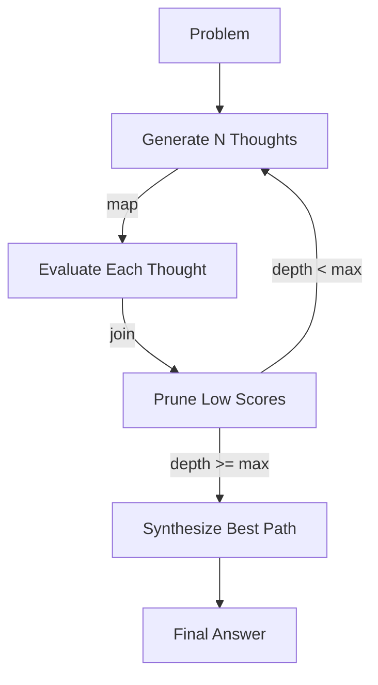

# Specification: The Cognitive Weaver (Reasoning)

**Chapter:** 17
**Pattern Name:** The Cognitive Weaver
**Status:** Draft v2
**Module:** `src/agentic_patterns/reasoning_weaver.py`

## 1. Overview

Simple "Chain of Thought" (CoT) is linear and brittle. **The Cognitive Weaver**
decouples the *reasoning process* from the *final response*. It allows agents
to use complex topologies like **Tree of Thoughts (ToT)**, **Graph of Thoughts
(GoT)**, or **Chain of Verification (CoVe)** to explore multiple solutions,
prune bad ideas, and synthesize the best path.

### 1.1 Why pydantic_graph.beta

Tree of Thoughts requires:
- **Fan-out:** Generate multiple candidate thoughts from one state
- **Parallel evaluation:** Score all thoughts concurrently
- **Fan-in:** Collect results and select best path
- **Iteration:** Repeat at each depth level

`pydantic_graph.beta` provides exactly these primitives:
- `.map()` for parallel fan-out over iterables
- `g.join()` for fan-in with reducers
- `g.decision()` for conditional branching

**Alternative considered:** Custom graph logic with `networkx`. Rejected because
`pydantic_graph.beta` provides typed state transitions, built-in reducers, and
Mermaid visualization without reinventing the wheel.

## 2. Architecture

### 2.1 Reasoning Flow



### 2.2 Data Models

```python
from dataclasses import dataclass, field
from typing import Literal, Any
from uuid import UUID, uuid4
from pydantic import BaseModel, Field


class ThoughtNode(BaseModel):
    """A single thought in the reasoning graph."""
    id: UUID = Field(default_factory=uuid4)
    parent_id: UUID | None = Field(
        default=None,
        description="Parent thought (None for root)"
    )
    thought: str = Field(description="The reasoning step content")
    score: float = Field(
        default=0.0, ge=0.0, le=1.0,
        description="Quality score from evaluator"
    )
    depth: int = Field(default=0, description="Depth in the tree")
    is_pruned: bool = Field(default=False, description="Marked for pruning")
    metadata: dict[str, Any] = Field(default_factory=dict)


class ThoughtEvaluation(BaseModel):
    """Evaluation result for a thought."""
    thought_id: UUID
    score: float = Field(ge=0.0, le=1.0, description="Quality score")
    reasoning: str = Field(description="Why this score")
    is_promising: bool = Field(description="Worth expanding further")


class ReasoningPath(BaseModel):
    """A complete path through the reasoning tree."""
    nodes: list[ThoughtNode] = Field(description="Nodes from root to leaf")
    total_score: float = Field(description="Sum or product of scores")

    @property
    def final_thought(self) -> str:
        return self.nodes[-1].thought if self.nodes else ""


class ReasoningResult(BaseModel):
    """Final result from reasoning process."""
    problem: str
    best_path: ReasoningPath
    all_paths: list[ReasoningPath] = Field(default_factory=list)
    final_answer: str
    total_thoughts_generated: int
    total_thoughts_pruned: int
    depth_reached: int


class ReasoningStrategy(BaseModel):
    """Configuration for reasoning topology."""
    strategy_type: Literal[
        "tree_of_thoughts",
        "beam_search",
        "best_first",
        "breadth_first"
    ] = "tree_of_thoughts"
    branching_factor: int = Field(
        default=3, ge=1, le=10,
        description="Thoughts to generate per node"
    )
    max_depth: int = Field(
        default=3, ge=1, le=10,
        description="Maximum tree depth"
    )
    beam_width: int = Field(
        default=2, ge=1,
        description="Top K thoughts to keep (beam search)"
    )
    prune_threshold: float = Field(
        default=0.3, ge=0.0, le=1.0,
        description="Min score to avoid pruning"
    )
    score_aggregation: Literal["sum", "product", "min", "average"] = "average"


@dataclass
class WeaverState:
    """State for the reasoning graph."""
    problem: str
    strategy: ReasoningStrategy

    # Mutable state
    all_thoughts: dict[UUID, ThoughtNode] = field(default_factory=dict)
    current_frontier: list[UUID] = field(default_factory=list)
    current_depth: int = 0
    best_path: ReasoningPath | None = None


@dataclass
class WeaverDeps:
    """Dependencies for the reasoning process."""
    thought_generator: Any  # Agent that generates thoughts
    thought_evaluator: Any  # Agent that scores thoughts
    synthesizer: Any  # Agent that produces final answer
```

### 2.3 Agents

```python
from pydantic_ai import Agent
from agentic_patterns._models import get_model

model = get_model()


class GeneratedThoughts(BaseModel):
    """Multiple thoughts generated from a prompt."""
    thoughts: list[str] = Field(
        description="Alternative reasoning paths"
    )


# Thought generator - creates multiple candidate thoughts
thought_generator = Agent(
    model,
    system_prompt=(
        "You are a creative reasoning engine. Given a problem and current "
        "reasoning state, generate MULTIPLE distinct approaches to continue.\n\n"
        "Each thought should:\n"
        "1. Be a single logical step\n"
        "2. Be clearly different from the others\n"
        "3. Move toward solving the problem\n\n"
        "Generate exactly the requested number of alternatives."
    ),
    output_type=GeneratedThoughts,
)


# Thought evaluator - scores individual thoughts
thought_evaluator = Agent(
    model,
    system_prompt=(
        "You are a critical evaluator of reasoning steps. Score each thought "
        "based on:\n"
        "1. Logical validity (no fallacies)\n"
        "2. Progress toward the goal\n"
        "3. Clarity and specificity\n"
        "4. Feasibility of the approach\n\n"
        "Score from 0.0 (worthless) to 1.0 (excellent).\n"
        "Set is_promising=True if this path is worth exploring further."
    ),
    output_type=ThoughtEvaluation,
)


# Synthesizer - combines best path into final answer
synthesizer_agent = Agent(
    model,
    system_prompt=(
        "You are a reasoning synthesizer. Given a problem and the best "
        "reasoning path found, produce a clear, final answer.\n\n"
        "Incorporate the insights from each reasoning step.\n"
        "Be concise but complete."
    ),
    output_type=str,
)
```

### 2.4 Graph Definition (pydantic_graph.beta)

```python
from pydantic_graph.beta import GraphBuilder, StepContext
from pydantic_graph.beta.join import reduce_list_append
import asyncio


g = GraphBuilder(state_type=WeaverState, output_type=ReasoningResult)


@g.step
async def initialize(
    ctx: StepContext[WeaverState, WeaverDeps, None],
) -> list[ThoughtNode]:
    """Create initial thoughts from the problem."""
    state = ctx.state
    deps = ctx.deps

    result = await deps.thought_generator.run(
        f"Problem: {state.problem}\n\n"
        f"Generate {state.strategy.branching_factor} distinct initial "
        f"approaches to solve this problem."
    )

    nodes = []
    for thought_text in result.output.thoughts:
        node = ThoughtNode(
            thought=thought_text,
            depth=0,
        )
        state.all_thoughts[node.id] = node
        nodes.append(node)

    state.current_frontier = [n.id for n in nodes]
    return nodes


@g.step
async def evaluate_thought(
    ctx: StepContext[WeaverState, WeaverDeps, ThoughtNode],
) -> ThoughtNode:
    """Evaluate a single thought (called in parallel via .map())."""
    thought = ctx.inputs
    deps = ctx.deps

    # Build context from parent chain
    path_context = _build_path_context(ctx.state, thought.id)

    result = await deps.thought_evaluator.run(
        f"Problem: {ctx.state.problem}\n\n"
        f"Reasoning path so far:\n{path_context}\n\n"
        f"Current thought to evaluate:\n{thought.thought}\n\n"
        f"Score this thought."
    )

    thought.score = result.output.score
    thought.is_pruned = not result.output.is_promising
    ctx.state.all_thoughts[thought.id] = thought

    return thought


@g.step
async def prune_and_expand(
    ctx: StepContext[WeaverState, WeaverDeps, list[ThoughtNode]],
) -> list[ThoughtNode] | ReasoningResult:
    """Prune low-scoring thoughts and expand survivors."""
    state = ctx.state
    deps = ctx.deps
    evaluated = ctx.inputs

    # Prune based on threshold
    survivors = [
        t for t in evaluated
        if t.score >= state.strategy.prune_threshold and not t.is_pruned
    ]

    # Apply beam width if using beam search
    if state.strategy.strategy_type == "beam_search":
        survivors = sorted(survivors, key=lambda t: -t.score)
        survivors = survivors[:state.strategy.beam_width]

    # Mark pruned thoughts
    pruned_ids = {t.id for t in evaluated} - {t.id for t in survivors}
    for pid in pruned_ids:
        if pid in state.all_thoughts:
            state.all_thoughts[pid].is_pruned = True

    state.current_depth += 1

    # Check termination
    if state.current_depth >= state.strategy.max_depth or not survivors:
        return await _synthesize_result(state, deps)

    # Expand survivors
    new_thoughts = []
    for parent in survivors:
        path_context = _build_path_context(state, parent.id)

        result = await deps.thought_generator.run(
            f"Problem: {state.problem}\n\n"
            f"Current reasoning:\n{path_context}\n\n"
            f"Generate {state.strategy.branching_factor} ways to continue "
            f"from: '{parent.thought}'"
        )

        for thought_text in result.output.thoughts:
            node = ThoughtNode(
                parent_id=parent.id,
                thought=thought_text,
                depth=state.current_depth,
            )
            state.all_thoughts[node.id] = node
            new_thoughts.append(node)

    state.current_frontier = [n.id for n in new_thoughts]
    return new_thoughts


# Helper to collect evaluated thoughts
collect_thoughts = g.join(reduce_list_append, initial_factory=list)


# Build the graph edges
g.add(
    # Start -> Initialize
    g.edge_from(g.start_node).to(initialize),

    # Initialize -> Evaluate (fan-out)
    g.edge_from(initialize).map().to(evaluate_thought),

    # Evaluate -> Collect (fan-in)
    g.edge_from(evaluate_thought).to(collect_thoughts),

    # Collect -> Prune/Expand
    g.edge_from(collect_thoughts).to(prune_and_expand),

    # Prune can either:
    # - Return more ThoughtNodes -> loop back to evaluate
    # - Return ReasoningResult -> end
    g.edge_from(prune_and_expand)
        .if_type(list)  # More thoughts
        .map()
        .to(evaluate_thought),

    g.edge_from(prune_and_expand)
        .if_type(ReasoningResult)  # Done
        .to(g.end_node),
)


# Build the graph
weaver_graph = g.build()


# Helper functions
def _build_path_context(state: WeaverState, thought_id: UUID) -> str:
    """Build context string from root to this thought."""
    path = []
    current_id = thought_id

    while current_id:
        thought = state.all_thoughts.get(current_id)
        if not thought:
            break
        path.append(f"Step {thought.depth + 1}: {thought.thought}")
        current_id = thought.parent_id

    return "\n".join(reversed(path))


def _find_best_path(state: WeaverState) -> ReasoningPath:
    """Find the highest-scoring path through the tree."""
    leaves = [
        t for t in state.all_thoughts.values()
        if not t.is_pruned and t.depth == state.current_depth - 1
    ]

    if not leaves:
        # Fallback to any non-pruned thought
        leaves = [t for t in state.all_thoughts.values() if not t.is_pruned]

    if not leaves:
        return ReasoningPath(nodes=[], total_score=0.0)

    best_leaf = max(leaves, key=lambda t: t.score)

    # Trace back to root
    path_nodes = []
    current = best_leaf
    while current:
        path_nodes.append(current)
        current = state.all_thoughts.get(current.parent_id) if current.parent_id else None

    path_nodes.reverse()

    # Calculate total score
    scores = [n.score for n in path_nodes]
    total = sum(scores) / len(scores) if scores else 0.0

    return ReasoningPath(nodes=path_nodes, total_score=total)


async def _synthesize_result(
    state: WeaverState,
    deps: WeaverDeps,
) -> ReasoningResult:
    """Synthesize final answer from best path."""
    best_path = _find_best_path(state)
    path_text = _build_path_context(
        state,
        best_path.nodes[-1].id if best_path.nodes else None
    )

    result = await deps.synthesizer.run(
        f"Problem: {state.problem}\n\n"
        f"Best reasoning path:\n{path_text}\n\n"
        f"Provide the final answer."
    )

    pruned_count = sum(1 for t in state.all_thoughts.values() if t.is_pruned)

    return ReasoningResult(
        problem=state.problem,
        best_path=best_path,
        final_answer=result.output,
        total_thoughts_generated=len(state.all_thoughts),
        total_thoughts_pruned=pruned_count,
        depth_reached=state.current_depth,
    )
```

### 2.5 Entry Point

```python
async def reason_with_topology(
    problem: str,
    strategy: ReasoningStrategy | None = None,
    generator: Agent | None = None,
    evaluator: Agent | None = None,
) -> ReasoningResult:
    """
    Solve a problem using structured reasoning topology.

    Args:
        problem: The problem to solve.
        strategy: Reasoning configuration (defaults to Tree of Thoughts).
        generator: Custom thought generator agent.
        evaluator: Custom thought evaluator agent.

    Returns:
        ReasoningResult with best path and final answer.

    Example:
        result = await reason_with_topology(
            problem="What's the best way to implement a cache with LRU eviction?",
            strategy=ReasoningStrategy(
                strategy_type="beam_search",
                branching_factor=3,
                max_depth=4,
                beam_width=2,
            ),
        )
        print(result.final_answer)
    """
    state = WeaverState(
        problem=problem,
        strategy=strategy or ReasoningStrategy(),
    )

    deps = WeaverDeps(
        thought_generator=generator or thought_generator,
        thought_evaluator=evaluator or thought_evaluator,
        synthesizer=synthesizer_agent,
    )

    result = await weaver_graph.run(state=state, deps=deps)
    return result.output


async def compare_strategies(
    problem: str,
    strategies: list[ReasoningStrategy],
) -> dict[str, ReasoningResult]:
    """
    Run multiple reasoning strategies on the same problem for comparison.

    Useful for evaluating which topology works best for different problem types.
    """
    results = {}

    for strategy in strategies:
        result = await reason_with_topology(problem, strategy)
        results[strategy.strategy_type] = result

    return results
```

## 3. Idiomatic Feature Table

| Feature | Used? | Implementation |
|---------|-------|----------------|
| `@output_validator` + `ModelRetry` | No | Scores accepted as-is from evaluator |
| `@system_prompt` | No | Static prompts, no runtime context injection |
| `deps_type` + `RunContext` | Yes | `WeaverDeps` holds agent instances |
| `@tool` / `@tool_plain` | No | Pure generation/evaluation, no external data |
| `pydantic_graph` | **Yes (Beta)** | `.map()` for fan-out, `g.join()` for fan-in |

## 4. Test Strategy

### 4.1 Unit Tests

```python
import pytest
from unittest.mock import AsyncMock, MagicMock
from uuid import uuid4


@pytest.fixture
def sample_strategy():
    return ReasoningStrategy(
        branching_factor=2,
        max_depth=2,
        beam_width=1,
    )


async def test_thought_generation():
    """Should generate multiple distinct thoughts."""
    mock_generator = MagicMock()
    mock_generator.run = AsyncMock(return_value=MagicMock(
        output=GeneratedThoughts(thoughts=["A", "B", "C"])
    ))

    state = WeaverState(
        problem="Test problem",
        strategy=ReasoningStrategy(branching_factor=3),
    )
    deps = WeaverDeps(
        thought_generator=mock_generator,
        thought_evaluator=MagicMock(),
        synthesizer=MagicMock(),
    )

    ctx = MagicMock()
    ctx.state = state
    ctx.deps = deps

    # Call initialize step
    result = await initialize(ctx)

    assert len(result) == 3
    assert len(state.all_thoughts) == 3


async def test_thought_evaluation():
    """Should score thoughts correctly."""
    thought = ThoughtNode(thought="Test thought", depth=0)

    mock_evaluator = MagicMock()
    mock_evaluator.run = AsyncMock(return_value=MagicMock(
        output=ThoughtEvaluation(
            thought_id=thought.id,
            score=0.8,
            reasoning="Good approach",
            is_promising=True,
        )
    ))

    state = WeaverState(
        problem="Test",
        strategy=ReasoningStrategy(),
    )
    state.all_thoughts[thought.id] = thought

    deps = WeaverDeps(
        thought_generator=MagicMock(),
        thought_evaluator=mock_evaluator,
        synthesizer=MagicMock(),
    )

    ctx = MagicMock()
    ctx.state = state
    ctx.deps = deps
    ctx.inputs = thought

    result = await evaluate_thought(ctx)

    assert result.score == 0.8
    assert not result.is_pruned


async def test_pruning_threshold():
    """Should prune thoughts below threshold."""
    good_thought = ThoughtNode(thought="Good", depth=0, score=0.8)
    bad_thought = ThoughtNode(thought="Bad", depth=0, score=0.2)

    state = WeaverState(
        problem="Test",
        strategy=ReasoningStrategy(prune_threshold=0.5, max_depth=1),
    )
    state.all_thoughts = {
        good_thought.id: good_thought,
        bad_thought.id: bad_thought,
    }

    # After pruning, only good_thought survives
    # (This tests the logic in prune_and_expand)
```

### 4.2 Integration Tests

```python
async def test_full_reasoning_cycle():
    """Test complete Tree of Thoughts reasoning."""
    # Use deterministic mocks
    thoughts_sequence = [
        ["Approach A", "Approach B"],  # Initial
        ["A1", "A2"],  # Expanding A
    ]
    scores_sequence = [0.7, 0.9, 0.8, 0.85]

    call_idx = {"gen": 0, "eval": 0}

    mock_gen = MagicMock()
    async def gen_thoughts(*args, **kwargs):
        idx = min(call_idx["gen"], len(thoughts_sequence) - 1)
        call_idx["gen"] += 1
        return MagicMock(output=GeneratedThoughts(
            thoughts=thoughts_sequence[idx]
        ))
    mock_gen.run = gen_thoughts

    mock_eval = MagicMock()
    async def eval_thought(*args, **kwargs):
        idx = min(call_idx["eval"], len(scores_sequence) - 1)
        score = scores_sequence[idx]
        call_idx["eval"] += 1
        return MagicMock(output=ThoughtEvaluation(
            thought_id=uuid4(),
            score=score,
            reasoning="OK",
            is_promising=score > 0.5,
        ))
    mock_eval.run = eval_thought

    mock_synth = MagicMock()
    mock_synth.run = AsyncMock(return_value=MagicMock(
        output="Final synthesized answer"
    ))

    result = await reason_with_topology(
        problem="Test problem",
        strategy=ReasoningStrategy(
            branching_factor=2,
            max_depth=2,
        ),
        generator=mock_gen,
        evaluator=mock_eval,
    )

    assert result.final_answer == "Final synthesized answer"
    assert result.depth_reached >= 1
```

## 5. Edge Cases

1. **All thoughts pruned:** Fall back to root thoughts for synthesis
2. **Single branch:** Degenerate to Chain of Thought
3. **Max depth reached:** Synthesize from best available path
4. **Evaluator always returns 0:** Everything pruned, use first thought
5. **Generator returns duplicates:** Should still work, may have redundant paths

## 6. Integration & Documentation

**Integration (TODO):**
- [ ] Added to `scripts/integration_test.sh` ALL_PATTERNS array
- [ ] Exported from `src/agentic_patterns/__init__.py`
- [ ] `if __name__ == "__main__"` demo block

**Documentation:**
- **Pattern page:** `docs/patterns/17-reasoning-weaver.md`
- **Mermaid:** Tree visualization with pruned branches marked
- **Use Cases:** Complex problem solving, debugging, planning
- **Example:** Math puzzle, logic riddle, architecture decision
- **Comparison:** Show same problem with CoT vs ToT vs Beam Search

## 7. Open Questions

1. Can thoughts be shared between branches?
2. How to detect circular reasoning in GoT?
3. Should the user see the thought process?
4. Can we cache thoughts?

## 6. Review & Refinement Areas

### 6.1 Tree of Thoughts (ToT) Focus
**Concern:** Graph of Thoughts (GoT) with merging and cycles is architecturally complex and can be hard to follow in a basic example.
**Refinement:** The primary implementation should focus on a clean, robust **Tree of Thoughts** (ToT). This demonstrates "Lookahead" and "Backtracking" clearly while keeping the code accessible.

### 6.2 Token & Context Management
**Concern:** Branching reasoning (e.g., exploring 3 paths to depth 4) can quickly exhaust context and budget.
**Refinement:** The Weaver must include a `max_nodes` or `max_tokens` circuit breaker. We should document that this pattern is intended for high-stakes reasoning, not routine requests.

### 6.3 Thought-Trace Visualization
**Concern:** The "Thinking" process is invisible to the user, making it hard to trust the output.
**Refinement:** The implementation should include a built-in method to export the reasoning tree as a **Mermaid** diagram. This is a core "working example" feature that makes the internal state observable.
