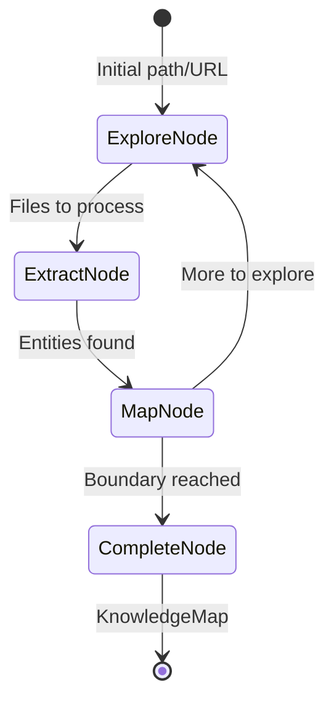

# Specification: The Cartographer (Exploration)

**Chapter:** 21
**Pattern Name:** The Cartographer
**Status:** Draft v2
**Module:** `src/agentic_patterns/domain_exploration.py`

## 1. Overview

Most RAG systems are passive—they only index what they're told. **The
Cartographer** is an autonomous Discovery Agent. When pointed at an unknown
domain (a GitHub repo, a local directory, a website), it crawls the space,
identifies entities, and builds a persistent **Semantic Map** (Knowledge Graph).

### 1.1 What This Pattern Adds

Standard RAG indexes documents in isolation. The Cartographer adds:

| Capability | Standard RAG | Cartographer |
|------------|--------------|--------------|
| Index documents | Manual/triggered | Autonomous discovery |
| Entity extraction | Document chunks | Semantic entities |
| Relationships | None | Knowledge graph |
| Navigation | Keyword search | Graph traversal |
| Boundaries | All or nothing | Configurable depth/scope |

### 1.2 Use Cases

1. **Codebase onboarding:** Explore a new repo and build a map of modules,
   classes, and dependencies
2. **Technical debt analysis:** Identify orphan modules, circular dependencies,
   undocumented APIs
3. **Documentation gap detection:** Find code entities without corresponding docs
4. **Domain modeling:** Extract business concepts from a corpus of documents

## 2. Architecture

### 2.1 Data Flow



### 2.2 Data Models

```python
from dataclasses import dataclass, field
from typing import Literal, Any
from pydantic import BaseModel, Field
from datetime import datetime


class SemanticEntity(BaseModel):
    """An entity discovered during exploration."""
    id: str = Field(description="Unique identifier (hash of type+name+location)")
    name: str = Field(description="Entity name")
    entity_type: Literal[
        "module", "class", "function", "variable",
        "concept", "document", "api_endpoint"
    ] = Field(description="Type of entity")
    summary: str = Field(description="Brief description of the entity")
    location: str = Field(description="File path or URL where entity was found")
    line_start: int | None = Field(
        default=None,
        description="Starting line number in source"
    )
    line_end: int | None = Field(
        default=None,
        description="Ending line number in source"
    )
    embedding: list[float] | None = Field(
        default=None,
        description="Vector embedding for similarity search"
    )
    metadata: dict[str, Any] = Field(
        default_factory=dict,
        description="Additional entity-specific metadata"
    )


class SemanticLink(BaseModel):
    """A relationship between two entities."""
    source_id: str = Field(description="Source entity ID")
    target_id: str = Field(description="Target entity ID")
    relationship: Literal[
        "imports", "calls", "defines", "references",
        "inherits", "implements", "contains", "depends_on"
    ] = Field(description="Type of relationship")
    weight: float = Field(
        default=1.0,
        ge=0.0,
        description="Strength of relationship"
    )
    evidence: str | None = Field(
        default=None,
        description="Code snippet or text showing the relationship"
    )


class ExplorationFrontier(BaseModel):
    """Tracks what has been explored and what remains."""
    explored: set[str] = Field(
        default_factory=set,
        description="Paths/URLs already processed"
    )
    pending: list[str] = Field(
        default_factory=list,
        description="Paths/URLs to explore next"
    )
    depth_map: dict[str, int] = Field(
        default_factory=dict,
        description="Depth from root for each path"
    )


class KnowledgeMap(BaseModel):
    """The complete knowledge graph from exploration."""
    entities: list[SemanticEntity] = Field(default_factory=list)
    links: list[SemanticLink] = Field(default_factory=list)
    root_path: str = Field(description="Starting point of exploration")
    explored_count: int = Field(default=0)
    max_depth_reached: int = Field(default=0)
    created_at: datetime = Field(default_factory=datetime.now)

    def get_entity(self, entity_id: str) -> SemanticEntity | None:
        """Retrieve entity by ID."""
        for e in self.entities:
            if e.id == entity_id:
                return e
        return None

    def get_neighbors(self, entity_id: str) -> list[SemanticEntity]:
        """Get entities connected to the given entity."""
        neighbor_ids = set()
        for link in self.links:
            if link.source_id == entity_id:
                neighbor_ids.add(link.target_id)
            elif link.target_id == entity_id:
                neighbor_ids.add(link.source_id)
        return [e for e in self.entities if e.id in neighbor_ids]


class ExplorationBoundary(BaseModel):
    """Configuration for crawl boundaries."""
    max_depth: int = Field(
        default=5,
        ge=1,
        description="Maximum depth from root"
    )
    max_files: int = Field(
        default=1000,
        ge=1,
        description="Maximum files to process"
    )
    include_patterns: list[str] = Field(
        default_factory=lambda: ["**/*.py", "**/*.md"],
        description="Glob patterns to include"
    )
    exclude_patterns: list[str] = Field(
        default_factory=lambda: ["**/node_modules/**", "**/.git/**", "**/__pycache__/**"],
        description="Glob patterns to exclude"
    )
    follow_external_links: bool = Field(
        default=False,
        description="Whether to follow links outside root domain"
    )


@dataclass
class CartographerState:
    """Runtime state for the exploration graph."""
    frontier: ExplorationFrontier = field(default_factory=ExplorationFrontier)
    knowledge_map: KnowledgeMap | None = None
    current_depth: int = 0


@dataclass
class CartographerDeps:
    """Dependencies for the Cartographer."""
    boundary: ExplorationBoundary = field(default_factory=ExplorationBoundary)
    embedding_model: str = "text-embedding-3-small"
    storage_path: str | None = None  # Path to persist the knowledge map
```

### 2.3 Knowledge Store

```python
import hashlib
from pathlib import Path
import networkx as nx


class KnowledgeStore:
    """
    Wraps NetworkX for graph operations and optional LanceDB for embeddings.

    Uses NetworkX for:
    - Graph structure and traversal
    - Centrality calculations
    - Path finding

    Uses LanceDB (optional) for:
    - Vector similarity search
    - Persistent storage
    """

    def __init__(
        self,
        knowledge_map: KnowledgeMap | None = None,
        lance_path: str | None = None,
    ):
        self._graph = nx.DiGraph()
        self._lance_table = None
        self._entity_lookup: dict[str, SemanticEntity] = {}

        if knowledge_map:
            self._load_from_map(knowledge_map)

        if lance_path:
            self._init_lance(lance_path)

    def _load_from_map(self, km: KnowledgeMap) -> None:
        """Load a KnowledgeMap into the graph."""
        for entity in km.entities:
            self._graph.add_node(entity.id, **entity.model_dump())
            self._entity_lookup[entity.id] = entity

        for link in km.links:
            self._graph.add_edge(
                link.source_id,
                link.target_id,
                relationship=link.relationship,
                weight=link.weight,
            )

    def add_entity(self, entity: SemanticEntity) -> None:
        """Add an entity to the graph."""
        self._graph.add_node(entity.id, **entity.model_dump())
        self._entity_lookup[entity.id] = entity

    def add_link(self, link: SemanticLink) -> None:
        """Add a relationship to the graph."""
        self._graph.add_edge(
            link.source_id,
            link.target_id,
            relationship=link.relationship,
            weight=link.weight,
        )

    def find_central_entities(self, top_n: int = 10) -> list[SemanticEntity]:
        """Find most central entities using PageRank."""
        pagerank = nx.pagerank(self._graph)
        sorted_ids = sorted(pagerank.keys(), key=lambda x: pagerank[x], reverse=True)
        return [self._entity_lookup[eid] for eid in sorted_ids[:top_n] if eid in self._entity_lookup]

    def find_orphans(self) -> list[SemanticEntity]:
        """Find entities with no connections."""
        orphan_ids = [n for n in self._graph.nodes() if self._graph.degree(n) == 0]
        return [self._entity_lookup[eid] for eid in orphan_ids if eid in self._entity_lookup]

    def find_path(
        self,
        source_id: str,
        target_id: str,
    ) -> list[SemanticEntity] | None:
        """Find shortest path between two entities."""
        try:
            path_ids = nx.shortest_path(self._graph, source_id, target_id)
            return [self._entity_lookup[eid] for eid in path_ids if eid in self._entity_lookup]
        except nx.NetworkXNoPath:
            return None

    def to_knowledge_map(self, root_path: str) -> KnowledgeMap:
        """Export to KnowledgeMap."""
        entities = list(self._entity_lookup.values())
        links = []
        for u, v, data in self._graph.edges(data=True):
            links.append(SemanticLink(
                source_id=u,
                target_id=v,
                relationship=data.get("relationship", "references"),
                weight=data.get("weight", 1.0),
            ))
        return KnowledgeMap(
            entities=entities,
            links=links,
            root_path=root_path,
            explored_count=len(entities),
        )


def generate_entity_id(entity_type: str, name: str, location: str) -> str:
    """Generate deterministic ID for an entity."""
    content = f"{entity_type}:{name}:{location}"
    return hashlib.sha256(content.encode()).hexdigest()[:16]
```

### 2.4 Graph Nodes (pydantic_graph stable)

```python
from pydantic_graph import BaseNode, End, GraphRunContext


class ExploreNode(BaseNode[CartographerState]):
    """
    Reconnaissance: List files/directories at current frontier.

    Reads the pending frontier and discovers what exists at each path.
    Filters based on boundary configuration.
    """

    async def run(
        self,
        ctx: GraphRunContext[CartographerState],
    ) -> "ExtractNode | CompleteNode":
        frontier = ctx.state.frontier
        boundary = ctx.deps.boundary

        if not frontier.pending:
            return CompleteNode()

        # Take next batch from frontier
        batch_size = 10
        to_explore = frontier.pending[:batch_size]
        frontier.pending = frontier.pending[batch_size:]

        discovered_files: list[str] = []
        for path in to_explore:
            if path in frontier.explored:
                continue

            depth = frontier.depth_map.get(path, 0)
            if depth > boundary.max_depth:
                continue

            frontier.explored.add(path)

            # Discover children (files/directories)
            p = Path(path)
            if p.is_dir():
                for child in p.iterdir():
                    child_str = str(child)
                    if self._matches_boundary(child_str, boundary):
                        discovered_files.append(child_str)
                        frontier.depth_map[child_str] = depth + 1
            elif p.is_file():
                discovered_files.append(path)

        # Check if we've hit max files
        if len(frontier.explored) >= boundary.max_files:
            return CompleteNode()

        return ExtractNode(files_to_process=discovered_files)

    def _matches_boundary(
        self,
        path: str,
        boundary: ExplorationBoundary,
    ) -> bool:
        """Check if path matches include/exclude patterns."""
        from fnmatch import fnmatch

        # Check excludes first
        for pattern in boundary.exclude_patterns:
            if fnmatch(path, pattern):
                return False

        # Check includes
        for pattern in boundary.include_patterns:
            if fnmatch(path, pattern):
                return True

        return False


class ExtractNode(BaseNode[CartographerState]):
    """
    Entity Extraction: Read files and identify semantic entities.

    Uses an extraction agent to identify classes, functions, concepts.
    """
    files_to_process: list[str]

    async def run(
        self,
        ctx: GraphRunContext[CartographerState],
    ) -> "MapNode":
        extracted_entities: list[SemanticEntity] = []
        extracted_links: list[SemanticLink] = []

        for file_path in self.files_to_process:
            try:
                content = Path(file_path).read_text()
            except Exception:
                continue

            # Use extraction agent
            result = await extractor_agent.run(
                f"Extract entities from this file:\n\n{content[:8000]}",
                deps=ExtractionDeps(file_path=file_path),
            )

            extracted_entities.extend(result.output.entities)
            extracted_links.extend(result.output.links)

        return MapNode(
            new_entities=extracted_entities,
            new_links=extracted_links,
        )


class MapNode(BaseNode[CartographerState]):
    """
    Relationship Mapping: Add entities to knowledge map and find more to explore.

    Merges new entities into the graph and identifies paths to explore further.
    """
    new_entities: list[SemanticEntity]
    new_links: list[SemanticLink]

    async def run(
        self,
        ctx: GraphRunContext[CartographerState],
    ) -> ExploreNode | "CompleteNode":
        # Initialize knowledge map if needed
        if ctx.state.knowledge_map is None:
            ctx.state.knowledge_map = KnowledgeMap(
                root_path=ctx.deps.storage_path or ".",
            )

        km = ctx.state.knowledge_map

        # Add new entities (deduplicate by ID)
        existing_ids = {e.id for e in km.entities}
        for entity in self.new_entities:
            if entity.id not in existing_ids:
                km.entities.append(entity)
                existing_ids.add(entity.id)

        # Add new links
        for link in self.new_links:
            km.links.append(link)

        km.explored_count = len(km.entities)

        # Check if more to explore
        if ctx.state.frontier.pending:
            return ExploreNode()

        return CompleteNode()


class CompleteNode(BaseNode[CartographerState]):
    """
    Finalize exploration and return the knowledge map.
    """

    async def run(
        self,
        ctx: GraphRunContext[CartographerState],
    ) -> End[KnowledgeMap]:
        if ctx.state.knowledge_map is None:
            ctx.state.knowledge_map = KnowledgeMap(
                root_path=ctx.deps.storage_path or ".",
            )

        # Persist if storage path configured
        if ctx.deps.storage_path:
            await self._persist(ctx.state.knowledge_map, ctx.deps.storage_path)

        return End(ctx.state.knowledge_map)

    async def _persist(self, km: KnowledgeMap, path: str) -> None:
        """Save knowledge map to disk."""
        Path(path).write_text(km.model_dump_json(indent=2))
```

### 2.5 Extraction Agent

```python
from pydantic_ai import Agent, RunContext
from pydantic import BaseModel
from agentic_patterns._models import get_model


class ExtractionResult(BaseModel):
    """Result of entity extraction from a file."""
    entities: list[SemanticEntity]
    links: list[SemanticLink]


@dataclass
class ExtractionDeps:
    """Dependencies for the extraction agent."""
    file_path: str


model = get_model()

extractor_agent = Agent(
    model,
    system_prompt=(
        "You are a code analysis expert. Extract semantic entities from source code.\n\n"
        "For Python files, identify:\n"
        "- Classes (with inheritance relationships)\n"
        "- Functions (with call relationships)\n"
        "- Module-level imports (as dependencies)\n"
        "- Important constants/variables\n\n"
        "For Markdown files, identify:\n"
        "- Document sections as concepts\n"
        "- References to code entities\n"
        "- Links to other documents\n\n"
        "Return structured entities with clear relationships."
    ),
    deps_type=ExtractionDeps,
    output_type=ExtractionResult,
)


@extractor_agent.system_prompt
def inject_file_context(ctx: RunContext[ExtractionDeps]) -> str:
    """Add file path context to extraction."""
    return f"\nAnalyzing file: {ctx.deps.file_path}"
```

### 2.6 Entry Points

```python
from pydantic_graph import Graph


async def explore_domain(
    root_path: str,
    boundary: ExplorationBoundary | None = None,
    storage_path: str | None = None,
) -> KnowledgeMap:
    """
    Explore a domain and build a knowledge map.

    Autonomously crawls from root_path, extracts entities,
    and builds a semantic graph of the domain.

    Args:
        root_path: Starting path (directory or URL).
        boundary: Exploration boundary configuration.
        storage_path: Optional path to persist the knowledge map.

    Returns:
        KnowledgeMap with discovered entities and relationships.

    Example:
        knowledge = await explore_domain(
            root_path="./src",
            boundary=ExplorationBoundary(
                max_depth=3,
                include_patterns=["**/*.py"],
            ),
            storage_path="./knowledge.json",
        )
        print(f"Found {len(knowledge.entities)} entities")
    """
    if boundary is None:
        boundary = ExplorationBoundary()

    deps = CartographerDeps(
        boundary=boundary,
        storage_path=storage_path,
    )

    state = CartographerState(
        frontier=ExplorationFrontier(pending=[root_path]),
    )

    graph = Graph(
        nodes=[ExploreNode, ExtractNode, MapNode, CompleteNode],
    )

    result = await graph.run(
        ExploreNode(),
        state=state,
        deps=deps,
    )

    return result.output


async def query_knowledge_map(
    knowledge_map: KnowledgeMap,
    query: str,
) -> list[SemanticEntity]:
    """
    Query a knowledge map using natural language.

    Uses the query agent to find relevant entities.

    Args:
        knowledge_map: The knowledge map to query.
        query: Natural language query.

    Returns:
        List of matching entities.

    Example:
        entities = await query_knowledge_map(
            knowledge_map,
            "Find all classes that handle authentication",
        )
    """
    store = KnowledgeStore(knowledge_map)

    # Use query agent to interpret and execute
    result = await query_agent.run(
        query,
        deps=QueryDeps(store=store),
    )

    return result.output


def analyze_structure(knowledge_map: KnowledgeMap) -> dict:
    """
    Analyze the structure of a knowledge map.

    Returns metrics about the discovered domain.

    Args:
        knowledge_map: The knowledge map to analyze.

    Returns:
        Dictionary with structural metrics.

    Example:
        metrics = analyze_structure(knowledge_map)
        print(f"Central entities: {metrics['central_entities']}")
        print(f"Orphan entities: {metrics['orphan_count']}")
    """
    store = KnowledgeStore(knowledge_map)

    return {
        "entity_count": len(knowledge_map.entities),
        "link_count": len(knowledge_map.links),
        "central_entities": [e.name for e in store.find_central_entities(5)],
        "orphan_count": len(store.find_orphans()),
        "entity_types": _count_by_type(knowledge_map.entities),
        "relationship_types": _count_by_relationship(knowledge_map.links),
    }


def _count_by_type(entities: list[SemanticEntity]) -> dict[str, int]:
    """Count entities by type."""
    counts: dict[str, int] = {}
    for e in entities:
        counts[e.entity_type] = counts.get(e.entity_type, 0) + 1
    return counts


def _count_by_relationship(links: list[SemanticLink]) -> dict[str, int]:
    """Count links by relationship type."""
    counts: dict[str, int] = {}
    for link in links:
        counts[link.relationship] = counts.get(link.relationship, 0) + 1
    return counts
```

## 3. Idiomatic Feature Table

| Feature | Used? | Implementation |
|---------|-------|----------------|
| `@output_validator` + `ModelRetry` | No | Entity extraction is best-effort |
| `@system_prompt` | Yes | `extractor_agent` injects file path context |
| `deps_type` + `RunContext` | Yes | `ExtractionDeps`, `CartographerDeps` |
| `@tool` / `@tool_plain` | Optional | Query agent could use graph traversal tools |
| `pydantic_graph` | Yes (stable) | Cyclic Explore → Extract → Map → Explore |

## 4. Infrastructure

### 4.1 Zero-Server Design

The Cartographer runs entirely locally:

- **NetworkX:** In-memory graph for relationships and analysis
- **LanceDB (optional):** Vector storage for semantic search
- **JSON persistence:** Simple file-based storage for knowledge maps

### 4.2 Embedding Strategy

```python
async def compute_embedding(
    text: str,
    model: str = "text-embedding-3-small",
) -> list[float]:
    """
    Compute embedding for entity summary.

    For local/Ollama setup, use a local embedding model.
    Falls back to hash-based pseudo-embedding for testing.
    """
    # Implementation depends on available embedding service
    ...
```

## 5. Test Strategy

### 5.1 Unit Tests

```python
import pytest
from pathlib import Path
from tempfile import TemporaryDirectory


@pytest.fixture
def sample_codebase():
    """Create a temporary codebase for testing."""
    with TemporaryDirectory() as tmpdir:
        # Create sample files
        (Path(tmpdir) / "main.py").write_text(
            "from utils import helper\n\nclass App:\n    pass"
        )
        (Path(tmpdir) / "utils.py").write_text(
            "def helper():\n    return 42"
        )
        yield tmpdir


def test_exploration_boundary_filtering():
    """Should filter files based on boundary patterns."""
    boundary = ExplorationBoundary(
        include_patterns=["**/*.py"],
        exclude_patterns=["**/test_*.py"],
    )

    node = ExploreNode()
    assert node._matches_boundary("src/main.py", boundary) is True
    assert node._matches_boundary("tests/test_main.py", boundary) is False


def test_knowledge_store_centrality():
    """Should identify central entities."""
    km = KnowledgeMap(
        root_path=".",
        entities=[
            SemanticEntity(id="a", name="A", entity_type="class", summary="", location=""),
            SemanticEntity(id="b", name="B", entity_type="class", summary="", location=""),
            SemanticEntity(id="c", name="C", entity_type="class", summary="", location=""),
        ],
        links=[
            SemanticLink(source_id="a", target_id="b", relationship="calls"),
            SemanticLink(source_id="c", target_id="b", relationship="calls"),
        ],
    )

    store = KnowledgeStore(km)
    central = store.find_central_entities(1)

    assert len(central) == 1
    assert central[0].id == "b"  # B has most incoming links


def test_knowledge_store_orphans():
    """Should find entities with no connections."""
    km = KnowledgeMap(
        root_path=".",
        entities=[
            SemanticEntity(id="a", name="A", entity_type="class", summary="", location=""),
            SemanticEntity(id="b", name="B", entity_type="class", summary="", location=""),
        ],
        links=[],  # No links
    )

    store = KnowledgeStore(km)
    orphans = store.find_orphans()

    assert len(orphans) == 2
```

### 5.2 Integration Tests

```python
from unittest.mock import AsyncMock, patch


async def test_explore_domain_integration(sample_codebase):
    """Integration test with real file system."""
    # Mock the extraction agent
    mock_result = AsyncMock()
    mock_result.output = ExtractionResult(
        entities=[
            SemanticEntity(
                id="app",
                name="App",
                entity_type="class",
                summary="Main application",
                location=f"{sample_codebase}/main.py",
            ),
        ],
        links=[],
    )

    with patch.object(extractor_agent, "run", return_value=mock_result):
        km = await explore_domain(
            root_path=sample_codebase,
            boundary=ExplorationBoundary(
                max_depth=2,
                include_patterns=["**/*.py"],
            ),
        )

    assert len(km.entities) > 0
    assert km.root_path == sample_codebase


async def test_graph_cycle_terminates():
    """Graph should terminate when frontier exhausted."""
    with TemporaryDirectory() as tmpdir:
        # Empty directory - should complete quickly
        km = await explore_domain(
            root_path=tmpdir,
            boundary=ExplorationBoundary(max_depth=1),
        )

    assert km.explored_count == 0
```

### 5.3 Graph Node Tests

```python
async def test_explore_node_respects_max_depth():
    """ExploreNode should stop at max depth."""
    state = CartographerState(
        frontier=ExplorationFrontier(
            pending=["/deep/path"],
            depth_map={"/deep/path": 10},
        ),
    )
    deps = CartographerDeps(
        boundary=ExplorationBoundary(max_depth=5),
    )

    node = ExploreNode()
    ctx = MockGraphRunContext(state=state, deps=deps)
    result = await node.run(ctx)

    # Should skip deep path and complete
    assert isinstance(result, CompleteNode)
```

## 6. Edge Cases

1. **Empty directory:** Return empty KnowledgeMap immediately
2. **Permission denied:** Skip file and log warning
3. **Binary files:** Detect and skip non-text files
4. **Circular symlinks:** Track visited paths to prevent infinite loops
5. **Very large files:** Truncate content for extraction (8KB limit)
6. **Malformed code:** Extraction agent should handle gracefully

## 7. Integration & Documentation

**Integration (TODO):**
- [ ] Added to `scripts/integration_test.sh` ALL_PATTERNS array
- [ ] Exported from `src/agentic_patterns/__init__.py`
- [ ] `if __name__ == "__main__"` demo block

**Documentation:**
- **Pattern page:** `docs/patterns/21-domain-exploration.md`
- **Mermaid:** State diagram showing exploration cycle
- **Example:** Explore the agentic-patterns repo itself
- **Metrics:** Show centrality analysis of discovered entities
- **Comparison:** RAG vs Knowledge Graph approaches

**Open Questions:**
1. How to handle large codebases (chunking)?
2. Should we map external dependencies?
3. How to keep the map up to date?
4. Can we visualize the map?

## 9. Review & Refinement Areas

### 9.1 AST-LLM Hybridization
**Concern:** LLM-based entity extraction may miss or hallucinate entities and relationships, especially in complex codebases.
**Refinement:** For the Python example, use a hybrid approach where the `ast` module provides ground-truth entities (classes, functions, imports) and the LLM is used strictly for generating semantic summaries and identifying conceptual relationships not visible in code.

### 9.2 Memory Management for Large Domains
**Concern:** Building a single `KnowledgeMap` for a large codebase can consume significant memory and risk crashes.
**Refinement:** Implement a "Chunked Mapping" strategy. Periodically flush extracted entities to the persistent `KnowledgeStore` (LanceDB/JSON) and clear the in-memory accumulators in `CartographerState`.

### 9.3 Token Budgeting & "Small Samples First"
**Concern:** An unconstrained crawl of a large repository will be extremely expensive in terms of LLM tokens.
**Refinement:** The example implementation must default to a very low `max_files` (e.g., 10-20) and `max_depth`. We should provide a "Dry Run" mode that shows what *would* be crawled before triggering the LLM extraction.

### 9.4 Deterministic Entity ID Stability
**Concern:** If a file is moved, the current `type:name:location` hash will change, creating a duplicate entity.
**Refinement:** Investigate using content-based hashing or scoped names (e.g., `module.class.method`) for IDs instead of location-based hashing to ensure stability when files are refactored.
