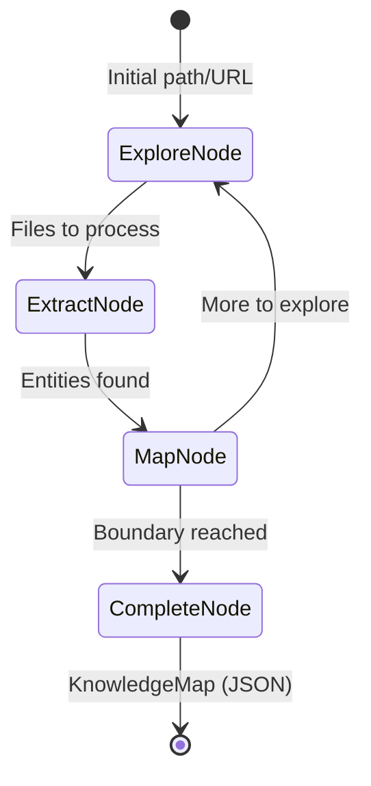

# Specification: The Cartographer (Exploration)

**Chapter:** 21
**Pattern Name:** The Cartographer
**Status:** Finalized Spec
**Module:** `src/agentic_patterns/domain_exploration.py`

## 1. Overview

Most RAG systems are passive—they only index what they're told. **The
Cartographer** is an autonomous Discovery Agent. When pointed at an unknown
domain (a GitHub repo, a local directory), it crawls the space,
identifies entities, and builds a persistent **Semantic Map** (Knowledge Graph).

### 1.1 Core Capabilities

| Capability | Implementation |
|------------|----------------|
| **Structural Truth** | AST-based extraction (zero-token) for code hierarchy |
| **Semantic Insight** | LLM-based summarization of purpose and intent |
| **Stable Identity** | Scoped IDs (e.g. `pkg.mod.Class`) to survive refactors |
| **Token Safety** | "Dry Run" mode to preview crawl scope before LLM calls |
| **Persistence** | Atomic JSON serialization with resumable frontier state |

## 2. Architecture

### 2.1 Data Flow



### 2.2 Persistence (JSON-First)

The Cartographer implements an atomic JSON persistence layer:
1. **Atomic Write**: Saves to `*.tmp` then renames to avoid corruption during interruption.
2. **Resumability**: Stores the `ExplorationFrontier` state, allowing the agent to resume incomplete crawls.
3. **Graph Export**: `KnowledgeStore` can export the graph to JSON or NetworkX formats.

### 2.3 Extraction Strategy (Hybrid)

To balance cost and accuracy:
1. **AST Extractor (The Skeleton)**: Scans Python files for Classes, Functions, and Imports. This provides "Ground Truth" for the graph structure and relationships (inheritance, calls).
2. **LLM Extractor (The Flesh)**: Analyzes the docstrings/logic to provide a `summary` and identifies "Concepts" in Markdown files.
3. **Dry Run Mode**: Configuration flag to execute the crawl and AST extraction *without* triggering the expensive LLM semantic extraction.

## 3. Data Models

```python
from dataclasses import dataclass, field
from typing import Literal, Any
from pydantic import BaseModel, Field
from datetime import datetime
import hashlib

class SemanticEntity(BaseModel):
    """An entity discovered during exploration."""
    id: str = Field(description="Unique identifier (scoped hash)")
    name: str = Field(description="Entity name")
    entity_type: Literal[
        "module", "class", "function", "variable",
        "concept", "document", "api_endpoint"
    ] = Field(description="Type of entity")
    summary: str = Field(description="Brief description of the entity")
    location: str = Field(description="File path or URL where entity was found")
    content_hash: str | None = Field(description="Hash of content for change detection")
    metadata: dict[str, Any] = Field(default_factory=dict)

class SemanticLink(BaseModel):
    """A relationship between two entities."""
    source_id: str
    target_id: str
    relationship: Literal[
        "imports", "calls", "defines", "references",
        "inherits", "implements", "contains", "depends_on"
    ]
    weight: float = 1.0

class ExplorationFrontier(BaseModel):
    """Tracks what has been explored and what remains."""
    explored: set[str] = Field(default_factory=set)
    pending: list[str] = Field(default_factory=list)
    depth_map: dict[str, int] = Field(default_factory=dict)

class KnowledgeMap(BaseModel):
    """The complete knowledge graph from exploration."""
    entities: list[SemanticEntity] = Field(default_factory=list)
    links: list[SemanticLink] = Field(default_factory=list)
    root_path: str
    last_updated: datetime = Field(default_factory=datetime.now)
    frontier_state: ExplorationFrontier | None = None  # For resumability

class ExplorationBoundary(BaseModel):
    """Configuration for crawl boundaries."""
    max_depth: int = Field(default=5)
    max_files: int = Field(default=20)  # Low default for safety
    include_patterns: list[str] = Field(default_factory=lambda: ["**/*.py", "**/*.md"])
    exclude_patterns: list[str] = Field(
        default_factory=lambda: ["**/node_modules/**", "**/.git/**", "**/__pycache__/**"]
    )
    dry_run: bool = Field(
        default=False,
        description="If True, skips LLM extraction (AST only)"
    )

def generate_entity_id(entity_type: str, scope: str, name: str) -> str:
    """
    Generate deterministic ID based on scope rather than file path.
    
    Args:
        scope: The module path or logical parent (e.g., 'src.agentic_patterns.domain_exploration')
        name: The entity name (e.g., 'CartographerState')
    """
    content = f"{entity_type}:{scope}:{name}"
    return hashlib.sha256(content.encode()).hexdigest()[:16]
```

## 4. Implementation Details (Graph)

### 4.1 Node Definition Rules
- Nodes with fields **MUST** use `@dataclass`.
- Nodes should inherit from `BaseNode[State, Deps, Output]`.
- Return types must be stringified forward references (e.g., `"ExtractNode | CompleteNode"`) unless using `from __future__ import annotations`.

```python
@dataclass
class ExtractNode(BaseNode[CartographerState, CartographerDeps, KnowledgeMap]):
    files_to_process: list[str]

    async def run(
        self, 
        ctx: GraphRunContext[CartographerState]
    ) -> "MapNode":
        ...
```

## 5. Implementation Roadmap

### Milestone 1: Foundations
- Add `networkx` to `pyproject.toml`.
- Implement `KnowledgeMap` models and `KnowledgeStore` class.
- Implement atomic JSON persistence (save/load).
- Implement basic graph analysis (orphans, centrality).

### Milestone 2: Hybrid Senses
- Implement `ASTExtractor`: 
    - Parse `.py` files using `ast` module.
    - Extract classes, functions, and imports.
    - Generate "scoped" names for stable IDs.
- Implement `LLMExtractor` (the `extractor_agent`):
    - System prompt for semantic summarization.
    - Token usage tracking.
- Implement merging logic (enriching AST skeleton with LLM summaries).

### Milestone 3: The Autonomous Cycle
- Implement `pydantic-graph` nodes:
    - `ExploreNode`: Handles directory walking and boundary filtering.
    - `ExtractNode`: Orchestrates AST + LLM extraction (respecting `dry_run`).
    - `MapNode`: Updates the `KnowledgeMap`.
- Implement `explore_domain()` entry point.

### Milestone 4: Verification
- **Integration Test**: `scripts/integration_test.sh` update.
- **Demo Script**: A script that maps the `agentic_patterns` library itself.
- **Documentation**: Update `docs/patterns/21-domain-exploration.md`.