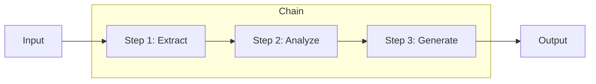

# Chapter 1: Prompt Chaining

Chain multiple LLM calls where each step's output becomes the next input.

## Key Insight

> "Complex tasks fail in a single prompt. Breaking them into a chain of specialized steps makes each step verifiable and the whole pipeline debuggable."

- **Single-Shot**: One prompt tries to do everything. Fails on complex tasks.
- **Chained Steps**: Extract → Analyze → Generate. Each step is testable.

## Flow Diagram



## Implementation

Source: [`src/agentic_patterns/prompt_chaining.py`](https://github.com/runyaga/agentic-patterns-book/blob/main/src/agentic_patterns/prompt_chaining.py)

### Data Models

```python
--8<-- "src/agentic_patterns/prompt_chaining.py:models"
```

### Agents with System Prompts

```python
--8<-- "src/agentic_patterns/prompt_chaining.py:agents"
```

### Chain Execution

```python
--8<-- "src/agentic_patterns/prompt_chaining.py:chain"
```

## Use Cases

- **Document Processing**: Extract -> Analyze -> Generate
- **Research Pipelines**: Gather -> Synthesize -> Report
- **Content Creation**: Outline -> Draft -> Refine
- **Data Transformation**: Parse -> Process -> Format

## Production Reality Check

### When to Use
- Tasks naturally decompose into sequential steps with clear data dependencies
- Intermediate results need validation or structured formatting before proceeding
- Complex reasoning benefits from breaking down into smaller, verifiable steps
- Pipeline-style workflows where each step transforms the output
- *Comparison*: A single-shot prompt cannot handle the full task or produces
  unreliable results

### When NOT to Use
- Single-shot queries that don't need intermediate processing
- When latency is critical (each chain link adds a full LLM round-trip)
- Simple transformations that could be done with string formatting or regex
- When steps don't have meaningful dependencies (use Parallelization instead)
- *Anti-pattern*: Chaining deterministic transformations that don't need LLM
  reasoning (use plain code instead)

### Production Considerations
- **Observability**: Log each chain step separately for debugging failed pipelines
- **Failure handling**: Decide retry strategy—per-step retry vs. full-chain restart
- **Cost**: Each step is a separate API call; multiply token costs by chain length
- **Latency**: Total latency = sum of all step latencies; consider caching for
  repeated inputs
- **State management**: Consider persisting intermediate results for long chains
  to enable resumption after failures

## Example

```bash
.venv/bin/python -m agentic_patterns.prompt_chaining
```
