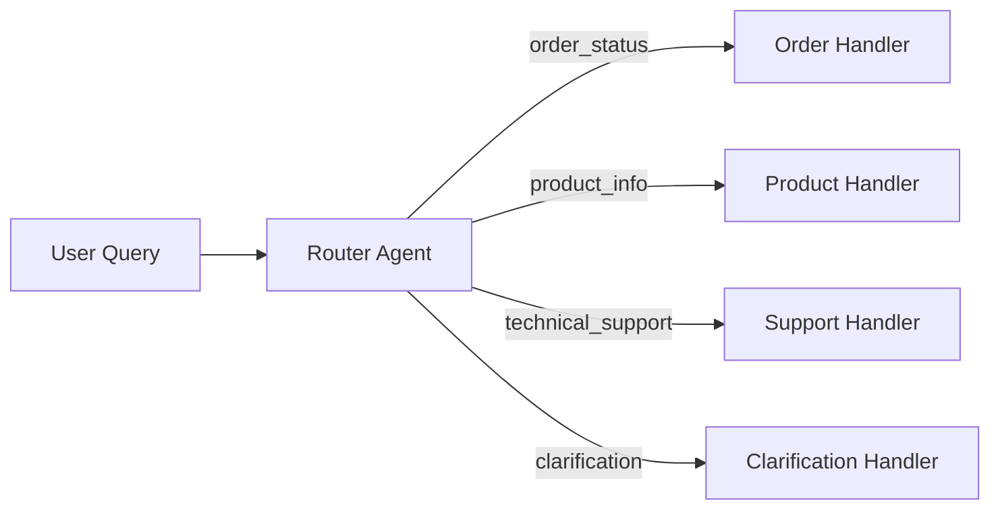

# Chapter 2: Routing

Classify user intent and route queries to specialized handlers.

## Flow Diagram



## Implementation

Source: [`src/agentic_patterns/routing.py`](https://github.com/runyaga/agentic-patterns-book/blob/main/src/agentic_patterns/routing.py)

### Intent & Response Models

```python
--8<-- "src/agentic_patterns/routing.py:models"
```

### Router & Handler Agents

```python
--8<-- "src/agentic_patterns/routing.py:agents"
```

### Routing Logic

```python
--8<-- "src/agentic_patterns/routing.py:routing"
```

## Use Cases

- **Customer Service**: Route to order/product/support teams
- **Multi-domain Q&A**: Route to domain experts
- **Workflow Automation**: Direct tasks to processors
- **Content Moderation**: Route based on content type

## When to Use

- Multiple specialized handlers exist
- Domain expertise varies significantly by query type
- Fallback handling is needed for ambiguous requests (using confidence scores)

## Example

```bash
.venv/bin/python -m agentic_patterns.routing
```
