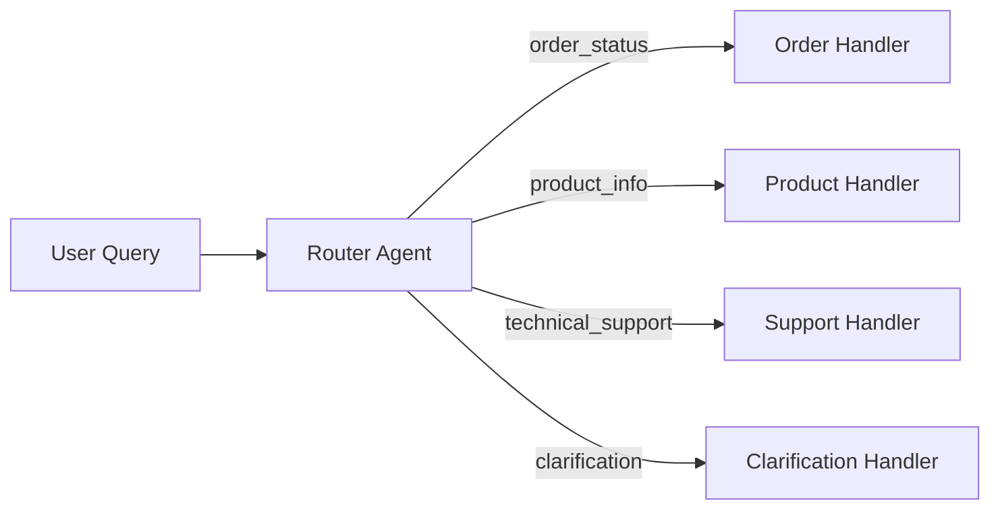

# Chapter 2: Routing

Classify user intent and route queries to specialized handlers.

## Key Insight

> "A generalist agent that handles everything handles nothing well. Route queries to domain specialists for higher quality and lower latency."

- **Generalist**: Single prompt covers all domains. Quality degrades at scale.
- **Router + Specialists**: Classify intent, dispatch to experts. Each handler is optimized.

## Flow Diagram



## Implementation

Source: [`src/agentic_patterns/routing.py`](https://github.com/runyaga/agentic-patterns-book/blob/main/src/agentic_patterns/routing.py)

### Intent & Response Models

```python
--8<-- "src/agentic_patterns/routing.py:models"
```

### Router & Handler Agents

```python
--8<-- "src/agentic_patterns/routing.py:agents"
```

### Routing Logic

```python
--8<-- "src/agentic_patterns/routing.py:routing"
```

## Use Cases

- **Customer Service**: Route to order/product/support teams
- **Multi-domain Q&A**: Route to domain experts
- **Workflow Automation**: Direct tasks to processors
- **Content Moderation**: Route based on content type

## Production Reality Check

### When to Use
- Multiple specialized handlers exist with distinct capabilities
- Domain expertise varies significantly by query type
- Fallback handling is needed for ambiguous requests (using confidence scores)
- Request volume justifies the complexity of maintaining multiple handlers
- *Comparison*: A single system prompt cannot adequately cover all domains, or
  manual rules are too brittle to maintain

### When NOT to Use
- Single-purpose applications where all queries go to the same handler
- When a system prompt can adequately cover all domains (simpler is better)
- Low-volume applications where a generalist agent is "good enough"
- When routing accuracy is critical but training data is limited
- *Anti-pattern*: Support FAQ bot with <10 intents—use a single agent with
  good prompting instead

### Production Considerations
- **Classification errors**: Monitor misrouted queries; log router decisions for
  analysis. Consider human review for low-confidence classifications.
- **Handler availability**: Implement circuit breakers if handlers can fail
  independently. Fallback to a generalist handler when specialists are down.
- **Latency**: Router adds one LLM call before the actual handler. For latency-
  sensitive apps, consider caching common routes or using faster models for
  classification.
- **Observability**: Track routing distribution over time to detect drift or
  new query patterns that need new handlers.
- **Label drift**: Routing categories evolve as product changes. Re-evaluate
  router training data periodically; stale labels cause systematic misroutes.

## Example

```bash
.venv/bin/python -m agentic_patterns.routing
```
