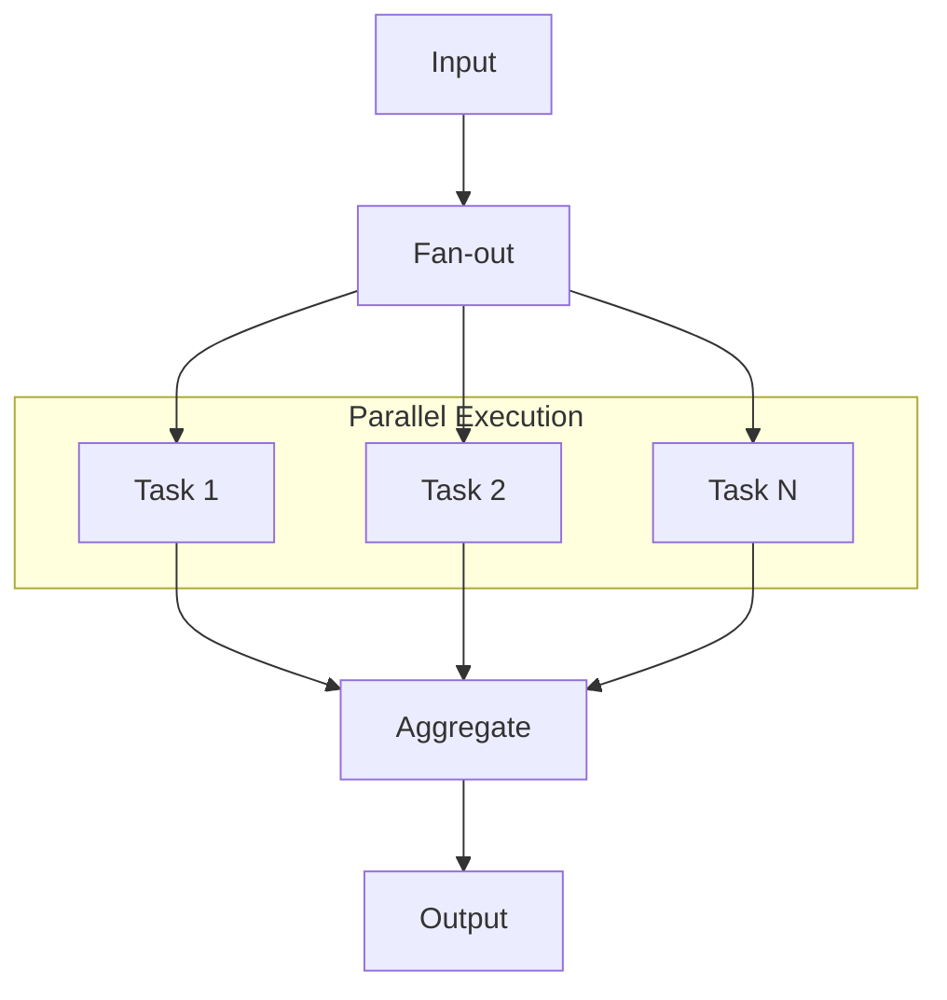

# Chapter 3: Parallelization

Execute independent sub-tasks concurrently (`asyncio.gather`) to reduce latency.

## Key Insight

> "Sequential execution wastes time when tasks are independent. Fan-out, process in parallel, aggregate results—latency equals your slowest task, not the sum."

- **Sequential**: Task A → Task B → Task C. Total time = A + B + C.
- **Parallel**: Tasks A, B, C run concurrently. Total time = max(A, B, C).

## Flow Diagram



## Implementation

Source: [`src/agentic_patterns/parallelization.py`](https://github.com/runyaga/agentic-patterns-book/blob/main/src/agentic_patterns/parallelization.py)

### Data Models

```python
--8<-- "src/agentic_patterns/parallelization.py:models"
```

### Agents

```python
--8<-- "src/agentic_patterns/parallelization.py:agents"
```

### Parallelization Patterns

```python
--8<-- "src/agentic_patterns/parallelization.py:patterns"
```

## Use Cases

- **Sectioning**: Research (History, Pros/Cons), Content generation (Intro, Body, Conclusion).
- **Voting**: Fact-checking, Content safety classification, Creative brainstorming (best of N).
- **Map-Reduce**: Log analysis, Document summarization, Batch data extraction.

## Production Reality Check

### When to Use
- **Sectioning**: Task divides into distinct, independent sub-topics that can be
  processed simultaneously
- **Voting**: High accuracy needed and models may hallucinate; consensus reduces
  error rates
- **Map-Reduce**: Large datasets where items can be processed individually then
  aggregated
- *Comparison*: A single-shot call cannot handle the task's scope, or sequential
  processing would be unacceptably slow

### When NOT to Use
- Tasks with sequential dependencies (use Prompt Chaining instead)
- When API rate limits would throttle parallel requests anyway
- Small tasks where parallelization overhead exceeds time savings
- When results must be strictly ordered (parallel execution is non-deterministic)
- *Anti-pattern*: Parallelizing 3 trivial subtasks that each take <100ms—
  coordination overhead dominates

### Production Considerations
- **Rate limits**: `asyncio.gather` can spike concurrent requests. Use
  `asyncio.Semaphore` to cap concurrency and avoid 429 errors.
- **Cost**: Voting (N parallel calls) multiplies cost by N. Budget accordingly
  and consider when consensus is truly necessary vs. single-call sufficiency.
- **Error handling**: One failed task can fail `gather()`. Use
  `return_exceptions=True` or `asyncio.TaskGroup` with proper exception handling.
- **Aggregation quality**: Map-Reduce aggregation step may lose nuance. Test
  aggregator prompts carefully with diverse inputs.
- **Memory**: Large parallel batches load all results into memory simultaneously.
  For very large datasets, use streaming or chunked processing.

## Example

```bash
.venv/bin/python -m agentic_patterns.parallelization
```
