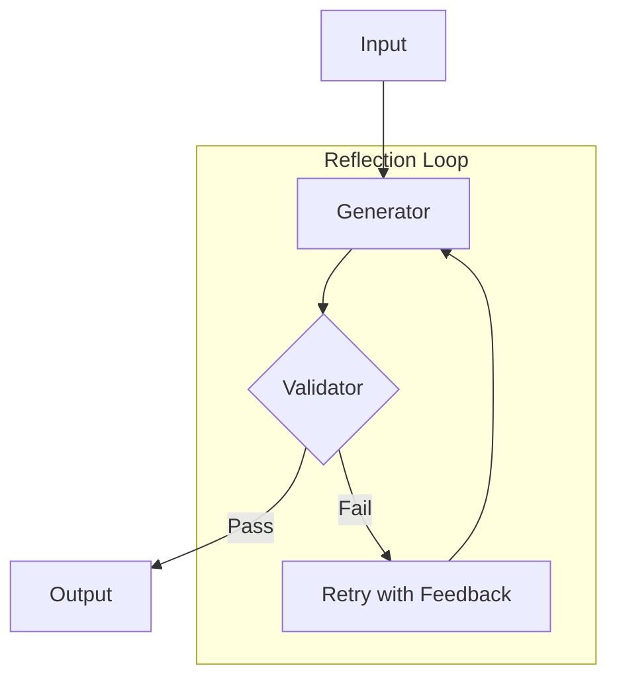

# Chapter 4: Reflection

Self-correction via automated validation loops.

## Flow Diagram



## Implementation

Source: [`src/agentic_patterns/reflection.py`](https://github.com/runyaga/agentic-patterns-book/blob/main/src/agentic_patterns/reflection.py)

### Data Models & Dependencies

```python
--8<-- "src/agentic_patterns/reflection.py:models"
```

### Agents with Output Validator

```python
--8<-- "src/agentic_patterns/reflection.py:agents"
```

### Reflection Execution

```python
--8<-- "src/agentic_patterns/reflection.py:reflection"
```

## Use Cases

- **Code Generation**: Validator runs unit tests; retries on failure.
- **Content Writing**: Validator checks style guidelines; retries on violations.
- **Data Extraction**: Validator checks schema constraints; retries on mismatches.

## Production Reality Check

### When to Use
- You have clear "pass/fail" or scoring criteria that can be programmatically
  checked
- You want linear application logic (`result = run()`) with retries handled
  internally
- Feedback from failures should inform the retry (model sees why it failed via
  `ModelRetry` message in conversation history)
- Quality requirements justify the cost of multiple generation attempts
- *Comparison*: Single-shot + external validation is too cumbersome to maintain

### When NOT to Use
- No objective validation criteria exist (purely subjective quality)
- Single-attempt accuracy is already acceptable for your use case
- Latency budget doesn't allow for retry loops (each retry is a full LLM call)
- Validation logic is complex enough to warrant external orchestration
- *Anti-pattern*: Creative writing tasks with subjective quality—retries don't
  converge when "good" has no objective definition

### Production Considerations
- **Max retries**: Always set a cap. Infinite loops are expensive and can
  indicate a fundamentally broken prompt that retries won't fix.
- **Cost tracking**: Monitor retry rates. High retry rates suggest prompt
  improvement is needed rather than more retries.
- **Validator complexity**: Keep validators fast and deterministic. Slow
  validators (e.g., running full test suites) compound latency.
- **Feedback quality**: The `ModelRetry` message becomes part of context.
  Make error messages actionable ("missing required field X" not just "invalid").
- **Validator drift**: Validators change as schemas evolve. Keep validator logic
  versioned alongside output models to avoid silent breakage.

## Example

```bash
.venv/bin/python -m agentic_patterns.reflection
```
