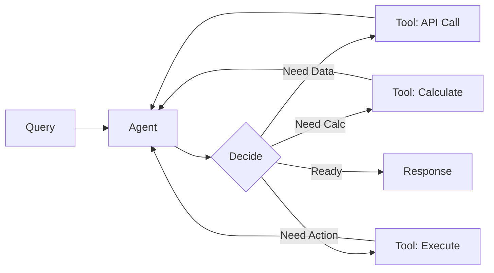

# Chapter 5: Tool Use

Enable agents to execute external functions (APIs, DBs, calculations).

## Key Insight

> "LLMs are powerful reasoners but terrible at math, live data, and taking actions. Tools extend agents beyond text generation to interact with the real world."

- **Pure LLM**: Hallucinates numbers, uses stale data, can't act.
- **LLM + Tools**: Calculates precisely, fetches live data, executes actions.

## Flow Diagram



## Implementation

Source: [`src/agentic_patterns/tool_use.py`](https://github.com/runyaga/agentic-patterns-book/blob/main/src/agentic_patterns/tool_use.py)

### Data Models

```python
--8<-- "src/agentic_patterns/tool_use.py:models"
```

### Agent Definition

```python
--8<-- "src/agentic_patterns/tool_use.py:agent"
```

### Tool Definitions

```python
--8<-- "src/agentic_patterns/tool_use.py:tools"
```

### Execution

```python
--8<-- "src/agentic_patterns/tool_use.py:run"
```

## Use Cases

- **Data Retrieval**: Database queries, Search APIs, File reading.
- **Computation**: Math, Date/Time, Data transformation.
- **Action Execution**: Sending emails, Posting to Slack, Updating records.

## Production Reality Check

### When to Use
- Tasks require capabilities beyond text generation (math, current data, APIs)
- Real-time information is needed (weather, stock prices, database lookups)
- Interaction with external systems is required (sending emails, updating records)
- Computation must be exact (financial calculations, date math)
- *Comparison*: Prompt context alone cannot provide the required information,
  or pre-computed batch data would be stale

### When NOT to Use
- All required information can be provided in the prompt context
- Approximate answers from the model's training data are acceptable
- Tool execution has unacceptable latency for your use case
- Security constraints prevent giving the model access to external systems
- *Anti-pattern*: Calling an LLM tool for deterministic computations (e.g.,
  string formatting) that could be local code

### Production Considerations
- **Security**: Tools are code execution. Sanitize inputs, validate outputs,
  and use least-privilege principles. Never `eval()` LLM-generated code directly.
- **Error handling**: Tools can fail (network errors, invalid inputs). Return
  structured error messages so the model can recover or inform the user.
- **Rate limits**: External APIs have quotas. Implement caching and backoff.
  Consider whether the model might call tools excessively.
- **Idempotency**: For action tools (send email, update DB), consider what
  happens if the same tool is called twice. Guard against duplicate actions.
- **Observability**: Log all tool calls with inputs and outputs. This is your
  audit trail for debugging and compliance.
- **Output validation**: Validate tool response schemas to prevent prompt
  injection via malicious tool outputs.

## Example

```bash
.venv/bin/python -m agentic_patterns.tool_use
```
