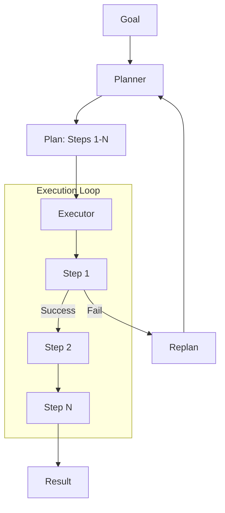

# Chapter 6: Planning

Dynamically decompose goals into steps, execute them, and adapt to failures.

## Flow Diagram



## Implementation

Source: [`src/agentic_patterns/planning.py`](https://github.com/runyaga/agentic-patterns-book/blob/main/src/agentic_patterns/planning.py)

### Data Models

```python
--8<-- "src/agentic_patterns/planning.py:models"
```

### Agents

```python
--8<-- "src/agentic_patterns/planning.py:agents"
```

### Planning & Execution Logic

```python
--8<-- "src/agentic_patterns/planning.py:planning"
```

## Use Cases

- **Complex Research**: Decompose "Write report on X" into "Search", "Read", "Outline", "Write".
- **Code Refactoring**: "Analyze file", "Plan changes", "Apply edits", "Run tests".
- **Multi-step Analysis**: "Fetch data", "Clean data", "Run stats", "Visualize".

## Production Reality Check

### When to Use
- Goal is too complex for a single prompt ("one-shot" doesn't work)
- Steps have strict dependencies (step B needs output from step A)
- Error recovery is needed (if step 2 fails, try alternative step 2b)
- Transparency in the process is required (users need to see/approve the plan)
- *Comparison*: Prompt chaining with fixed steps is too rigid for the task's
  variability

### When NOT to Use
- Task is simple enough for prompt chaining with fixed steps
- Planning overhead exceeds execution time (small tasks don't need plans)
- Real-time latency requirements don't allow for plan generation
- The domain is well-understood with predictable steps (hardcode the workflow)
- *Anti-pattern*: One-off tasks with stable steps already encoded in code—
  dynamic planning adds overhead without value

### Production Considerations
- **Plan quality**: LLM-generated plans can be unrealistic or miss steps.
  Consider human review for high-stakes tasks, or use constrained planning
  with predefined step templates.
- **Execution failures**: Plan for plan failures. What happens when step 3 of 5
  fails? Options: abort, retry step, replan from current state, skip to next.
- **State persistence**: Long-running plans need checkpointing. Store completed
  step results so execution can resume after crashes.
- **Cost explosion**: Replanning on every failure can spiral costs. Set limits
  on replan attempts and total steps.
- **Plan validation**: Validate generated plans against constraints and
  permissions to avoid unsafe or impossible steps.
- **Timeouts**: Set per-step and total-plan timeouts. Unbounded planning loops
  are expensive and confusing to users.

## Example

```bash
.venv/bin/python -m agentic_patterns.planning
```
