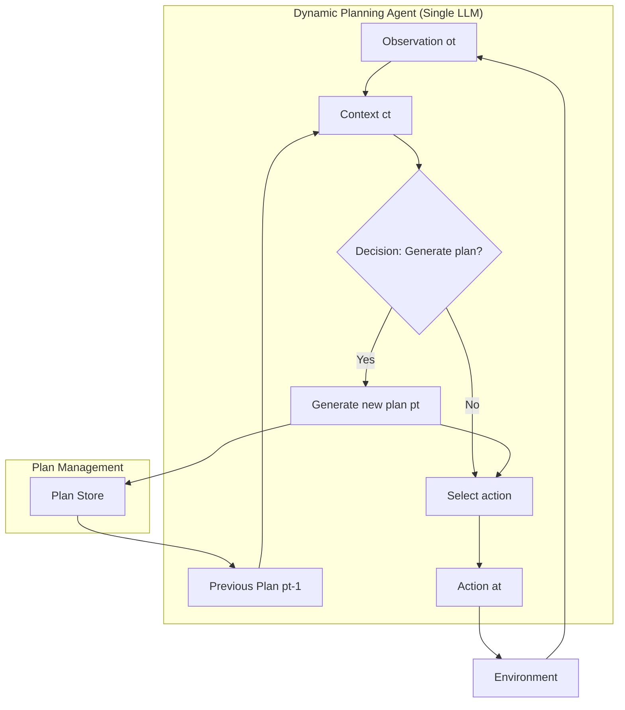

# Chapter 6b: Dynamic Planning

Agents learn **when** to plan, not just how to plan.

Based on "Learning When to Plan: Efficiently Allocating Test-Time Compute for LLM Agents" (Paglieri et al., 2025).

## Key Insight

> "Each task has a 'Goldilocks' frequency for planning that clearly outperforms naive strategies of always planning or never planning."

- **Always-plan (ReAct style)**: Computationally expensive, introduces instability
- **Never-plan**: Limits performance on complex tasks
- **Dynamic planning**: Agent decides when replanning is worth the cost

## Flow Diagram



## Implementation

Source: [`src/agentic_patterns/dynamic_planning.py`](https://github.com/runyaga/agentic-patterns-book/blob/main/src/agentic_patterns/dynamic_planning.py)

### Data Models

```python
--8<-- "src/agentic_patterns/dynamic_planning.py:models"
```

### Prompts

```python
--8<-- "src/agentic_patterns/dynamic_planning.py:prompts"
```

### Context Management

```python
--8<-- "src/agentic_patterns/dynamic_planning.py:context"
```

### Agents

```python
--8<-- "src/agentic_patterns/dynamic_planning.py:agents"
```

### Output Parsing

```python
--8<-- "src/agentic_patterns/dynamic_planning.py:parsing"
```

### Step Execution

```python
--8<-- "src/agentic_patterns/dynamic_planning.py:step"
```

### Episode Runner

```python
--8<-- "src/agentic_patterns/dynamic_planning.py:episode"
```

## Comparison: Static vs Dynamic Planning

| Aspect | Static (Ch 6) | Dynamic (Ch 6b) |
|--------|---------------|-----------------|
| When to plan | Always upfront | Runtime decision |
| Plan format | Structured steps | Natural language |
| Replanning | On failure | On plan drift |
| Cost awareness | No | Yes (implicit) |
| Best for | Known workflows | Long-horizon tasks |

## Planning Modes

The implementation supports three modes for comparison:

| Mode | Description | Use Case |
|------|-------------|----------|
| `DYNAMIC` | Agent decides when to plan | Production use |
| `ALWAYS` | Plan every step (ReAct baseline) | Baseline comparison |
| `NEVER` | Never plan (action-only) | Simple tasks |

## Cost-Benefit Framework

The agent implicitly weighs:

**Plan when**: `Aplan(ct) > Cplan`

Where:
- `Aplan(ct)` = Planning Advantage (expected improvement from new plan)
- `Cplan = Ctokens + Clatency + Cnoise`
  - `Ctokens` = Token cost (proportional to plan length)
  - `Clatency` = Time cost
  - `Cnoise` = Instability from excessive replanning

## Plan Drift

Plans decay in usefulness over time due to:
- **Abstraction level**: High-level plans last longer
- **Model accuracy**: Better planners produce more durable plans
- **Environment dynamics**: Volatile environments obsolete plans faster

## Use Cases

### When to Use Dynamic Planning
- Long-horizon tasks where static plans become stale
- Environments with unpredictable state changes
- Tasks requiring adaptive strategy
- When planning overhead varies by situation

### When NOT to Use
- Short, predictable tasks (use static planning)
- Real-time latency constraints
- Well-understood domains with fixed workflows
- Tasks where consistent behavior is required

## Production Considerations

- **Token budgets**: Track planning frequency to control costs
- **Plan caching**: Reuse plans across similar contexts
- **Fallback modes**: Switch to ALWAYS or NEVER if DYNAMIC fails
- **Metrics**: Monitor planning frequency as a health indicator
- **Human steering**: Accept external plans that override agent plans

## Example

```bash
.venv/bin/python -m agentic_patterns.dynamic_planning
```
