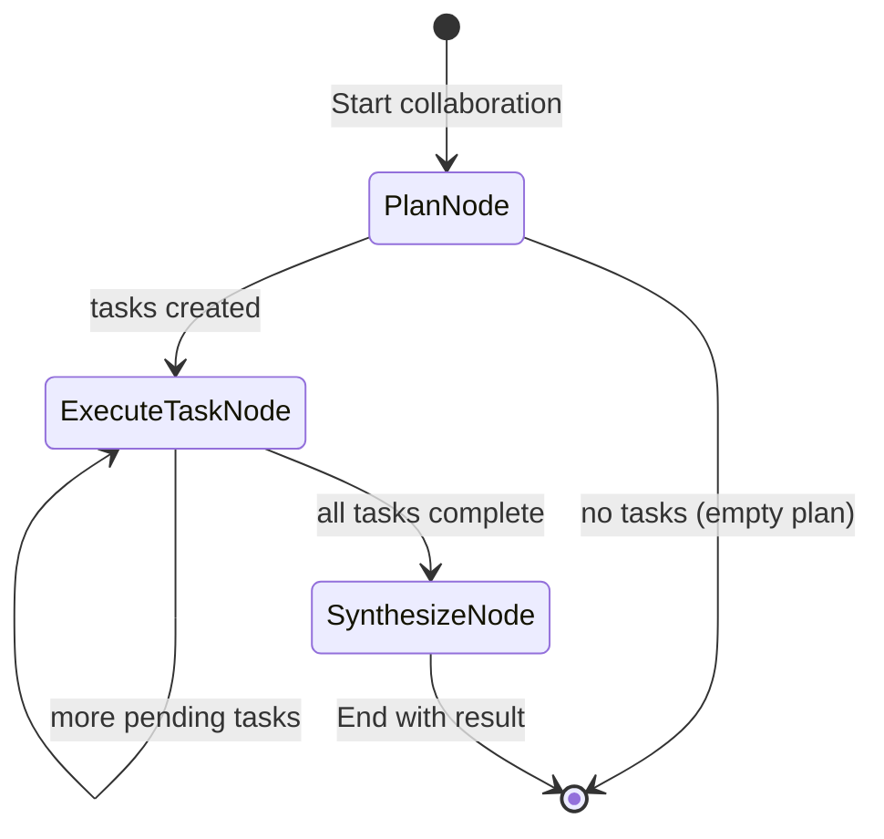

# Chapter 7: Multi-Agent Collaboration

Coordinate specialized agents (Supervisor, Researcher, Writer) to achieve complex goals.

## Flow Diagram



## Implementation

Source: [`src/agentic_patterns/multi_agent.py`](https://github.com/runyaga/agentic-patterns-book/blob/main/src/agentic_patterns/multi_agent.py)

### Data Models

```python
--8<-- "src/agentic_patterns/multi_agent.py:models"
```

### Agents

```python
--8<-- "src/agentic_patterns/multi_agent.py:agents"
```

### Collaboration Logic

```python
--8<-- "src/agentic_patterns/multi_agent.py:collaboration"
```

## Use Cases

- **Content Factory**: Research -> Outline -> Write -> Review.
- **Software Dev**: Architect -> Backend Dev -> Frontend Dev -> QA.
- **Complex Analysis**: Legal Analyst + Financial Analyst + Risk Officer.

## When to Use

- Task exceeds single context window or single agent's capability.
- Distinct specialized skills are required (e.g., coding vs. writing).
- Parallel processing (Network) or sequential validation (Supervisor) is needed.

## Example

```bash
.venv/bin/python -m agentic_patterns.multi_agent
```
