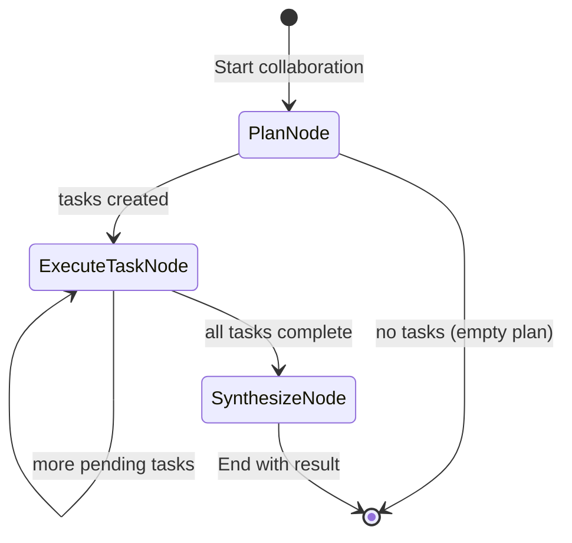

# Chapter 7: Multi-Agent Collaboration

Coordinate specialized agents (Supervisor, Researcher, Writer) to achieve complex goals.

## Flow Diagram



## Implementation

Source: [`src/agentic_patterns/multi_agent.py`](https://github.com/runyaga/agentic-patterns-book/blob/main/src/agentic_patterns/multi_agent.py)

### Data Models

```python
--8<-- "src/agentic_patterns/multi_agent.py:models"
```

### Agents

```python
--8<-- "src/agentic_patterns/multi_agent.py:agents"
```

### Collaboration Logic

```python
--8<-- "src/agentic_patterns/multi_agent.py:collaboration"
```

## Use Cases

- **Content Factory**: Research -> Outline -> Write -> Review.
- **Software Dev**: Architect -> Backend Dev -> Frontend Dev -> QA.
- **Complex Analysis**: Legal Analyst + Financial Analyst + Risk Officer.

## Production Reality Check

### When to Use
- Task exceeds single context window or single agent's capability
- Distinct specialized skills are required (e.g., coding vs. writing vs. review)
- Parallel processing (multiple agents working simultaneously) provides speedup
- Sequential validation is needed (one agent reviews another's output)
- *Comparison*: A single well-prompted agent with tools cannot handle the task's
  scope or quality requirements

### When NOT to Use
- A single well-prompted agent can handle the task (simpler is better)
- Communication overhead between agents exceeds task complexity
- Debugging and observability requirements are strict (multi-agent is harder
  to trace)
- Latency budget doesn't allow for multiple sequential agent calls
- *Anti-pattern*: Small, deterministic data transforms where orchestration
  overhead dominates the actual work

### Production Considerations
- **Coordination complexity**: More agents = more failure modes. Start with
  fewer agents and add only when single-agent approaches demonstrably fail.
- **Context sharing**: Agents need shared context. Design clear protocols for
  what information flows between agents and how.
- **Error propagation**: One agent's mistake can cascade. Implement validation
  between agent handoffs and clear error recovery strategies.
- **Cost multiplication**: N agents = roughly N times the token cost. Budget
  for the full pipeline, not just individual agents.
- **Protocol versioning**: Schema drift between agents causes brittle handoffs.
  Version inter-agent message formats explicitly.
- **Observability**: Log each agent's inputs, outputs, and decision points.
  Multi-agent debugging without logs is nearly impossible.

## Example

```bash
.venv/bin/python -m agentic_patterns.multi_agent
```
