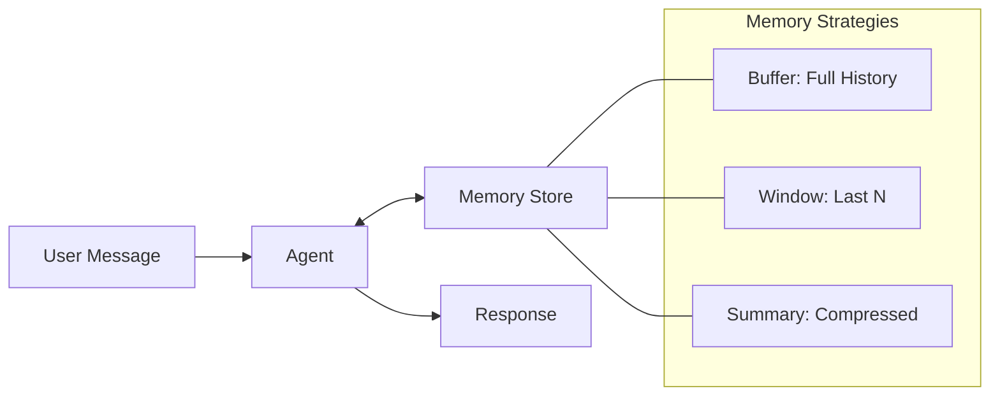

# Chapter 8: Memory Management

Maintain conversation context across interactions using different storage strategies.

## Key Insight

> "Stateless agents forget everything between calls. Memory enables coherent multi-turn conversations, but the strategy (buffer, window, summary) determines cost vs. context quality."

- **Stateless**: Each call starts fresh. No continuity.
- **Memory-Enabled**: Context persists. Trade-off between full history and token limits.

## Flow Diagram



## Implementation

Source: [`src/agentic_patterns/memory.py`](https://github.com/runyaga/agentic-patterns-book/blob/main/src/agentic_patterns/memory.py)

### Memory Strategies

1.  **BufferMemory**: Stores complete history. Simplest, but hits token limits fast.
2.  **WindowMemory**: Keeps last $N$ messages. Efficient, but loses distant context.
3.  **SummaryMemory**: Summarizes old messages, keeps recent ones. Balanced.

### Data Models & Memory Classes

```python
--8<-- "src/agentic_patterns/memory.py:models"
```

### Agent with Memory Injection

```python
--8<-- "src/agentic_patterns/memory.py:agent"
```

### Memory-Enabled Chat

```python
--8<-- "src/agentic_patterns/memory.py:memory"
```

## Use Cases

- **Chatbots**: Maintaining user persona and preference context.
- **Long-running Sessions**: Coding assistants, RPG game masters.
- **Summarization**: Digesting long transcripts into key points.

## Production Reality Check

### When to Use

| Type | Best For | Trade-off |
|------|----------|-----------|
| **Buffer** | Short, high-detail tasks | High token cost, hits limits fast |
| **Window** | Infinite streams, reactive bots | Loses distant context ("amnesia") |
| **Summary** | Long-term coherent conversations | Lossy compression of details |

- *Comparison*: Stateless interactions don't need memory; use memory only when
  context across turns is required for coherence

### When NOT to Use
- Stateless interactions where each request is independent
- When message history is already managed externally (e.g., by your app's DB)
- Short conversations that fit easily in context window without management
- When summary quality is critical but hard to validate (summaries lose nuance)
- *Anti-pattern*: Compliance-heavy domains where storing conversation history
  is prohibited or requires complex audit controls

### Production Considerations
- **Storage persistence**: In-memory stores are lost on restart. Use Redis,
  PostgreSQL, or similar for production memory that survives deployments.
- **Token budgeting**: Memory competes with prompt and response for context
  window. Monitor actual token usage and tune memory limits accordingly.
- **Summary quality**: SummaryMemory relies on LLM summarization which can
  hallucinate or drop important facts. Validate summaries for critical use cases.
- **Privacy**: Memory stores may contain PII. Implement retention policies,
  encryption, and user data deletion capabilities.
- **Multi-user isolation**: Ensure one user's memory doesn't leak to another.
  Namespace or partition memory by user/session ID.
- **Cache invalidation**: Decide when memory should be cleared (session end,
  time-based expiry, explicit user request).

## Example

```bash
.venv/bin/python -m agentic_patterns.memory
```
