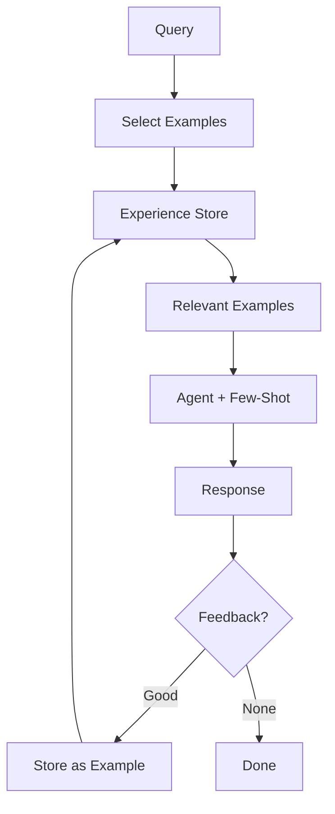

# Chapter 9: Learning and Adaptation

Improve performance over time by storing experiences (Few-Shot) and adapting prompts.

## Flow Diagram



## Implementation

Source: [`src/agentic_patterns/learning.py`](https://github.com/runyaga/agentic-patterns-book/blob/main/src/agentic_patterns/learning.py)

### Data Models & Experience Store

```python
--8<-- "src/agentic_patterns/learning.py:models"
```

### Agents with Example Injection

```python
--8<-- "src/agentic_patterns/learning.py:agents"
```

### Learning & Adaptation Logic

```python
--8<-- "src/agentic_patterns/learning.py:learning"
```

## Use Cases

- **Style Adaptation**: Mimic user's writing style based on past edits.
- **Code Correction**: Learn from linter errors to avoid repeating them.
- **Classification**: Improve label accuracy by providing "gold" examples.

## Production Reality Check

### When to Use
- Tasks are repetitive and belong to distinct, identifiable categories
- Quality feedback is available (explicit ratings or implicit signals like
  user corrections)
- Zero-shot performance is insufficient, but few-shot shows promise
- You have a mechanism to capture and store successful examples
- *Comparison*: Static prompt tuning or manual curation is too labor-intensive
  to maintain as patterns evolve

### When NOT to Use
- Tasks are highly variable with no repeating patterns
- No reliable feedback signal exists to identify "good" examples
- Context window is already constrained (examples consume tokens)
- Regulatory requirements prohibit storing user interactions for training
- *Anti-pattern*: Safety-critical domains where feedback labels are noisy or
  delayed—learning from bad examples degrades safety

### Production Considerations
- **Example quality**: Garbage in, garbage out. Curate examples carefully;
  bad examples can degrade performance. Consider human review for the example
  store.
- **Example selection**: With many examples, selecting the most relevant ones
  for each query is critical. Consider semantic similarity or category matching
  rather than random sampling.
- **Token budget**: Each example consumes context window. Balance number of
  examples against available space for the actual task.
- **Staleness**: User preferences and domain patterns change. Implement example
  refresh/expiry to prevent learning from outdated patterns.
- **Privacy**: Examples may contain user data. Apply same privacy controls as
  you would to training data (consent, retention, deletion rights).
- **Feedback loops**: Monitor whether "learned" behaviors are actually improving
  outcomes. Unchecked learning can reinforce mistakes (dataset bias amplification).

## Example

```bash
.venv/bin/python -m agentic_patterns.learning
```
