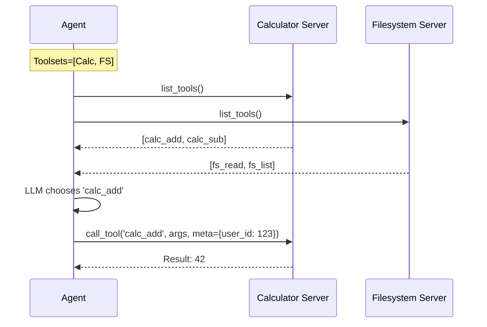

# MCP Integration (Tool Extensibility)

Source: [`src/agentic_patterns/mcp_integration.py`](https://github.com/runyaga/agentic-patterns-book/blob/main/src/agentic_patterns/mcp_integration.py)

The **MCP Integration** pattern demonstrates how to use the Model Context Protocol (MCP) to extend agents with external tools. Instead of hardcoding tools, this pattern allows agents to connect to local or remote servers (via stdio or HTTP/SSE) to dynamically discover capabilities.

## Key Concepts



-   **Native Support**: `pydantic-ai` has first-class support for MCP via the `toolsets` parameter. No custom connector code is required.
-   **Multi-Server Orchestration**: Agents can connect to multiple servers simultaneously (e.g., a Calculator server AND a Filesystem server).
-   **Tool Prefixes**: To avoid naming conflicts (e.g., two servers both having a `search` tool), tools can be namespaced (e.g., `calc_add`, `fs_read`).
-   **Dependency Propagation**: Agent-level dependencies (like `user_id` or `auth_token`) can be securely passed down to MCP tool handlers via the `process_tool_call` hook.

## Implementation

This implementation focuses on "Idiomatic pydantic-ai" usage, avoiding unnecessary abstraction layers.

### Creating an MCP Agent

Connecting to a server is as simple as defining an `MCPServerStdio` and passing it to the `Agent`.

```python
--8<-- "src/agentic_patterns/mcp_integration.py:agent"
```

### Multi-Server Support

You can mix and match servers. The LLM sees all available tools and chooses the right one.

```python
--8<-- "src/agentic_patterns/mcp_integration.py:run"
```

### Dependency Injection

Use `process_tool_call` to inject context into every tool invocation.

```python
--8<-- "src/agentic_patterns/mcp_integration.py:deps"
```

## Use Cases

1.  **Tool Reuse**: Write a tool once (e.g., "Database Access") and share it across multiple agents (Python, TypeScript, Go).
2.  **Security Boundaries**: Run tools in a separate process or container (via Docker) to sandbox potentially dangerous operations like file access.
3.  **Local Dev Tools**: Give your agent access to your local CLI tools (git, grep, ls) via stdio servers.

## Production Reality Check

### When to Use

| Use Case | Recommended Approach |
| :--- | :--- |
| **Simple Python Tools** | Use standard `@agent.tool`. Easier to debug and deploy. |
| **Shared/Remote Tools** | Use **MCP Integration**. For tools on other servers or in other languages. |
| **Sandboxed Execution** | Use **MCP Integration**. Run MCP server in Docker/WASM for isolation. |

- *Comparison*: For Python-only tools in a single process, standard `@agent.tool`
  is simpler and has lower overhead

### When NOT to Use
- All tools are Python and run in the same process (standard `@agent.tool` is
  simpler)
- Tool latency is critical (MCP adds IPC overhead vs. direct function calls)
- You don't need tool reuse across languages/agents
- Deployment constraints prevent running separate MCP server processes
- *Anti-pattern*: Single-process internal tools with tight latency SLAs—MCP
  adds unnecessary serialization and network hops

### Production Considerations
- **Server lifecycle**: MCP servers are separate processes. Handle startup,
  shutdown, and restarts properly. Consider systemd/supervisord for production.
- **Connection failures**: Network/IPC can fail. Implement reconnection logic
  and graceful degradation when servers are unavailable.
- **Tool discovery caching**: `list_tools()` can be cached to avoid repeated
  discovery calls. Invalidate cache when servers restart.
- **Security**: MCP servers execute code. Run in sandboxed environments (Docker,
  WASM) for untrusted operations. Validate all inputs from agents.
- **Schema versioning**: Tool schemas can change. Coordinate agent and server
  updates to avoid breaking changes from contract drift.
- **Observability**: Log MCP tool calls separately from agent logs. Include
  server name, tool name, inputs, outputs, and latency.

## Example

```bash
# Run the included demo
.venv/bin/python -m agentic_patterns.mcp_integration
```
