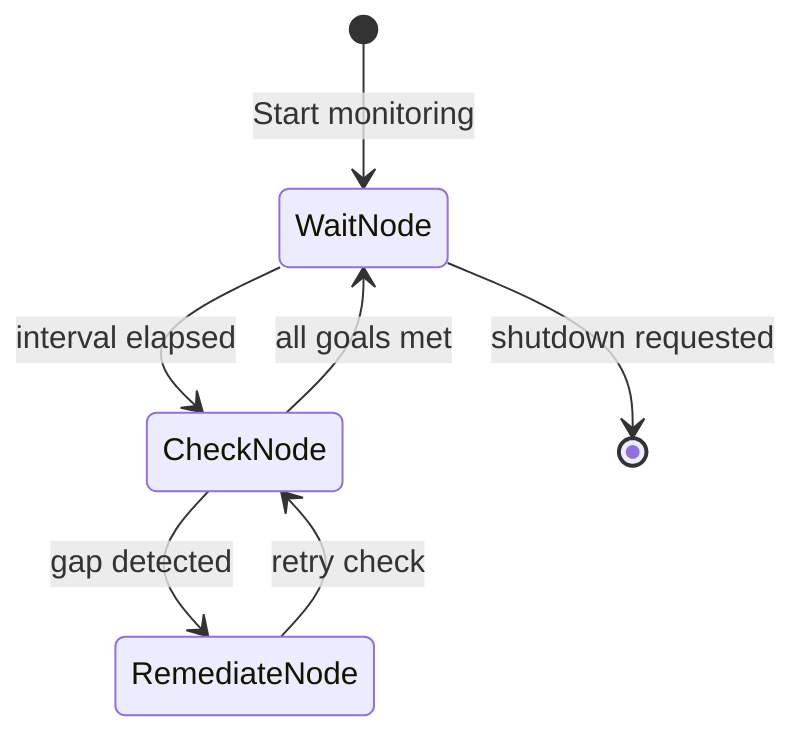

# Goal Monitoring

**Chapter 11: The Teleological Engine**

Most agents are reactive - they wait for prompts to act. The Goal Monitoring
pattern makes agents **proactive**: they continuously check if goals are met
and attempt remediation when gaps are detected.

## Overview



## Key Components

### Goal

A measurable target with an async evaluator:

```python
--8<-- "src/agentic_patterns/goal_monitoring.py:models"
```

### GoalMonitor

Manages the monitoring lifecycle:

```python
--8<-- "src/agentic_patterns/goal_monitoring.py:monitor"
```

## Usage Example

```python
--8<-- "src/agentic_patterns/goal_monitoring.py:main"
```

## Comparators

| Comparator | Meaning | Example |
|------------|---------|---------|
| `>=` | Current should be >= target | Uptime >= 99.9% |
| `<=` | Current should be <= target | Disk usage <= 80% |
| `==` | Current should equal target | Active connections == 0 |
| `>` | Current should be > target | Revenue > 0 |
| `<` | Current should be < target | Error rate < 1% |

## How It Works

1. **WaitNode**: Sleeps for `check_interval`, then transitions to CheckNode
2. **CheckNode**: Evaluates all goals, populates status, transitions to
   RemediateNode on first gap or back to WaitNode if all pass
3. **RemediateNode**: Calls the remediation agent with the goal's hint,
   escalates on failure, then returns to CheckNode to re-verify

## When to Use (vs Cron)

This pattern is similar to a cron job with health checks. Use this table to decide:

| Scenario | Use Cron / Systemd | Use Goal Monitor |
| :--- | :--- | :--- |
| **Logic** | Static thresholds (Disk > 90%) | Dynamic/Contextual reasoning |
| **Action** | Fixed scripts (`systemctl restart`) | Agentic remediation (read logs, plan fix) |
| **Trigger** | Time-based only | State-based (can run continuously) |
| **Cost** | Free (shell scripts) | Non-zero (LLM calls for remediation) |
| **Complexity** | Low | Medium (requires async loop) |

**Verdict:** For 90% of infrastructure monitoring, use existing tools (Prometheus, Datadog). Use this pattern when the remediation requires *intelligence* (e.g., "Fix the typo in the README" or "Refactor this function if it gets too complex").

## Production TODOs

This V1 implementation is intentionally lean. See the spec for production
enhancements:

- **P1: Escalation** - Add EscalateNode for repeated failures, integrate
  alerting
- **P2: Persistence** - Save/load state to JSON for resume after restart
- **P3: Advanced Evaluators** - file_stat, agent_assessment evaluators
- **P4: OKR Hierarchy** - Objectives with multiple Key Results
- **P5: Observability** - Logfire integration for structured logging

## API Reference

::: agentic_patterns.goal_monitoring
    options:
      show_root_heading: true
      members:
        - Goal
        - GoalStatus
        - GoalMonitor
        - run_goal_monitor
        - on_escalate
