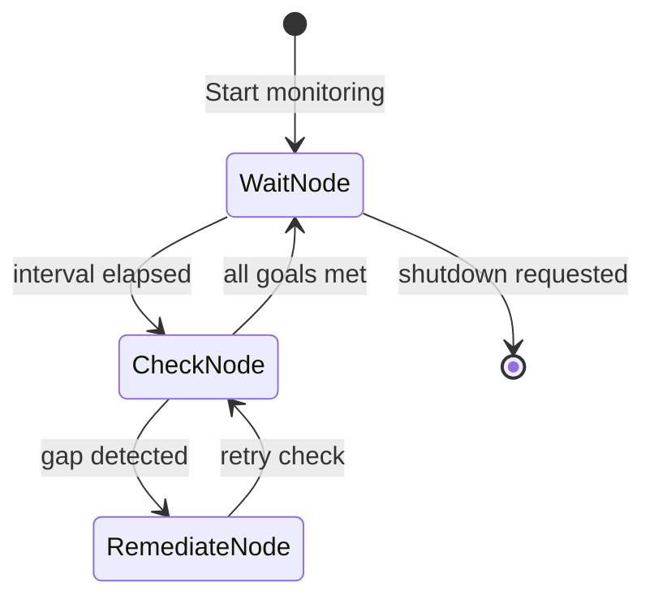

# Goal Monitoring

**Chapter 11: The Teleological Engine**

Most agents are reactive - they wait for prompts to act. The Goal Monitoring
pattern makes agents **proactive**: they continuously check if goals are met
and attempt remediation when gaps are detected.

## Overview



## Key Components

### Goal

A measurable target with an async evaluator:

```python
from agentic_patterns.goal_monitoring import Goal

async def get_disk_usage() -> float:
    import shutil
    usage = shutil.disk_usage("/")
    return (usage.used / usage.total) * 100

goal = Goal(
    name="disk_space",
    target=80.0,
    comparator="<=",  # Current should be <= target
    evaluator=get_disk_usage,
    remediation_hint="Clean up temp files and old logs",
)
```

### GoalMonitor

Manages the monitoring lifecycle:

```python
from agentic_patterns.goal_monitoring import GoalMonitor

monitor = GoalMonitor(
    goals=[goal],
    check_interval=300.0,  # Check every 5 minutes
)

await monitor.start()
# ... later
await monitor.stop()
```

## Usage Example

```python
import asyncio
from agentic_patterns.goal_monitoring import Goal, GoalMonitor

# Define evaluator functions
async def get_memory_usage() -> float:
    import psutil
    return psutil.virtual_memory().percent

# Define goals
goals = [
    Goal(
        name="memory",
        target=90.0,
        comparator="<=",
        evaluator=get_memory_usage,
        remediation_hint="Restart memory-heavy services",
    ),
]

async def main():
    monitor = GoalMonitor(goals, check_interval=60.0)
    await monitor.start()

    # Run for 10 minutes
    await asyncio.sleep(600)

    # Check final status
    for status in monitor.get_status():
        print(f"{status.goal_name}: {status.current_value:.1f} "
              f"({'met' if status.is_met else 'NOT MET'})")

    await monitor.stop()

if __name__ == "__main__":
    asyncio.run(main())
```

## Comparators

| Comparator | Meaning | Example |
|------------|---------|---------|
| `>=` | Current should be >= target | Uptime >= 99.9% |
| `<=` | Current should be <= target | Disk usage <= 80% |
| `==` | Current should equal target | Active connections == 0 |
| `>` | Current should be > target | Revenue > 0 |
| `<` | Current should be < target | Error rate < 1% |

## How It Works

1. **WaitNode**: Sleeps for `check_interval`, then transitions to CheckNode
2. **CheckNode**: Evaluates all goals, populates status, transitions to
   RemediateNode on first gap or back to WaitNode if all pass
3. **RemediateNode**: Calls the remediation agent with the goal's hint,
   escalates on failure, then returns to CheckNode to re-verify

## When to Use This (vs Cron)

This pattern is similar to a cron job with health checks. Be skeptical.

**Use cron/systemd timers when:**
- Thresholds are static and well-defined
- Remediation is a fixed script (restart service, clean disk)
- You have existing monitoring (Prometheus, Nagios, Datadog)
- Reliability matters more than flexibility
- Cost matters (LLM calls are expensive)

**Consider this pattern when:**
- Remediation requires reasoning about context
- Goals change dynamically at runtime
- It's part of a larger agentic workflow
- You need the agent to explain its remediation decisions

**Honest assessment:** For 90% of monitoring use cases, cron + shell scripts +
existing alerting (PagerDuty, Slack) is simpler, cheaper, and more reliable.
This pattern is most useful when embedded in an agentic system that already
uses LLMs, not as a standalone monitoring solution.

## Production TODOs

This V1 implementation is intentionally lean. See the spec for production
enhancements:

- **P1: Escalation** - Add EscalateNode for repeated failures, integrate
  alerting
- **P2: Persistence** - Save/load state to JSON for resume after restart
- **P3: Advanced Evaluators** - file_stat, agent_assessment evaluators
- **P4: OKR Hierarchy** - Objectives with multiple Key Results
- **P5: Observability** - Logfire integration for structured logging

## API Reference

::: agentic_patterns.goal_monitoring
    options:
      show_root_heading: true
      members:
        - Goal
        - GoalStatus
        - GoalMonitor
        - run_goal_monitor
        - on_escalate
