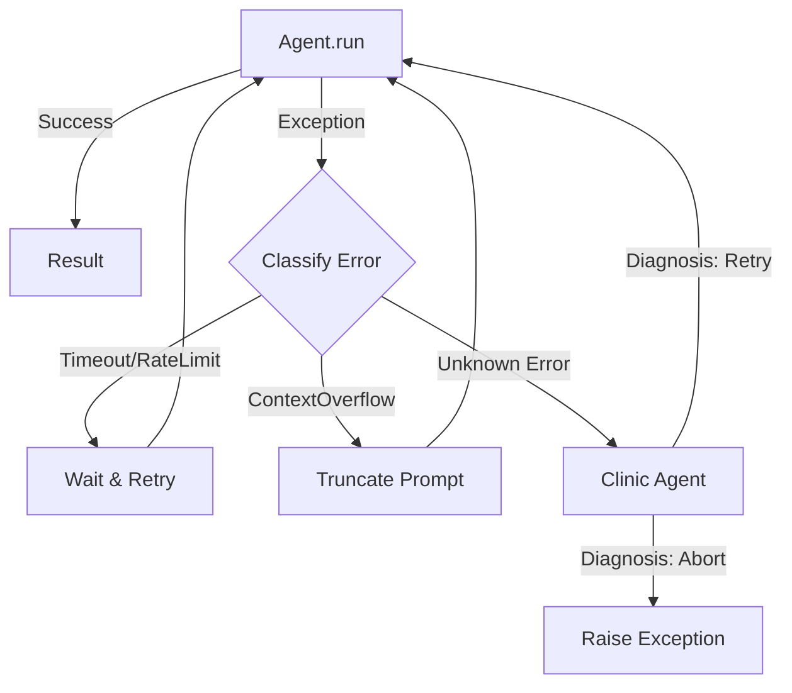

# Chapter 12: Exception Recovery

The Phoenix Protocol—intelligent recovery from agent failures.

## Key Insight

> "Blind retries waste tokens and repeat failures. The Phoenix Protocol diagnoses errors before deciding whether to retry, adapt, or abort."

- **Blind Retry**: Same action, same failure. Expensive and ineffective.
- **Phoenix Protocol**: Classify error → deterministic fix OR clinic diagnosis → targeted recovery.

## Flow Diagram



-   **Deterministic First**: Uses pattern matching to catch common errors (Timeout, Rate Limit) instantly without wasting tokens on an LLM diagnosis.
-   **Clinic Agent**: A specialized LLM agent that acts as a doctor for other agents. It analyzes the error message and "prescribes" a fix.
-   **Smart Retry**: Implements intelligent backoff, truncation, and circuit breaking based on the error type.
-   **Non-Intrusive Wrapper**: Implemented as a simple `recoverable_run()` wrapper function that can be applied to any existing `pydantic-ai` agent.
-   **Full Proxy**: Returns the complete `AgentRunResult` with all metadata (`.output`, `.usage()`, `.all_messages()`).

## Implementation

The implementation follows a "V1 Smart Retry" approach that prioritizes simplicity and token efficiency.

### Recovery Logic

The core logic uses a `recoverable_run` wrapper that catches exceptions and decides whether to retry deterministically or consult the Clinic.

```python
--8<-- "src/agentic_patterns/exception_recovery.py:recoverable_run"
```

### Deterministic Classification

We avoid expensive LLM calls for known errors by using Python heuristics.

```python
--8<-- "src/agentic_patterns/exception_recovery.py:classify"
```

### The Clinic Agent

For unknown or ambiguous errors, we ask the Clinic Agent if a retry is worth it.

```python
--8<-- "src/agentic_patterns/exception_recovery.py:clinic"
```

## Use Cases

1.  **Unreliable APIs**: Wrapping agents that call flaky external tools.
2.  **Long-Running Tasks**: Automatically recovering from timeouts or rate limits.
3.  **Context Management**: Automatically truncating prompts when context limits are hit.
4.  **Production Safety**: preventing a single crashed agent from bringing down the entire application.

## Production Reality Check

### When to Use

| Use Case | Recommended Approach |
| :--- | :--- |
| **Output Validation** | Use `@output_validator` with `ModelRetry`. For *semantic* errors where model ran but produced bad data. |
| **Exception Handling** | Use **Phoenix Protocol**. For *runtime* errors (crashes, timeouts, API failures). |
| **Complex Workflows** | Use `pydantic_graph`. If recovery requires complex state transitions. |

- *Comparison*: For simple transient failures, basic retry with `tenacity` or a
  loop may be sufficient

### When NOT to Use
- Errors are always fatal and shouldn't be retried (e.g., auth failures)
- Simple retry with backoff is sufficient (use `tenacity` or basic loop)
- Clinic Agent overhead exceeds value of intelligent diagnosis
- Streaming responses are required (see Streaming Limitation section)
- *Anti-pattern*: Retrying on deterministic auth/config failures—these won't
  succeed regardless of retry count

### Production Considerations
- **Retry limits**: Always cap retries. Infinite retry loops are expensive and
  can indicate a fundamentally broken prompt/system.
- **Deterministic classification**: The heuristic classifier handles 90% of
  errors without LLM calls. Keep this path fast and cheap.
- **Clinic Agent costs**: The Clinic Agent is only called for UNKNOWN errors.
  Monitor how often this happens—high rates suggest missing heuristics.
- **Circuit breaking**: After N consecutive failures, consider circuit breaking
  to prevent cascade failures. Don't hammer a failing API.
- **Idempotency**: Recovery may re-run actions. Ensure side-effect-producing
  operations are idempotent or guard against duplicate execution.
- **Observability**: Log every exception, classification, and recovery action.
  Essential for understanding failure patterns and tuning heuristics.

## Streaming Limitation

`recoverable_run()` only supports `agent.run()`, **NOT** `agent.run_stream()`.

Streaming recovery is fundamentally broken:

| Error Timing | ~% of Cases | Retry Works? |
|--------------|-------------|--------------|
| Before any data | 30% | Yes |
| Mid-stream | 60% | No - duplicates/inconsistency |
| After stream done | 10% | Maybe |

The 60% mid-stream case is fatal: user already printed partial output,
retry re-yields, app state is now wrong.

For streaming with recovery, use the `is_retryable()` helper at the
application level:

```python
from agentic_patterns.exception_recovery import is_retryable

for attempt in range(max_attempts):
    try:
        async with agent.run_stream("prompt") as stream:
            async for chunk in stream.stream_text():
                print(chunk, end="", flush=True)
        break  # Success
    except Exception as e:
        if not is_retryable(e) or attempt == max_attempts - 1:
            raise
        # Clear output, wait, retry at application level
```

## Example

```bash
# Run the included demo
.venv/bin/python -m agentic_patterns.exception_recovery
```

