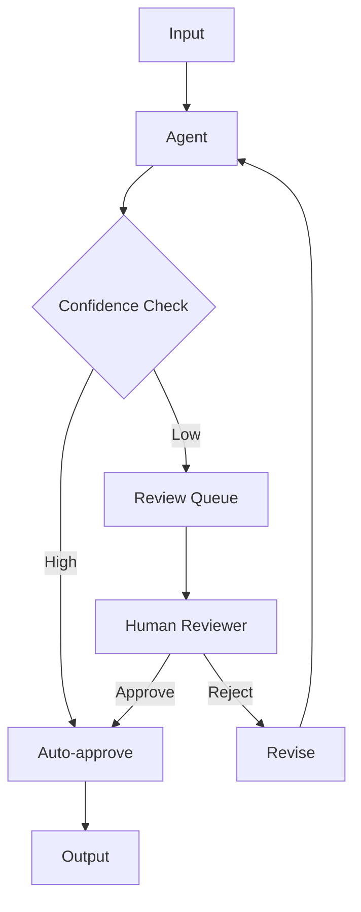

# Chapter 13: Human-in-the-Loop

Integrate human oversight for high-stakes decisions or low-confidence outputs.

## Flow Diagram



## Implementation

Source: [`src/agentic_patterns/human_in_loop.py`](https://github.com/runyaga/agentic-patterns-book/blob/main/src/agentic_patterns/human_in_loop.py)

### Data Models & Policies

```python
--8<-- "src/agentic_patterns/human_in_loop.py:models"
```

### Agents

```python
--8<-- "src/agentic_patterns/human_in_loop.py:agents"
```

### Workflow with Oversight

```python
--8<-- "src/agentic_patterns/human_in_loop.py:workflow"
```

## Use Cases

- **Content Moderation**: Review flagged toxic/sensitive content.
- **Financial Ops**: Approve transactions > $10k.
- **Code Deployment**: Agent scaffolds code, Human reviews PR.
- **Medical/Legal**: AI drafts, Expert validates.

## Production Reality Check

### When to Use
- Cost of error is high (financial loss, safety risk, legal liability)
- Compliance or regulations require human sign-off
- AI is prone to hallucination in the domain (medical, legal, financial)
- Confidence scores reliably indicate when human review is needed
- Building trust during initial deployment before full automation
- *Comparison*: Full automation with post-hoc audit is insufficient for
  error-cost or compliance requirements

### When NOT to Use
- Latency requirements don't allow waiting for human response
- Volume is too high for humans to review (need to improve AI or accept risk)
- Error cost is low and correction after-the-fact is acceptable
- No humans are available to review (24/7 systems without staff)
- *Anti-pattern*: Content moderation at internet scale without adequate
  reviewer staffing—queue will explode

### Production Considerations
- **Queue management**: Human review requests need a queue. Handle backpressure
  when humans can't keep up. Consider SLAs and timeouts.
- **Fallback behavior**: What happens if no human responds within N minutes?
  Auto-approve, auto-reject, or escalate?
- **Reviewer fatigue**: Too many reviews leads to rubber-stamping. Monitor
  approval rates and review times for signs of fatigue.
- **Access control**: Human approvals are a security boundary. Implement
  reviewer authentication and audit who approved what.
- **Feedback loops**: Capture human decisions to improve the AI's confidence
  calibration and reduce future human reviews.
- **Audit trail**: Log every human decision with timestamp, reviewer ID, and
  rationale. Essential for compliance and debugging.
- **UI/UX**: Reviewers need context to make good decisions. Show relevant
  information, not just "approve/reject" buttons.

## Example

```bash
.venv/bin/python -m agentic_patterns.human_in_loop
```
