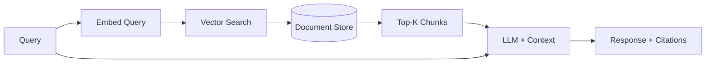

# Chapter 14: Knowledge Retrieval (RAG)

Augment LLMs with external knowledge via embeddings and vector search.

## Key Insight

> "LLMs know what they were trained on—nothing more. RAG grounds responses in your documents, reducing hallucination and enabling answers about proprietary or recent information."

- **Pure LLM**: Hallucinates or refuses questions about unknown data.
- **RAG**: Retrieves relevant chunks, grounds answers in source documents.

## Flow Diagram



## Implementation

Source: [`src/agentic_patterns/knowledge_retrieval.py`](https://github.com/runyaga/agentic-patterns-book/blob/main/src/agentic_patterns/knowledge_retrieval.py)

### Data Models

```python
--8<-- "src/agentic_patterns/knowledge_retrieval.py:models"
```

### Utility Functions

```python
--8<-- "src/agentic_patterns/knowledge_retrieval.py:utils"
```

### Vector Store

```python
--8<-- "src/agentic_patterns/knowledge_retrieval.py:store"
```

### RAG Pipeline

```python
--8<-- "src/agentic_patterns/knowledge_retrieval.py:rag"
```

## Use Cases

- **Doc Q&A**: Chat with PDF manuals or API docs.
- **Company Wiki**: Search internal policies (Notion/Confluence).
- **Recent News**: Inject latest data that post-dates the model training.

## Production Reality Check

### When to Use
- Information is proprietary, private, or too new for model's training data
- Hallucination must be minimized (grounding answers in source documents)
- Source citations are required (compliance, trust, verification)
- Knowledge base changes frequently and can't be baked into model weights
- *Comparison*: For small, stable document sets, prompt stuffing (including
  full docs in context) is simpler than building a RAG pipeline

### When NOT to Use
- Questions are about general knowledge the model already has
- Document corpus is small enough to fit in context window directly
- Retrieval latency is unacceptable for your use case
- Query types don't match well with semantic similarity (e.g., exact lookups)
- *Anti-pattern*: Tiny, stable FAQ docs where RAG adds latency and complexity
  for no benefit

### Production Considerations
- **Chunking strategy**: Chunk size affects retrieval quality. Too small loses
  context; too large wastes tokens. Experiment with your corpus.
- **Embedding quality**: Embedding model choice matters. Domain-specific models
  may outperform general ones for specialized content.
- **Retrieval relevance**: Monitor retrieval quality. If retrieved chunks don't
  answer the question, the LLM will hallucinate anyway.
- **Index maintenance**: Documents change. Implement incremental indexing and
  handle document updates/deletions.
- **Citation faithfulness**: Retrieved chunks may be cited but not actually used.
  Evaluate whether citations are accurate and relevant.
- **Hybrid search**: Pure vector search misses exact matches. Consider hybrid
  (vector + keyword) for better recall.
- **Latency budget**: Embedding query + vector search + LLM call. Each step
  adds latency. Consider caching frequent queries.
- **Evaluation**: Regularly evaluate retrieval precision/recall and answer
  quality. RAG can degrade silently as corpus grows.

## Example

```bash
.venv/bin/python -m agentic_patterns.knowledge_retrieval
```
