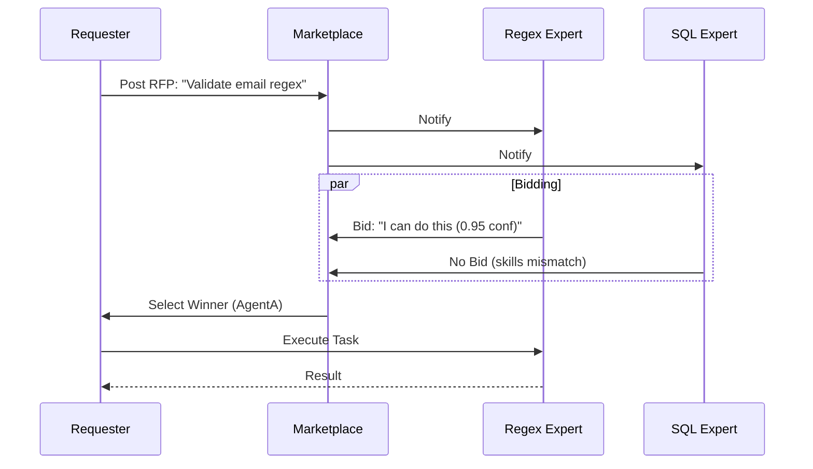

# Agent Marketplace (The Agora)

**Chapter 15** · *Specification / Planned*

> **Note:** This pattern is currently in the specification phase. The documentation below reflects the planned design.

In complex systems, agents shouldn't be hard-wired to each other. **The Agora** implements a decentralized communication pattern where agents function like participants in a marketplace. They "bid" on tasks based on their specialized skills and current capacity.

## Key Concepts



-   **RFP (Request for Proposal)**: A structured task definition including requirements, skills needed, and budget/deadline.
-   **Bidding**: Agents autonomously decide whether to bid on a task based on their capabilities and load.
-   **Selection Strategy**: The marketplace (or requester) selects the winning bid using strategies like "Highest Confidence", "Lowest Cost", or "Agent Judgment" (asking another LLM to pick).
-   **Decoupling**: The requester does not need to know which agents exist or how to call them.

## Use Cases

1.  **Dynamic Worker Pools**: When the set of available agents changes at runtime (e.g., plugins loaded dynamically).
2.  **Competitive Execution**: When multiple agents *could* do a task, but one might be better suited based on context (e.g., "Fast Linter" vs "Deep Auditor").
3.  **Resource Optimization**: Selecting the cheapest agent that meets the confidence threshold for a given task.

## Proposed Implementation

The core architecture uses `pydantic_graph` to model the RFP lifecycle:

```python
class TaskRFP(BaseModel):
    requirement: str
    required_skills: list[str]
    min_confidence: float = 0.5

class AgentBid(BaseModel):
    agent_id: str
    confidence: float
    proposal: str

# Workflow: PostRFP -> CollectBids -> SelectWinner -> ExecuteTask
```

### Example Scenario

A "Project Manager" agent needs a code review.
1.  It posts an RFP to the Agora.
2.  **Agent A (Linter)** bids: "I can check syntax instantly. Cost: $0.01. Confidence: 1.0 for syntax."
3.  **Agent B (Security)** bids: "I can check for vulnerabilities. Cost: $0.50. Confidence: 0.9 for security."
4.  The Manager selects **Agent A** first for a quick check, then **Agent B** if the syntax passes.

## Production Reality Check

For static workflows where you know your agents ahead of time, use the **Router (Chapter 2)** or **Supervisor (Chapter 7)** patterns. The Agora is powerful but introduces latency and complexity suitable only for highly dynamic or open-ended systems.
