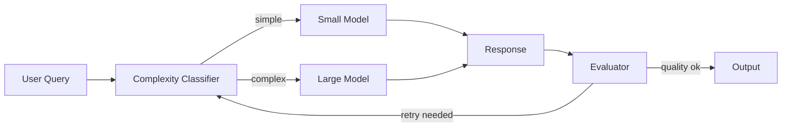

# Resource-Aware Optimization

**Chapter 16**

[Source](https://github.com/yourusername/agentic-patterns/blob/main/src/agentic_patterns/resource_aware.py)

LLM-based applications can be expensive and slow. **Resource-Aware Optimization** addresses this by dynamically routing requests to the most appropriate model based on task complexity and budget constraints. Simple queries go to fast, cheap models; complex reasoning goes to powerful, expensive ones.

## Key Concepts



-   **Complexity Classification**: A lightweight classifier that assesses whether a query needs a powerful model or can be handled cheaply.
-   **Model Tiering**: Multiple models organized by cost/capability (LIGHTWEIGHT, STANDARD, ADVANCED).
-   **Budget Tracking**: Real-time monitoring of token/cost consumption with hard limits.
-   **Resource Usage**: Per-operation tracking of tokens, cost, and execution time.

## Implementation

The implementation provides several key components:

**ResourceBudget** tracks and enforces constraints:

```python
@dataclass
class ResourceBudget:
    max_tokens: int = 100000
    max_cost: float = 10.0
    max_operations: int = 1000
    tokens_used: int = 0
    cost_incurred: float = 0.0

    def can_afford(self, estimated_tokens: int, estimated_cost: float) -> bool:
        token_ok = (self.tokens_used + estimated_tokens) <= self.max_tokens
        cost_ok = (self.cost_incurred + estimated_cost) <= self.max_cost
        return token_ok and cost_ok and self.operations_count < self.max_operations
```

**ComplexityClassifier** assesses task difficulty using keywords and heuristics:

```python
@dataclass
class ComplexityClassifier:
    keywords_complex: list[str] = field(default_factory=lambda: [
        "analyze", "compare", "evaluate", "synthesize", "design"
    ])
    keywords_simple: list[str] = field(default_factory=lambda: [
        "what is", "define", "list", "name", "when", "where"
    ])

    def classify(self, task: str) -> ComplexityAssessment:
        # Returns TaskComplexity.SIMPLE, MEDIUM, or COMPLEX
        ...
```

**ModelSelector** routes to appropriate model tier based on complexity and remaining budget:

```python
@dataclass
class ModelSelector:
    def select_for_complexity(
        self, complexity: TaskComplexity, budget: ResourceBudget | None = None
    ) -> ModelConfig:
        tier_map = {
            TaskComplexity.SIMPLE: ModelTier.LIGHTWEIGHT,
            TaskComplexity.MEDIUM: ModelTier.STANDARD,
            TaskComplexity.COMPLEX: ModelTier.ADVANCED,
        }
        # Downgrade tier if budget is running low
        if budget and budget.get_remaining()["tokens"] < 1000:
            return self.model_configs[ModelTier.LIGHTWEIGHT]
        return self.model_configs[tier_map[complexity]]
```

**ResourceAwareExecutor** ties it all together:

```python
@dataclass
class ResourceAwareExecutor:
    budget: ResourceBudget
    classifier: ComplexityClassifier
    selector: ModelSelector

    async def run(self, task: str) -> tuple[str, ResourceUsage]:
        assessment = await self.classify_task(task)
        config = self.selector.select_for_complexity(assessment.complexity, self.budget)
        if not self.budget.can_afford(estimated_tokens, estimated_cost):
            return "Error: Insufficient budget", usage
        result = await task_agent.run(task)
        self.budget.record_usage(usage)
        return result.output, usage
```

## Use Cases

1.  **Cost Optimization**: Route 80% of support tickets to cheap models, escalate only when needed.
2.  **Latency Optimization**: Use fast models for real-time chat, slow models for background analysis.
3.  **Hybrid Pipelines**: Cheap model for draft generation, expensive model for refinement.
4.  **Budget Enforcement**: Hard limits on token/cost consumption per session or user.

## Production Reality Check

### When to Use
- Variable task complexity where cheap models handle simple requests, expensive
  models handle complex ones
- Cost constraints require intelligent routing to minimize API spend
- Latency requirements vary (some requests need fast responses, others can wait)
- Multiple LLM providers or model tiers are available for routing decisions
- *Comparison*: For uniform complexity tasks, a single model is simpler to
  operate and debug

### When NOT to Use
- Uniform task complexity where all requests need the same model capability
- Single model deployments without routing options
- Low volume where routing overhead exceeds cost savings
- Time-to-market pressure outweighs optimization benefits (add later)
- *Anti-pattern*: Adding routing complexity for <$100/month in API costs—
  engineering time exceeds savings

### Production Considerations
- **Router accuracy**: Misclassification is expensive. Routing a complex task to
  a cheap model produces garbage; routing simple tasks to expensive models
  wastes money. Track routing accuracy vs. actual task complexity.
- **Latency overhead**: Router classification adds latency. For real-time apps,
  this overhead may negate benefits. Consider async classification or caching
  for repeat queries.
- **Cost tracking**: Implement per-request cost attribution. Without it, you
  can't measure whether optimization is actually saving money.
- **Fallback chains**: What happens when the selected model fails? Define
  fallback logic (retry same tier, escalate to higher tier, fail fast).
- **Model drift**: Model capabilities change with updates. Routing rules tuned
  for GPT-4-0613 may be wrong for GPT-4-turbo. Re-evaluate periodically.
- **Budget enforcement**: Hard budget caps need circuit breakers. Don't just
  track spend; actively block requests when budgets are exhausted.

## Example

```bash
.venv/bin/python -m agentic_patterns.resource_aware
```
