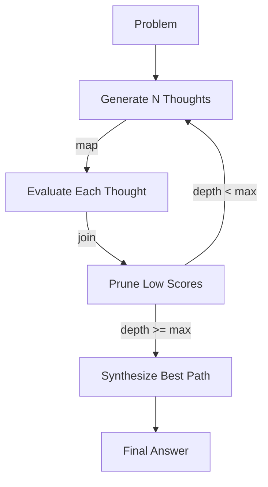

# Reasoning Weaver (The Cognitive Weaver)

**Chapter 17** · *Specification / Planned*

> **Note:** This pattern is currently in the specification phase. The documentation below reflects the planned design.

Simple "Chain of Thought" (CoT) is linear and brittle. **The Cognitive Weaver** decouples the *reasoning process* from the *final response*. It allows agents to use complex topologies like **Tree of Thoughts (ToT)** to explore multiple solutions, prune bad ideas, and synthesize the best path.

## Key Concepts



-   **Fan-Out**: Generating multiple candidate "next steps" from a single state.
-   **Parallel Evaluation**: Scoring all candidates concurrently to find the most promising paths.
-   **Pruning**: Abandoning low-scoring branches to save resources ("Backtracking").
-   **Synthesis**: Merging the best reasoning nodes into a final, high-confidence output.

## Use Cases

1.  **Complex Puzzles**: Problems like the "Game of 24" where a greedy approach (picking the most likely next word) often leads to a dead end.
2.  **Strategic Planning**: Generating multiple project plans, evaluating risks for each, and picking the safest one.
3.  **Code Architecture**: Exploring different design patterns for a module before writing code.

## Proposed Implementation

The implementation leverages `pydantic_graph.beta` for parallel fan-out (`.map()`) and reduction (`g.join()`):

```python
@g.step
async def evaluate_thought(ctx: StepContext) -> ThoughtNode:
    """Score a single thought in parallel."""
    # ...

# Connect fan-out to fan-in
g.edge_from(initialize).map().to(evaluate_thought)
g.edge_from(evaluate_thought).to(collect_thoughts)
```

## Production Reality Check

### When to Use
- Problem has a verifiable solution condition (can check if answer is correct)
- Greedy decoding fails (choosing most likely next word leads to dead ends)
- Lookahead and backtracking are valuable (puzzles, multi-step planning)
- Example: "Game of 24"—use 4, 7, 8, 8 to make 24
- *Comparison*: Single-shot or chain-of-thought prompting fails to explore
  alternative paths; ToT enables systematic search

### When NOT to Use
- Open-ended chat or creative writing (no way to score/prune branches)
- Simple queries that single-shot handles well
- Latency budget is tight (ToT is 10x-100x slower than standard calls)
- Token budget is constrained (branching factor × depth = token explosion)
- *Anti-pattern*: Summarization or customer support responses where "correctness"
  is subjective and pruning criteria don't exist

### Production Considerations
- **Model selection**: Use small, fast models (e.g., `qwen3:4b`) for generation
  steps. Use stronger models (or pure code) for evaluation. Route between them.
- **Token budgeting**: Branching factor × depth = total tokens. Set strict
  limits. Default to low values (branch=3, depth=3) and increase only if needed.
- **Pruning aggressiveness**: Prune early to save cost. But too aggressive
  pruning may discard the winning path. Tune per problem type.
- **Evaluator quality**: Bad evaluators lead to bad pruning. Invest in robust
  scoring logic—consider deterministic checks where possible. Without a good
  evaluator, ToT degenerates into expensive random search.
- **Caching**: Similar inputs may share explored subtrees. Cache promising paths
  to avoid redundant search across related queries.
- **Observability**: Log the full tree structure for debugging. "Why did it
  choose this path?" is hard to answer without tree visualization.
- **Fallback**: If ToT times out or exceeds budget, fall back to single-shot.
  Don't fail completely just because exploration was expensive.

## Example

> **Note:** This pattern is in specification phase. No runnable example yet.