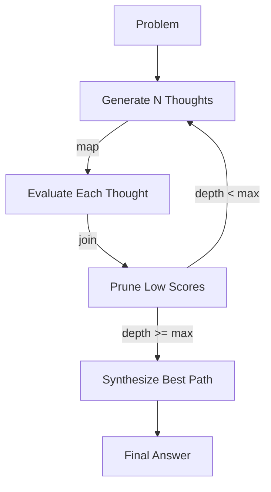

# Reasoning Weaver (The Cognitive Weaver)

**Chapter 17** · *Specification / Planned*

> **Note:** This pattern is currently in the specification phase. The documentation below reflects the planned design.

Simple "Chain of Thought" (CoT) is linear and brittle. **The Cognitive Weaver** decouples the *reasoning process* from the *final response*. It allows agents to use complex topologies like **Tree of Thoughts (ToT)** to explore multiple solutions, prune bad ideas, and synthesize the best path.

## Key Concepts



-   **Fan-Out**: Generating multiple candidate "next steps" from a single state.
-   **Parallel Evaluation**: Scoring all candidates concurrently to find the most promising paths.
-   **Pruning**: Abandoning low-scoring branches to save resources ("Backtracking").
-   **Synthesis**: Merging the best reasoning nodes into a final, high-confidence output.

## Use Cases

1.  **Complex Puzzles**: Problems like the "Game of 24" where a greedy approach (picking the most likely next word) often leads to a dead end.
2.  **Strategic Planning**: Generating multiple project plans, evaluating risks for each, and picking the safest one.
3.  **Code Architecture**: Exploring different design patterns for a module before writing code.

## Proposed Implementation

The implementation leverages `pydantic_graph.beta` for parallel fan-out (`.map()`) and reduction (`g.join()`):

```python
@g.step
async def evaluate_thought(ctx: StepContext) -> ThoughtNode:
    """Score a single thought in parallel."""
    # ...

# Connect fan-out to fan-in
g.edge_from(initialize).map().to(evaluate_thought)
g.edge_from(evaluate_thought).to(collect_thoughts)
```

## Production Reality Check

Tree of Thoughts is computationally expensive (Branching Factor $\times$ Depth = Token Explosion).
*   **Recommendation**: Use a **Small Specialist Model** (e.g., `qwen3:4b`) for the `GeneratorAgent` to produce candidate steps quickly and cheaply.
*   **Constraint**: Do not use this for open-ended chat or simple queries. Reserve it for verifiable problems requiring lookahead.

```