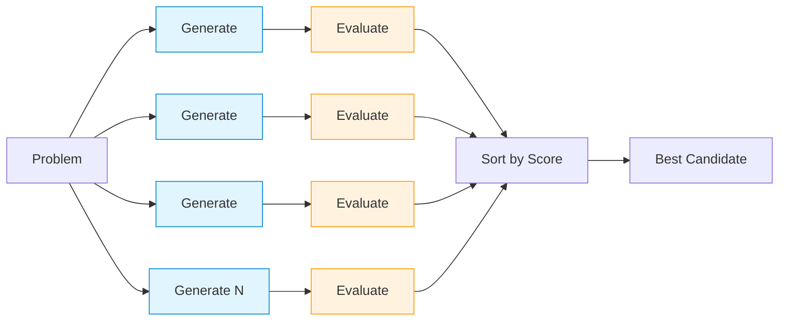

# Chapter 17a: Thought Candidates (Best-of-N)

Single-level parallel generation and evaluation of candidate solutions.

## Flow Diagram



**Model Tiers:**

- 🔵 **Generate** (blue): Fast model (`FAST_MODEL`, e.g., qwen3:4b)
- 🟠 **Evaluate** (orange): Strong model (`STRONG_MODEL`, e.g., gpt-oss:20b)

## Implementation

Source: [`src/agentic_patterns/thought_candidates.py`](https://github.com/runyaga/agentic-patterns-book/blob/main/src/agentic_patterns/thought_candidates.py)

### Data Models

```python
--8<-- "src/agentic_patterns/thought_candidates.py:models"
```

### Agents

```python
--8<-- "src/agentic_patterns/thought_candidates.py:agents"
```

### Best-of-N Sampling

```python
--8<-- "src/agentic_patterns/thought_candidates.py:patterns"
```

## Configuration

### Output Constraints

Control LLM output size via `OutputConfig`:

```python
from agentic_patterns.thought_candidates import (
    OutputConfig,
    ProblemStatement,
    run_best_of_n,
)

# Tight constraints for local models (faster, less JSON errors)
config = OutputConfig(max_words=80, ascii_only=True)

# Relaxed for cloud models
config = OutputConfig(max_words=500, ascii_only=False)

result = await run_best_of_n(problem, n=3, config=config)
```

### Model Tiers

Set via environment variables:

```bash
# Use different models for generation vs evaluation
export FAST_MODEL=qwen3:4b      # Quick generation
export STRONG_MODEL=gpt-oss:20b # Quality evaluation
```

## Use Cases

- **Best-of-N Sampling**: Generate multiple solutions, pick highest-scoring.
- **Self-Consistency**: Multiple reasoning paths for the same problem.
- **Foundation for ToT**: Building block for Tree of Thoughts (17b).

## Production Reality Check

### When to Use
- Need higher quality than single-shot (sampling improves output)
- Problem has evaluable correctness criteria (can score solutions)
- Can afford N parallel LLM calls (cost scales linearly with N)
- *Comparison*: Single-shot fails to produce reliable results

### When NOT to Use
- Single-shot is sufficient quality for your use case
- No objective scoring criteria exist (purely subjective evaluation)
- Tight latency/cost budget (each candidate is 2 LLM calls)
- *Anti-pattern*: Creative writing with no measurable quality metric

### Production Considerations
- **Cost**: N candidates = N generation + N evaluation calls (2N total).
  Budget accordingly.
- **Evaluator quality**: Bad evaluators select bad candidates. Invest in
  robust scoring logic—consider deterministic checks where possible.
- **Diminishing returns**: Quality gains plateau beyond N=5-10 for most
  problems. Start small and increase only if needed.
- **Parallel execution**: All N candidates run concurrently via
  `asyncio.gather`. Beware rate limits.
- **Typed context**: Uses `deps_type` for structured context injection,
  avoiding error-prone string concatenation.
- **Output constraints**: Use `OutputConfig` to prevent JSON parse errors
  from overly long or unicode-heavy responses (common with local models).

## Example

```bash
.venv/bin/python -m agentic_patterns.thought_candidates
```

Output shows a rich table of candidates with scores and the best selection:

```
───────────────── DEMO: Thought Candidates (Best-of-N) ─────────────────

┏━━━┳━━━━━━━━┳━━━━━━━┳━━━━━━━━━━━━━━━━━━━━━━━━━━━━━━━━━━━┳━━━━━━━━━━━━┓
┃ # ┃ Score  ┃ Valid ┃ Approach                          ┃ Feedback   ┃
┡━━━╇━━━━━━━━╇━━━━━━━╇━━━━━━━━━━━━━━━━━━━━━━━━━━━━━━━━━━━╇━━━━━━━━━━━━┩
│ ★ │  8.5   │   ✓   │ Russian nesting dolls analogy...  │ Clear...   │
│ 2 │  7.2   │   ✓   │ Mirror facing mirror analogy...   │ Good...    │
│ 3 │  5.1   │   ✗   │ Loop explanation...               │ Missing... │
└───┴────────┴───────┴───────────────────────────────────┴────────────┘

╭──────────────────── ★ Best Candidate ────────────────────╮
│ Score: 8.5/10                                            │
│ Approach: Russian nesting dolls - each doll contains...  │
╰──────────────────────────────────────────────────────────╯
```
