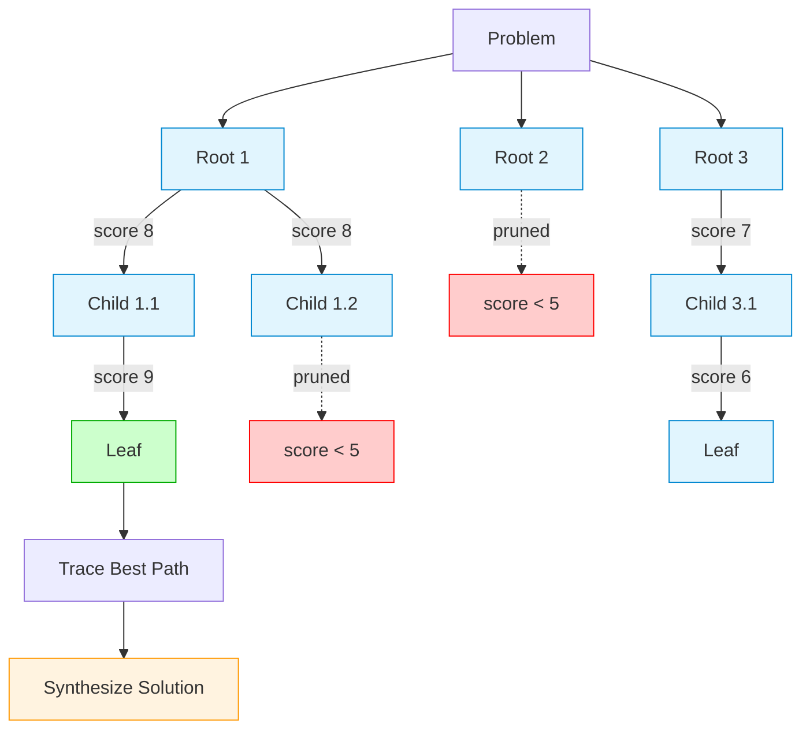

# Chapter 17b: Tree of Thoughts

Multi-level exploration with pruning, extending Thought Candidates (17a).

## Key Insight

> "Greedy reasoning picks the most likely next step—often a dead end. Tree of Thoughts explores multiple paths, prunes bad branches, and finds solutions that greedy misses."

- **Greedy/Chain-of-Thought**: One path forward. Dead ends are fatal.
- **Tree of Thoughts**: Branch, evaluate, prune. Backtrack from dead ends.

## Flow Diagram



**Model Tiers:**

- 🔵 **Generate nodes** (blue): Fast model (`FAST_MODEL`) for thought generation
- 🟠 **Synthesize** (orange): Strong model (`STRONG_MODEL`) for final synthesis
- 🔴 **Pruned** (red): Low-scoring branches discarded
- 🟢 **Best leaf** (green): Highest-scoring path endpoint

*Note: Evaluation at each node also uses the strong model (via 17a's evaluator).*

## Implementation

Source: [`src/agentic_patterns/tree_of_thoughts.py`](https://github.com/runyaga/agentic-patterns-book/blob/main/src/agentic_patterns/tree_of_thoughts.py)

### Data Models

```python
--8<-- "src/agentic_patterns/tree_of_thoughts.py:models"
```

### Agents

```python
--8<-- "src/agentic_patterns/tree_of_thoughts.py:agents"
```

### Tree Exploration

```python
--8<-- "src/agentic_patterns/tree_of_thoughts.py:patterns"
```

## Configuration

### Tree Parameters

Control exploration via `TreeConfig`:

```python
from agentic_patterns.tree_of_thoughts import TreeConfig, run_tree_of_thoughts
from agentic_patterns.thought_candidates import OutputConfig, ProblemStatement

tree_config = TreeConfig(
    max_depth=3,       # How deep to explore
    branch_factor=3,   # Candidates per node
    prune_threshold=5.0,  # Minimum score to continue
    beam_width=2,      # Top-k nodes to expand per level
)

# Output constraints for LLM responses
output_config = OutputConfig(max_words=80, ascii_only=True)

result = await run_tree_of_thoughts(problem, tree_config, output_config)
```

### Cost Estimation

| Config | Nodes | LLM Calls | Notes |
|--------|-------|-----------|-------|
| depth=2, branch=2, beam=2 | ~6 | ~13 | Fast demo |
| depth=3, branch=3, beam=2 | ~15 | ~31 | Balanced |
| depth=3, branch=4, beam=3 | ~39 | ~79 | Thorough |

*Each node = 2 calls (generate + evaluate). Plus 1 synthesis call.*

### Model Tiers

```bash
# Recommended: Fast model for generation, strong for evaluation
export FAST_MODEL=qwen3:4b
export STRONG_MODEL=gpt-oss:20b
```

## Use Cases

- **Diagnostic Reasoning**: Explore hypotheses about system issues.
- **Strategic Planning**: Evaluate multiple plan branches, assess risks.
- **Code Architecture**: Compare different design patterns before coding.
- **Multi-step Problem Solving**: Problems where greedy approaches fail.

## Production Reality Check

### When to Use
- Problem has a verifiable solution condition (can check if answer is correct)
- Greedy decoding fails (choosing most likely next step leads to dead ends)
- Lookahead and backtracking are valuable (puzzles, multi-step planning)
- *Comparison*: Single-shot or chain-of-thought fails to explore
  alternative paths; ToT enables systematic search

### When NOT to Use
- Open-ended chat or creative writing (no way to score/prune branches)
- Simple queries that single-shot handles well
- Latency budget is tight (ToT is 10x-100x slower than standard calls)
- Token budget is constrained (branching factor × depth = token explosion)
- *Anti-pattern*: Summarization or customer support where "correctness"
  is subjective and pruning criteria don't exist

### Production Considerations
- **Token explosion**: `branch_factor^depth` = exponential cost. A 3-branch,
  3-depth tree generates 39 nodes (1 + 3 + 9 + 27).
- **Pruning tuning**: Too aggressive and you lose the optimal path; too
  lenient and you waste resources. Tune per problem type.
- **Evaluator quality**: Bad evaluators lead to bad pruning. Without a
  good evaluator, ToT degenerates into expensive random search.
- **Beam width**: Limits how many nodes expand at each level. Lower beam
  width = faster but may miss optimal paths.
- **Fallback**: If ToT times out or exceeds budget, fall back to single-shot.
  Don't fail completely just because exploration was expensive.
- **Observability**: Log the full tree structure for debugging. "Why did it
  choose this path?" is hard to answer without tree visualization.
- **Output constraints**: Use `OutputConfig` to prevent JSON errors from
  overly verbose responses. Critical for local models.
- **Reuses 17a**: Imports `generate_and_evaluate` from thought_candidates
  for atomic candidate generation.

## Example

```bash
.venv/bin/python -m agentic_patterns.tree_of_thoughts
```

Output shows a rich tree visualization with the best path highlighted:

```
────────────── DEMO: Tree of Thoughts - Diagnostic Reasoning ──────────────

╭─────────────────────────────── Problem ───────────────────────────────╮
│ A web application is responding slowly. Response times increased      │
│ from 200ms to 3 seconds over the past week.                          │
╰───────────────────────────────────────────────────────────────────────╯

🌳 Thought Tree
├── ★ [8.2] Check database query performance - look for slow queries...
│   ├── ★ [8.5] Run EXPLAIN on recent queries, check for missing indexes...
│   └── ● [6.1] Review connection pool settings...
├── ● [7.1] Investigate application-level bottlenecks...
│   └── ● [6.8] Profile endpoint handlers...
└── ✗ [4.2] Check DNS resolution... (pruned)

                        ★ Best Path
┏━━━━━━┳━━━━━━━━┳━━━━━━━━━━━━━━━━━━━━━━━━━━━━━━━━━━━━━━━━━━┓
┃ Step ┃ Score  ┃ Thought                                  ┃
┡━━━━━━╇━━━━━━━━╇━━━━━━━━━━━━━━━━━━━━━━━━━━━━━━━━━━━━━━━━━━┩
│  1   │  8.2   │ Check database query performance...      │
│  2   │  8.5   │ Run EXPLAIN on recent queries...         │
└──────┴────────┴──────────────────────────────────────────┘

╭───────────────────── Final Solution ─────────────────────╮
│ Start by analyzing database performance using EXPLAIN... │
│ Confidence: 85%                                          │
╰──────────────────────────────────────────────────────────╯

╭─────────── Statistics ───────────╮
│ Nodes explored    6              │
│ Nodes pruned      1              │
│ Best path length  2              │
╰──────────────────────────────────╯
```
