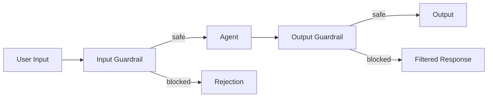

# Chapter 18: Guardrails

Protective mechanisms for safe and ethical agent behavior.

## Key Insight

> "Guardrails are not about limiting capability—they're about ensuring trust. An agent without guardrails is a liability in production."

- **Input Guardrails**: Block prompt injection, malicious content, policy violations.
- **Output Guardrails**: Filter toxic content, redact PII, enforce compliance.

## Flow Diagram



-   **Input Validation**: Pre-screening user inputs for prompt injection, malicious content, or policy violations before they reach the agent.
-   **Output Filtering**: Post-processing agent responses to detect and remove toxic, biased, or confidential information.
-   **Behavioral Constraints**: System prompt instructions that guide the agent toward safe behavior.
-   **Tool Restrictions**: Limiting which tools an agent can access based on context and permissions.

## Implementation

The implementation provides layered defense with multiple guardrail types:

**InputGuardrail** validates and sanitizes user input:

```python
@dataclass
class InputGuardrail:
    blocked_patterns: list[str] = field(default_factory=lambda: [
        r"ignore\s+(all\s+)?(previous\s+)?instructions",
        r"disregard\s+(your|the)\s+rules",
        r"jailbreak",
        r"pretend\s+you\s+are",
    ])
    max_input_length: int = 10000
    strip_html: bool = True

    def check(self, user_input: str) -> InputCheckResult:
        # Returns is_safe, decision, sanitized_input, violations, reasoning
        ...
```

**OutputGuardrail** filters agent responses:

```python
@dataclass
class OutputGuardrail:
    toxic_keywords: list[str] = field(default_factory=lambda: [
        "hate", "kill", "violence", "threat", "attack"
    ])
    pii_patterns: list[str] = field(default_factory=lambda: [
        r"\b\d{3}[-.]?\d{2}[-.]?\d{4}\b",  # SSN
        r"\b\d{16}\b",  # Credit card
        r"\b[A-Za-z0-9._%+-]+@[A-Za-z0-9.-]+\.[A-Z|a-z]{2,}\b",  # Email
    ])
    redact_pii: bool = True

    def check(self, output: str) -> OutputCheckResult:
        # Detects violations, redacts PII if enabled
        ...
```

**SafetyChecker** combines multiple guardrails:

```python
@dataclass
class SafetyChecker:
    input_guardrail: InputGuardrail
    output_guardrail: OutputGuardrail
    use_llm_assessment: bool = False
    strict_mode: bool = False

    def is_input_allowed(self, user_input: str) -> bool:
        result = self.check_input(user_input)
        return result.decision != SafetyDecision.UNSAFE
```

**GuardedExecutor** wraps agent execution with safety checks:

```python
@dataclass
class GuardedExecutor:
    checker: SafetyChecker
    block_on_input_violation: bool = True
    filter_output: bool = True
    log_violations: bool = True

    async def run(self, user_input: str) -> tuple[str, InputCheckResult, OutputCheckResult]:
        input_result = self.checker.check_input(user_input)
        if not input_result.is_safe and self.block_on_input_violation:
            return "I cannot process this request due to safety concerns.", input_result, None
        result = await task_agent.run(input_result.sanitized_input)
        output_result = self.checker.check_output(result.output)
        return output_result.filtered_output, input_result, output_result
```

## Use Cases

1.  **Content Moderation**: Filter toxic or inappropriate content in user-facing chatbots.
2.  **Compliance Enforcement**: Ensure agents don't provide regulated advice (medical, legal, financial) without disclaimers.
3.  **Data Protection**: Prevent agents from leaking PII or confidential information in responses.
4.  **Prompt Injection Defense**: Detect and block attempts to hijack agent behavior through malicious inputs.

## Production Reality Check

### When to Use
- User-facing applications where harmful/toxic output is unacceptable
- Regulated industries (healthcare, finance, legal) with compliance requirements
- Multi-tenant systems where one user's input could affect others
- Tool-using agents where unsafe actions have real-world consequences
- *Comparison*: For internal tools with trusted users and limited blast radius,
  guardrails may add unnecessary complexity

### When NOT to Use
- Internal tools with trusted users and limited blast radius
- Prototypes and experiments where safety overhead slows iteration
- Tasks where guardrails would block legitimate use cases (creative writing,
  security research, medical discussions)
- When guardrail latency exceeds acceptable response time budgets
- *Anti-pattern*: Over-filtering a developer tool that blocks legitimate
  technical discussions about security vulnerabilities

### Production Considerations
- **Defense in depth**: Single guardrail layer is insufficient. Combine input
  validation, output filtering, behavioral constraints, and human oversight.
- **False positives**: Overly aggressive guardrails block legitimate users.
  Track rejection rates and review blocked content regularly to tune thresholds.
- **Latency cost**: Each guardrail layer adds latency. Input screening +
  output filtering can double response time. Profile and optimize.
- **Bypass resistance**: Adversarial users will probe for bypasses (jailbreaks).
  Assume guardrails are not 100% effective. Layer with monitoring and
  rate limiting.
- **Audit logging**: Log all guardrail triggers with context. Essential for
  debugging false positives, identifying attack patterns, and compliance.
- **Graceful degradation**: What happens when the guardrail service is down?
  Fail-closed (block all) is safer but impacts availability. Decide policy
  explicitly.
- **Context sensitivity**: Static blocklists miss context. "How to make a bomb"
  is different in chemistry class vs. attack planning. Consider contextual
  classification.

## Example

```bash
.venv/bin/python -m agentic_patterns.guardrails
```
