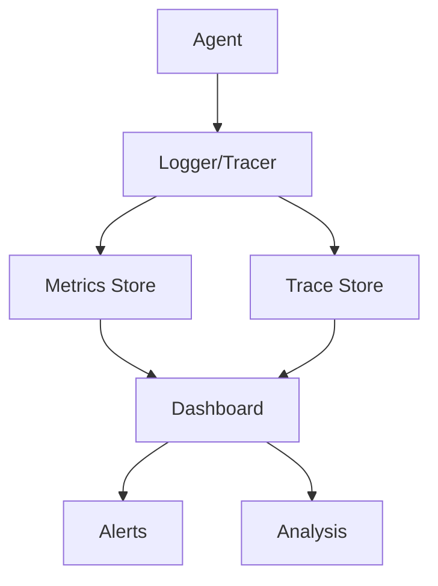

# Evaluation and Monitoring

**Chapter 19**

[Source](https://github.com/yourusername/agentic-patterns/blob/main/src/agentic_patterns/evaluation.py)

Agents in production need continuous evaluation to ensure quality, detect regressions, and optimize costs. **Evaluation and Monitoring** provides the observability infrastructure to understand agent behavior at scale.

## Key Concepts



-   **Structured Logging**: Capturing agent inputs, outputs, tool calls, and intermediate reasoning in a queryable format.
-   **Distributed Tracing**: Following requests across multiple agents and services with trace IDs.
-   **Quality Metrics**: Measuring accuracy, relevance, and user satisfaction beyond just latency and errors.
-   **Cost Attribution**: Tracking token usage and API costs per user, feature, or request type.

## Implementation

The implementation uses `pydantic-evals` with Logfire integration:

**Configure Logfire** for evaluation runs:

```python
def configure_logfire_for_evals(
    service_name: str = "agentic-patterns-evals",
    environment: str = "development",
) -> None:
    logfire.configure(
        scrubbing=False,  # Disable scrubbing for full eval visibility
        send_to_logfire="if-token-present",
        service_name=service_name,
        environment=environment,
    )
    logfire.instrument_pydantic_ai()
```

**Custom evaluators** for pattern-specific metrics:

```python
class IntentMatchEvaluator(Evaluator[str, tuple]):
    """Check if routing decision matches expected intent."""

    def __init__(self, expected_intent: str) -> None:
        self.expected_intent = expected_intent

    def evaluate(self, ctx: EvaluatorContext[str, tuple]) -> float:
        decision = ctx.output[0]
        if hasattr(decision, "intent"):
            return 1.0 if decision.intent.value == self.expected_intent else 0.0
        return 0.0


class TaskCompletionEvaluator(Evaluator[str, Any]):
    """Evaluate task completion ratio in multi-agent collaboration."""

    def evaluate(self, ctx: EvaluatorContext[str, Any]) -> float:
        if hasattr(ctx.output, "task_results"):
            results = ctx.output.task_results
            successful = sum(1 for r in results if r.success)
            return successful / len(results)
        return 0.0
```

**Dataset factories** for each pattern:

```python
def create_routing_dataset(include_llm_judge: bool = False) -> Dataset:
    cases = [
        Case(
            name="order_status_query",
            inputs="Where is my order ORD-12345?",
            expected_output={"intent": "order_status"},
            metadata={"category": "orders", "difficulty": "easy"},
        ),
        # ... more cases
    ]
    evaluators = [
        IsInstance(type_name="tuple"),
        ConfidenceThresholdEvaluator(min_confidence=0.5),
    ]
    if include_llm_judge:
        evaluators.append(LLMJudge(rubric="Response correctly identifies intent"))
    return Dataset(cases=cases, evaluators=evaluators)
```

**Main evaluation API**:

```python
async def evaluate_pattern(
    pattern_name: str,
    task_function: Callable,
    include_llm_judge: bool = False,
) -> EvaluationReport:
    dataset = PATTERN_DATASETS[pattern_name](include_llm_judge=include_llm_judge)
    return await dataset.evaluate(task_function)
```

## Use Cases

1.  **Quality Assurance**: Automatically evaluate agent outputs against golden datasets.
2.  **Cost Management**: Identify expensive queries and optimize routing decisions.
3.  **Debugging**: Trace why an agent produced a specific output by examining the full execution path.
4.  **A/B Testing**: Compare agent versions with statistical rigor before rollout.

## Production Reality Check

### When to Use
- Production deployments where you need visibility into agent behavior
- Quality assurance requires measuring output accuracy over time
- Cost management needs granular usage tracking per user/feature
- Debugging agent failures requires detailed execution traces
- *Comparison*: For early prototypes, print statements may be enough; formal
  monitoring adds overhead that slows iteration

### When NOT to Use
- Early prototypes where iteration speed trumps observability
- Simple single-turn completions with obvious success/failure criteria
- When monitoring infrastructure cost exceeds application cost
- Privacy-sensitive contexts where logging conversations is prohibited
- *Anti-pattern*: Logging every token of every conversation in a high-volume
  consumer app—storage costs explode and privacy risks multiply

### Production Considerations
- **Metric selection**: Don't log everything. Identify key metrics (latency,
  cost, quality scores, error rates) and instrument those. Too much data
  obscures signal.
- **Quality measurement**: Automated metrics (BLEU, ROUGE) correlate weakly
  with human judgment. Implement human evaluation sampling for ground truth.
- **Alerting thresholds**: Set alerts on anomalies (latency spikes, error rate
  increases, cost explosions). Define clear runbooks for each alert type.
- **Trace sampling**: Full tracing of every request is expensive. Use sampling
  (e.g., 1% of requests) for normal operation, full tracing for errors.
- **Data retention**: Agent traces contain user data. Define retention policies,
  implement PII scrubbing, and ensure compliance with data regulations.
- **A/B testing infrastructure**: Comparing agent versions requires proper
  experiment framework. Track metrics per variant and compute statistical
  significance.
- **Cost attribution**: Attribute costs to features, users, and use cases.
  Without attribution, optimization is guesswork.

## Example

```bash
.venv/bin/python -m agentic_patterns.evaluation routing
.venv/bin/python -m agentic_patterns.evaluation multi_agent --llm-judge
```
