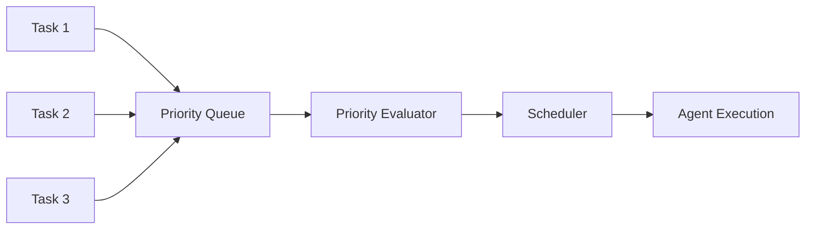

# Chapter 20: Prioritization

Systematic task ranking based on urgency, importance, and dependencies.

## Key Insight

> "FIFO is fair but dumb. Intelligent prioritization ensures high-impact work gets done first while preventing starvation of lower-priority tasks."

- **FIFO Queues**: Simple but ignores urgency, importance, and dependencies.
- **Priority Scheduling**: Weighted scoring with dynamic re-prioritization.

## Flow Diagram



-   **Priority Criteria**: Rules for evaluating task importance (urgency, impact, dependencies, cost/benefit).
-   **Dynamic Re-prioritization**: Adjusting priorities as circumstances change (deadlines approach, new tasks arrive).
-   **Dependency Resolution**: Ensuring prerequisite tasks complete before dependent tasks start.
-   **Fair Scheduling**: Preventing low-priority tasks from being starved indefinitely.

## Implementation

The implementation provides a complete task prioritization system:

**Task model** with priority attributes:

```python
class Task(BaseModel):
    id: str
    title: str
    urgency: float = Field(ge=0.0, le=1.0, description="Time sensitivity")
    importance: float = Field(ge=0.0, le=1.0, description="Impact on objectives")
    effort: float = Field(ge=0.0, le=1.0, description="Resource cost")
    dependencies: list[str] = Field(default_factory=list)
    deadline: datetime | None = None
    status: TaskStatus = TaskStatus.PENDING
    priority_level: PriorityLevel | None = None
    priority_score: float = 0.0
```

**PriorityEvaluator** calculates weighted scores:

```python
@dataclass
class PriorityEvaluator:
    criteria: PriorityCriteria  # urgency_weight, importance_weight, etc.

    def evaluate(self, task: Task, resolved_dependencies: set[str]) -> PriorityScore:
        urgency_score = task.urgency
        importance_score = task.importance
        deadline_score = self._calculate_deadline_score(task.deadline)
        dependency_score = self._calculate_dependency_score(task.dependencies, resolved)
        effort_score = 1.0 - task.effort  # Lower effort = higher priority

        final_score = (
            urgency_score * self.criteria.urgency_weight +
            importance_score * self.criteria.importance_weight +
            deadline_score * self.criteria.deadline_weight +
            dependency_score * self.criteria.dependency_weight +
            effort_score * self.criteria.effort_weight
        )
        return PriorityScore(task_id=task.id, final_score=final_score, ...)
```

**TaskQueue** manages priority-ordered task execution:

```python
@dataclass
class TaskQueue:
    tasks: dict[str, Task]
    evaluator: PriorityEvaluator
    completed_tasks: set[str]

    def add_task(self, task: Task) -> PriorityScore:
        score = self.evaluator.evaluate(task, self.completed_tasks)
        task.priority_score = score.final_score
        self.tasks[task.id] = task
        return score

    def get_next(self) -> Task | None:
        pending = [t for t in self.tasks.values() if t.status == TaskStatus.PENDING]
        pending.sort(key=lambda t: t.priority_score, reverse=True)
        return pending[0] if pending else None

    def complete_task(self, task_id: str) -> bool:
        # Marks complete and reprioritizes dependent tasks
        ...
```

**DynamicReprioritizer** adjusts priorities based on context changes:

```python
@dataclass
class DynamicReprioritizer:
    queue: TaskQueue
    deadline_threshold_hours: float = 24.0

    def check_deadlines(self) -> list[ReprioritizationEvent]:
        # Boost priority for approaching deadlines
        ...

    def on_dependency_resolved(self, dependency_id: str) -> list[ReprioritizationEvent]:
        # Reprioritize tasks that were waiting on this dependency
        ...
```

## Use Cases

1.  **Task Queues**: Processing customer requests in order of business impact.
2.  **Autonomous Agents**: Deciding which sub-goal to pursue when multiple options exist.
3.  **Resource Allocation**: Balancing agent compute time across competing priorities.
4.  **Deadline Management**: Ensuring time-sensitive tasks get processed first.

## Production Reality Check

### When to Use
- Agent handles multiple concurrent tasks with limited resources
- Tasks have varying urgency, importance, or deadlines
- Dependencies between tasks require execution ordering
- User expectations require responsive handling of high-priority requests
- *Comparison*: For single-task agents or uniform priority, FIFO ordering is
  simpler and sufficient

### When NOT to Use
- Single-task agents that process one request at a time
- All tasks have equal priority and no dependencies
- FIFO ordering is acceptable for your use case
- Prioritization logic complexity exceeds task complexity
- *Anti-pattern*: Building a sophisticated priority system for a queue that
  averages 3 items—overhead exceeds benefit

### Production Considerations
- **Priority starvation**: High-priority tasks can starve low-priority ones
  indefinitely. Implement aging (priority boost over time) or reserved capacity
  for lower priorities.
- **Priority inversion**: A high-priority task blocked on a low-priority one
  creates deadlock. Detect and handle dependency chains that span priorities.
- **Dynamic re-prioritization**: Priorities change (deadlines approach, users
  escalate). Support priority updates without losing task state.
- **Fairness vs. efficiency**: Pure priority ordering may be unfair to some
  users/tasks. Consider fair-share scheduling for multi-tenant systems.
- **Observability**: Log prioritization decisions. When users ask "why is my
  task slow?", you need to explain queue position and blocking factors.
- **Queue depth limits**: Unbounded queues hide problems. Set max queue depth
  and reject/defer new tasks when limits are reached.
- **Priority criteria drift**: Business rules for priority change. Externalize
  priority logic for easy updates without code deploys.

## Example

```bash
.venv/bin/python -m agentic_patterns.prioritization
```
