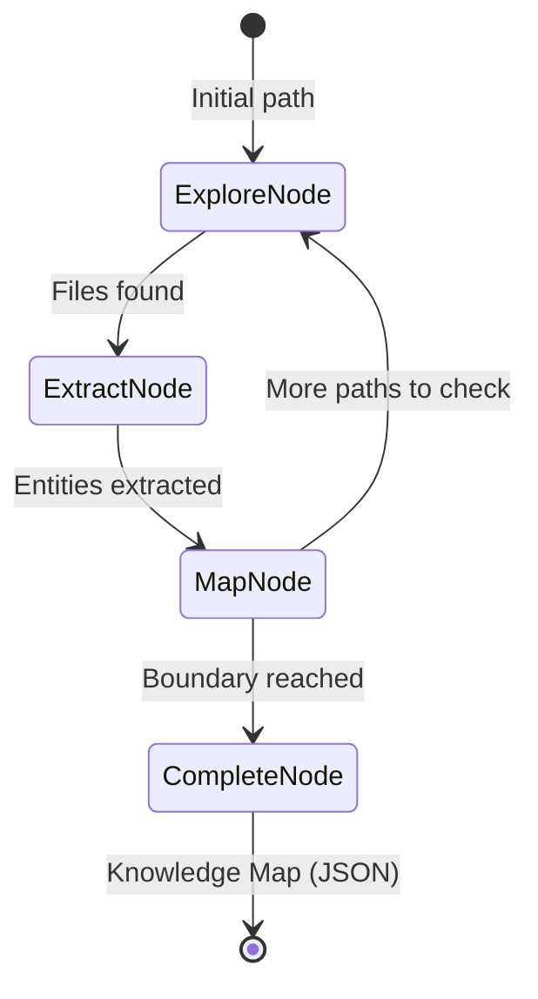

# Domain Exploration (The Cartographer)

**Chapter 21** · Discovery Agents learn the landscape of unknown domains.

Most RAG systems are passive—they only index what they're told. **The Cartographer** is an autonomous Discovery Agent. When pointed at an unknown domain (a GitHub repo, a local directory), it crawls the space, identifies entities, and builds a persistent **Semantic Map** (Knowledge Graph).

## Key Insight

> "Standard RAG treats documents as islands. The Cartographer treats them as a connected continent, mapping the bridges (relationships) before indexing the content."

- **Passive Indexing (Standard RAG)**: Truncated chunks, lost context, no structural understanding.
- **Active Discovery (Cartographer)**: Entity-first, relationship-aware, autonomous exploration.

## Flow Diagram



## Implementation

Source: [`src/agentic_patterns/domain_exploration.py`](https://github.com/runyaga/agentic-patterns-book/blob/main/src/agentic_patterns/domain_exploration.py)

### Data Models

```python
--8<-- "src/agentic_patterns/domain_exploration.py:models"
```

### Knowledge Store

```python
--8<-- "src/agentic_patterns/domain_exploration.py:store"
```

### Hybrid Extraction

```python
--8<-- "src/agentic_patterns/domain_exploration.py:extraction"
```

### Autonomous Graph

```python
--8<-- "src/agentic_patterns/domain_exploration.py:graph"
```

### Entry Point

```python
--8<-- "src/agentic_patterns/domain_exploration.py:entry"
```

## Comparison: Standard RAG vs. The Cartographer

| Aspect | Standard RAG | The Cartographer |
|--------|--------------|------------------|
| **Indexing** | Manual / Triggered | Autonomous Discovery |
| **Granularity** | Text Chunks | Semantic Entities |
| **Relationships** | Implicit (Similarity) | Explicit (Graph Edges) |
| **Navigation** | Vector Search | Graph Traversal |
| **Scope** | Fixed Corpus | Configurable Frontier |

## Core Strategies

### 1. Hybrid Senses (Tree-sitter + LLM + Markdown)
To balance accuracy and cost, the Cartographer uses a tiered extraction strategy:
- **Tree-sitter (The Skeleton)**: Uses `tree-sitter` for robust, multi-language code parsing. Captures classes with inheritance, functions with decorators, imports, and significant comments (TODOs, FIXMEs). Extensible to TypeScript, Go, Rust, and 100+ other languages.
- **Markdown AST (The Documentation)**: Uses `marktripy` to parse markdown structure—headings become sections, mermaid code blocks become diagrams, task lists (`- [ ]`, `- [x]`) become trackable tasks, and regular lists become list entities.
- **LLM (The Flesh)**: Uses a `pydantic-ai` agent to provide semantic summaries and identify high-level "concepts" (e.g., "The Observer Pattern") that are not explicitly named in the code.

### Entity Types

The Cartographer extracts the following entity types:

| Type | Source | Description |
|------|--------|-------------|
| `module` | Python AST | Python module file |
| `class` | Python AST | Class definition with docstring |
| `function` | Python AST | Function/method definition |
| `document` | Markdown AST | Markdown file (root entity) |
| `section` | Markdown AST | Heading (H1-H6) |
| `diagram` | Markdown AST | Mermaid diagram (flowchart, sequence, state, etc.) |
| `task` | Markdown AST | Task list item (`- [ ]` or `- [x]`) |
| `list` | Markdown AST | Bullet or ordered list |
| `code_reference` | Markdown AST | `--8<--` snippet inclusion |
| `concept` | LLM | High-level pattern or architecture insight |

### 2. Stable Identity (Scoped IDs)
Traditional indexing often breaks when files move. The Cartographer generates IDs based on **logical scope** (e.g., `pkg.module.ClassName`) rather than file paths or line numbers. This ensures the map remains stable during refactoring.

### 3. Atomic Persistence
Exploration can take time. The implementation uses atomic JSON writes (writing to `.tmp` then renaming) to ensure that if the agent is interrupted, the Knowledge Map remains uncorrupted and can be resumed.

## Use Cases

### When to Use
- **Onboarding**: "Map this new repo and explain the core architecture."
- **Gap Detection**: "Find all functions that are exported but not documented."
- **Dependency Analysis**: Visualizing how modules relate to identify circular dependencies or spaghetti code.
- **Technical Debt**: Identifying "orphan" components that are defined but never imported.
- **Documentation Analysis**: Track mermaid diagrams, find incomplete task lists, or identify doc-to-code references.

### When NOT to Use
- **Small Corpus**: When a simple `grep` or `README` is sufficient.
- **Real-time Requirements**: Crawling is inherently slower than keyword indexing.
- **Simple Search**: If you only need to find a specific string, don't build a graph.

## Production Considerations

- **Boundary Management**: Always set a `max_files` limit to prevent unbounded token spend on massive repositories.
- **Context Windows**: Large source files are truncated during LLM extraction to prevent context overflow.
- **Memory Scaling**: For graphs exceeding 100k nodes, replace the JSON/NetworkX implementation with a persistent graph database (e.g., Neo4j or LanceDB).
- **Dry Run Mode**: Always perform a "Dry Run" (AST only) first to preview the crawl scope before enabling the LLM "Brain".

## Example

Build a map of this repository (Python + Markdown):

```bash
# Run the built-in demo (explores both .py and .md files)
.venv/bin/python -m agentic_patterns.domain_exploration

# Or target a specific directory
.venv/bin/python -m agentic_patterns.domain_exploration /path/to/repo
```

Example output shows code entities (modules, classes, functions) alongside documentation entities (sections, diagrams, tasks, lists):

```
Entity Types
┏━━━━━━━━━━━━━━━━━┳━━━━━━━━━━━━┓
┃ Type            ┃      Count ┃
┡━━━━━━━━━━━━━━━━━╇━━━━━━━━━━━━┩
│ function        │        245 │
│ section         │         60 │
│ class           │         42 │
│ module          │         23 │
│ list            │         25 │
│ document        │          5 │
│ diagram         │          3 │
└─────────────────┴────────────┘
```
