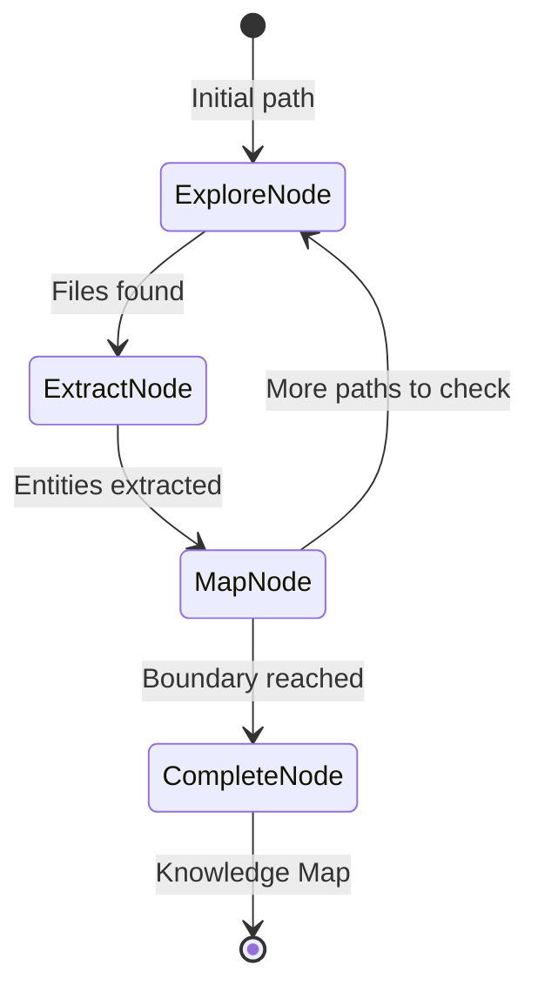

# Domain Exploration (The Cartographer)

**Chapter 21** · *Specification / Planned*

> **Note:** This pattern is currently in the specification phase. The documentation below reflects the planned design.

Most RAG systems are passive—they only index what they're told. **The Cartographer** is an autonomous Discovery Agent. When pointed at an unknown domain (a GitHub repo, a local directory), it crawls the space, identifies entities, and builds a persistent **Semantic Map** (Knowledge Graph).

## Key Concepts

-   **Autonomous Crawling**: The agent decides what to explore next based on what it finds (e.g., "I found an import for module X, I should find where X is defined").
-   **Semantic Entity Extraction**: Identifying "Concepts" (Classes, Functions, Patterns) rather than just chunking text.
-   **Knowledge Graph**: Building a graph of relationships (`imports`, `inherits`, `calls`) to enable structural understanding.
-   **Hybrid Analysis**: Combining robust static analysis (AST parsing) with LLM-based semantic understanding.

## Use Cases

1.  **Codebase Onboarding**: "Map this new repo and explain the core architecture."
2.  **Gap Detection**: "Find all functions that are exported but not documented."
3.  **Dependency Analysis**: Visualizing how modules relate to identify circular dependencies or spaghetti code.

## Proposed Implementation

The architecture uses a cyclic `pydantic_graph` workflow:
1.  **Explore**: List files at the frontier.
2.  **Extract**: Parse code (AST + LLM) to find entities.
3.  **Map**: Update the graph and identify new paths to explore.

## Production Reality Check

### When to Use
- Need autonomous discovery of unknown domain (new codebase, documentation set)
- Want semantic understanding beyond keyword search (entity relationships)
- Building knowledge graphs for structural queries (dependencies, call graphs)
- Gap detection is valuable (find undocumented functions, orphan modules)
- *Comparison*: For simple text search, grep/ctags/IDE indexers are faster and
  cheaper; Cartographer adds value when semantic relationships matter

### When NOT to Use
- Corpus is small and can be indexed manually
- Simple keyword search meets your needs
- Real-time exploration isn't acceptable (crawling is slow)
- Domain is well-understood and doesn't need discovery
- *Anti-pattern*: Small repo where a README and tags answer most questions—
  exploration overhead dominates the benefit

### Production Considerations
- **Boundaries**: Set strict `max_depth` and `max_files` limits. Unbounded
  crawling is expensive and can loop infinitely on large repos.
- **Memory management**: Large knowledge graphs should persist to disk
  (JSON/LanceDB) periodically. Don't hold everything in RAM.
- **AST-first accuracy**: LLMs hallucinate relationships. For code, use AST
  (Abstract Syntax Tree) for ground truth (imports, class hierarchy). Use LLM
  only for semantic summaries and conceptual relationships.
- **Incremental updates**: Full re-crawl is expensive. Implement incremental
  indexing for changed files only.
- **Staleness**: Exploration snapshots drift quickly in active repos. Plan for
  continuous updates or accept point-in-time limitations.
- **Access controls**: Crawling proprietary repos risks data leakage. Implement
  access controls and audit what's being indexed.
- **Token budgeting**: Each file processed = LLM call for entity extraction.
  Provide "dry run" mode to preview what would be crawled before committing.
- **Visualization**: Knowledge graphs need visualization to be useful. Plan for
  export to GraphViz, Neo4j, or similar tools.

## Example

> **Note:** This pattern is in specification phase. No runnable example yet.
