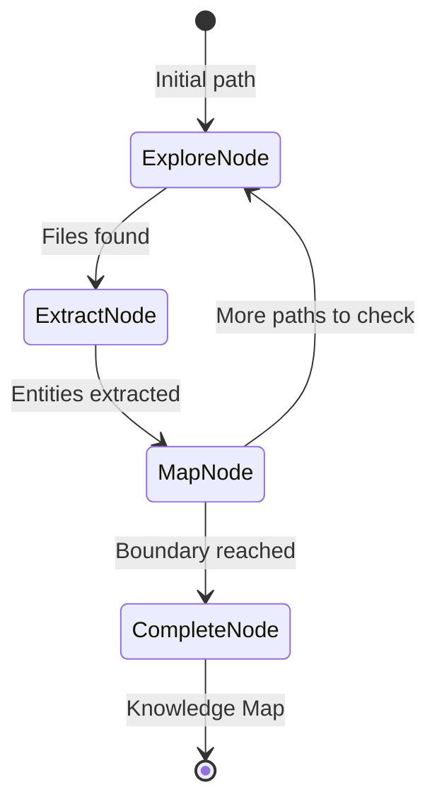

# Domain Exploration (The Cartographer)

**Chapter 21** · *Specification / Planned*

> **Note:** This pattern is currently in the specification phase. The documentation below reflects the planned design.

Most RAG systems are passive—they only index what they're told. **The Cartographer** is an autonomous Discovery Agent. When pointed at an unknown domain (a GitHub repo, a local directory), it crawls the space, identifies entities, and builds a persistent **Semantic Map** (Knowledge Graph).

## Key Concepts

-   **Autonomous Crawling**: The agent decides what to explore next based on what it finds (e.g., "I found an import for module X, I should find where X is defined").
-   **Semantic Entity Extraction**: Identifying "Concepts" (Classes, Functions, Patterns) rather than just chunking text.
-   **Knowledge Graph**: Building a graph of relationships (`imports`, `inherits`, `calls`) to enable structural understanding.
-   **Hybrid Analysis**: Combining robust static analysis (AST parsing) with LLM-based semantic understanding.

## Use Cases

1.  **Codebase Onboarding**: "Map this new repo and explain the core architecture."
2.  **Gap Detection**: "Find all functions that are exported but not documented."
3.  **Dependency Analysis**: Visualizing how modules relate to identify circular dependencies or spaghetti code.

## Proposed Implementation

The architecture uses a cyclic `pydantic_graph` workflow:
1.  **Explore**: List files at the frontier.
2.  **Extract**: Parse code (AST + LLM) to find entities.
3.  **Map**: Update the graph and identify new paths to explore.

## Production Reality Check

*   **Scale**: Crawling a large repo requires strict boundaries (`max_depth`, `max_files`) to avoid infinite loops and token exhaustion.
*   **Memory**: Large knowledge graphs should be persisted to disk (JSON/LanceDB) periodically, not held entirely in RAM.
*   **Accuracy**: LLMs hallucinate relationships. For code, rely on AST (Abstract Syntax Tree) for ground truth whenever possible.
